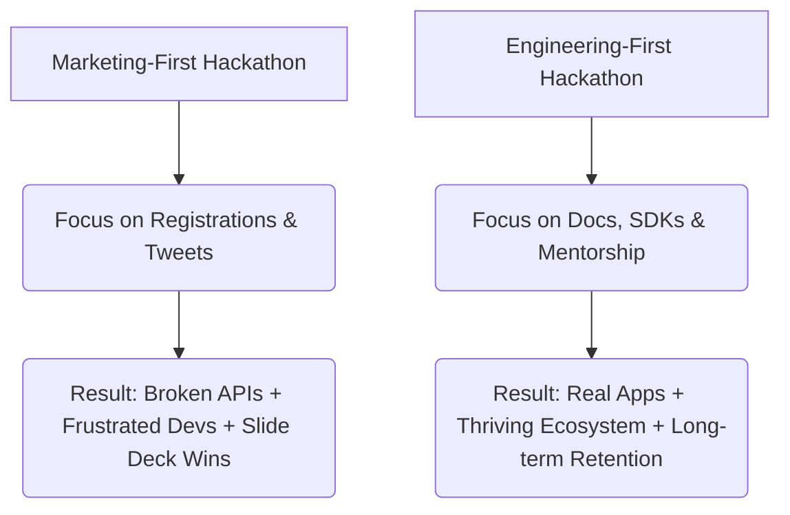

# Building Hackathons That Developers Actually Love

> **TL;DR:** Most hackathons are cheap corporate PR stunts that waste developers' weekends on broken APIs. To build a hackathon that actually builds a thriving ecosystem, you need to ditch the marketing buzzwords, provide rock-solid documentation, and focus on real engineering enablement over polished slide decks.

If you work in Developer Relations (DevRel) or community management, you have almost certainly participated in or organized a corporate hackathon that made you want to claw your eyes out. We all know the classic setup. A Fortune 500 company decides they need to be "innovative" and "engage with the startup ecosystem." They book a trendy co-working space, buy fifty boxes of lukewarm, greasy chain-pizza, and dump a broken, undocumented enterprise API on fifty exhausted software engineers who have sacrificed their weekend in exchange for the vague promise of a MacBook Pro or a $5,000 cash prize.

Then comes the opening ceremony. A suit-clad executive who has never touched a terminal in his life stands on stage and asks developers to "leverage synergistic blockchain-AI-cloud paradigms to disrupt global supply chain logistics" using an API that has been deprecated since 2014 and takes four hours just to configure an API key.

Unsurprisingly, by Sunday afternoon, the energy in the room is dead. Half the teams have dropped out, the remaining projects are held together by Scotch tape and hardcoded strings, and the winning project is inevitably a beautiful Figma mockup presented by a smooth-talking business major who didn't write a single line of code. It is an absolute waste of time, money, and cognitive energy. If we want to build developer communities that last, we need to completely reinvent how we run hackathons.

---

## 1. The Corporate Hackathon Trap: Why Most Events Suck

The fundamental flaw of most corporate hackathons is that they are designed as marketing campaigns, not engineering workshops. They are optimized for vanity metrics: how many developers registered, how many tweets were sent with the event hashtag, and how many PowerPoint presentations were delivered during the final pitch.

When you treat developers like free, outsourced R&D labor, they can smell it from a mile away. Developers do not want to be a line item on your quarterly marketing report. They want to solve hard problems, play with interesting technology, learn new skills, and hang out with smart people who share their passions.

If your API is a undocumented mess of spaghetti code, throwing a $10,000 prize pool at it won't save your event. It will only attract mercenaries who build throwaway wrapper scripts, submit their pitches, take your cash, and never touch your platform again. If you want high-quality projects, you must start with high-quality developer enablement.

---

## 2. Shift the Focus: Enablement Over Hype

To build a hackathon developers actually love, you must invert the pyramid. Stop focusing on the prize money and start focusing on the friction. The absolute best metric of a successful hackathon is **Time to Hello World (TTHW)**. How fast can a developer who has never heard of your protocol clone your repository, run a setup command, and see their first successful API response or contract execution?

If your TTHW is greater than fifteen minutes, you are losing half your developers before they even start brainstorming. 

Before you even announce your hackathon, run a rigorous, internal documentation audit. Bring in external developers who have never used your tech stack, lock them in a room, and watch them try to get your starter template running. Wherever they trip up—whether it's an outdated npm dependency, an unexplained config file, or a missing environment variable—fix it immediately. Your starter templates should be bulletproof. A developer's first twelve hours at a hackathon should be spent writing core application logic, not fighting with local environment configurations or complaining in your Discord support channels.

---

## 3. Designing the Ultimate Hackathon Structure

A great hackathon is not a 48-hour pressure cooker of sleep-deprived misery. It is a structured environment designed to maximize developer flow state. To achieve this, you need to structure your event across three distinct phases:

### Phase 1: Pre-Event Education
Never let the opening ceremony be the first time developers see your code. Host virtual office hours, onboarding workshops, and installation clinics a week before the hacking officially starts. This allows developers to form teams, brainstorm ideas, get their developer environment fully set up, and arrive on Friday ready to write code from minute one.

### Phase 2: In-Event Support and Flow State
During the event, protect your developers' focus. Minimize scheduled interruptions. Do not force them to stop hacking for corporate panels or generic presentations. 
- **Active Mentorship**: Ensure your technical mentors are actually in the trenches with the hackers. They should be walking the floor, monitoring support channels, and actively looking for blocked developers.
- **Human Fuel**: Ditch the greasy pizza. Provide real, nutritious food that doesn't lead to a massive sugar crash two hours later. Offer high-quality coffee, quiet resting spaces, and plenty of power strips.

### Phase 3: Fair and Transparent Judging
Nothing kills a developer community faster than a rigged or incompetent judging process. If developers spend 48 hours writing elegant, gas-optimized smart contracts, and they lose the grand prize to a team that just presented a non-functional mockup, they will never return to your ecosystem. 
Your judging panel must include technical experts who can actually read code. Require every team to submit a link to their public GitHub repository, and make the judging criteria transparent. If a project doesn't have a functional codebase, it shouldn't be eligible for technical prizes. Period.

---

## 4. Measuring Success Beyond the Pitch Deck

The final pitch deck is not the product; the repository is. If you want to build a sustainable, long-term developer ecosystem, your hackathon must be the beginning of the journey, not the end.

Measure your success by what happens *after* the weekend ends. How many of those public repositories are still active a month later? How many teams applied for your developer grant program? How many participants transitioned their hackathon projects into actual, venture-backed startups?

At Shantanu's blog, we believe in building real developer communities. Real developer relations is about showing up in the trenches, admitting when your SDK is broken, writing documentation that doesn't suck, and celebrating the engineers who are actually building the future. The next time you plan a hackathon, leave the suits at home, turn off the marketing buzzwords, and focus on the code. Your developers will thank you.

---

## Key Takeaways

- **Ditch the Vanity Metrics**: Registrations and social media impressions mean nothing if the codebases are empty. Focus on active repo submissions and subsequent developer retention.
- **Optimize TTHW**: Keep your "Time to Hello World" under fifteen minutes with bulletproof documentation and fully configured starter templates.
- **Fair Judging Protocols**: Ensure your judging panel is technically competent, audits the actual code on GitHub, and values functional software over pretty design mockups.
- **Sustainable Pipeline**: Use your hackathons as an on-ramp for developer grants and accelerator programs to turn weekend hacks into production-grade startups.

---

## Frequently Asked Questions

**Q: Should we allow non-technical members to participate in hackathons?**
A: Absolutely! Designers, product managers, and business strategist bring immense value to developer teams. However, their role should be to scope the product, design the interface, and articulate the business value, while working hand-in-hand with developers who are writing functional code. A balanced team is always the strongest.

**Q: What is a realistic prize pool for a developer hackathon in 2019?**
A: While a high prize pool attracts attention, structure matters more than the raw number. It is far better to have a modest grand prize ($3,000 - $5,000) with multiple smaller, highly specific bounty prizes ($500 - $1,000) for integrating specific APIs or tools. This keeps the competition diverse and ensures more developers get rewarded for their efforts.

**Q: Are virtual hackathons as effective as in-person ones?**
A: They serve different purposes. In-person hackathons are unmatched for raw energy, intense collaboration, and deep community bonding. Virtual hackathons, however, democratize access, allowing global talent to participate without travel friction, and are far more effective for generating long-term, high-quality code since developers can work at their own pace over several weeks.

---

*If this made you think, it'll do even more when shared. Hit that subscribe button — I write about developer relations, startup strategies, and engineering leadership every week and I promise to keep it real.*

*— [Shantanu Vishwanadha](https://substack.com/@thecoderpanda)*