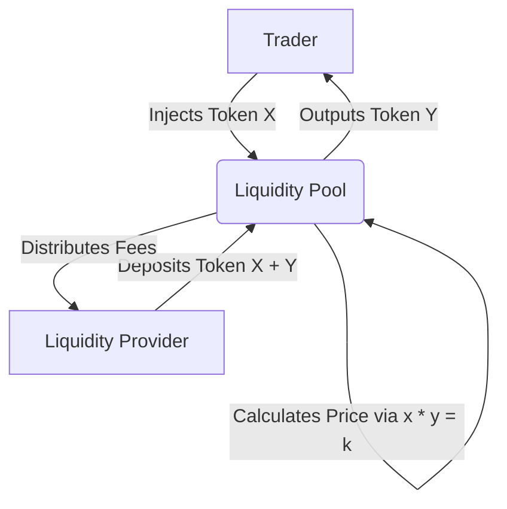

# Decentralized Exchanges: The DEX Era Is Coming Whether We're Ready or Not

> **TL;DR:** Centralized exchanges are the ultimate paradox of crypto, acting as highly vulnerable middlemen for trustless assets. The next era of trading belongs to decentralized exchanges (DEXs) powered by Automated Market Makers (AMMs) like Uniswap, proving that math is a better custodian than any offshore corporation.

If you have spent more than twenty minutes in crypto, you have probably developed a mild case of post-traumatic stress disorder. You have watched major exchanges vanish overnight into the legal ether, leaving behind nothing but a broken login screen, some vague tweets about "unscheduled maintenance," and hundreds of millions of dollars in missing user funds. From the historic disaster of Mt. Gox to the more recent, bizarre tragedy of QuadrigaCX—where a reported $190 million in client assets became permanently inaccessible because the founder allegedly took the private keys to his grave—centralized exchanges have proven time and again to be the single biggest systemic risk in our industry.

It is the ultimate cryptographic irony: we built a trustless, decentralized global financial network, and then we immediately turned around and deposited all our hard-earned tokens into hyper-centralized, highly opaque databases run by sketchy offshore companies registered in tropical tax havens. We traded custody for convenience, and we have paid for it in billions of dollars of lost capital. 

But things are changing. While the retail crowd is still playing casino roulette on centralized order books, a quiet revolution is happening on-chain. Decentralized exchanges (DEXs) are finally graduating from unusable developer proof-of-concepts to legitimate, high-volume financial venues. The DEX era is coming, and it is going to rewrite the rules of liquidity forever.

---

## 1. The Liquidity Illusion of Centralized Databases

Centralized exchanges (CEXs) are incredibly good at pretending to be decentralized. They have flashy websites, complex charting interfaces, and order books that update in milliseconds. But under the hood, a CEX is nothing more than a traditional SQL database. When you deposit Ethereum or Bitcoin into a centralized exchange, you are not actually sending it to your own wallet. You are sending it to the exchange’s omnibus wallet, and their internal ledger simply increments a number next to your username. 

This setup creates a massive liquidity illusion. Centralized order books look incredibly deep, but that liquidity is entirely artificial. It is dominated by market makers, wash-trading bots, and the exchange operators themselves, who can front-run your trades, freeze your accounts on a whim, or go bankrupt whenever the market dips too hard. The moment you click "withdraw," you are praying that the database entry matches the actual assets held in their cold storage. 

If we have learned anything from the crypto winter of 2018, it is that custody is non-negotiable. Self-custody is the foundational pillar of Web3, yet centralized exchanges strip that control away. True liquidity shouldn't depend on the solvency or honesty of a corporate middleman. It should exist transparently on-chain, accessible to anyone with a private key and an internet connection.

---

## 2. Why Traditional Order Books Die on the Blockchain

For years, developers tried to solve this custody problem by building decentralized order books. Early protocols like EtherDelta attempted to replicate the traditional bid-ask model directly on the Ethereum blockchain. If you wanted to buy a token, you had to broadcast your limit order to the network, wait for a miner to include it in a block, and then wait for a seller to submit a matching transaction to execute the trade.

It was a beautiful theory, but in practice, it was an absolute nightmare.

Traditional order books require immense throughput. High-frequency traders submit and cancel thousands of orders every second to adjust to market fluctuations. If you try to do that on Ethereum, every single order submission, modification, or cancellation requires a gas fee. During periods of high network congestion, trying to place a simple limit order could cost you $20 in gas and take fifteen minutes to process. By the time your order cleared, the market price had already moved, leaving you with nothing but a failed transaction and a lighter wallet. Latency and gas costs make on-chain limit order books fundamentally unviable on base-layer blockchains.

---

## 3. The $x \times y = k$ Revolution

Just when it seemed like decentralized trading was doomed to remain a slow, niche hobby for masochistic developers, an elegant piece of mathematics changed everything. Instead of trying to force a square peg into a round hole by copying Wall Street's order books, a new breed of protocol pioneered the Automated Market Maker (AMM).

Leading the charge is Uniswap, a simple protocol launched in late 2018 by Hayden Adams. Uniswap throws the entire concept of order books, bids, and asks into the garbage. Instead, it relies on a remarkably simple formula:

$$x \times y = k$$

In this equation, $x$ and $y$ represent the reserves of two different tokens in a liquidity pool (for example, ETH and DAI), and $k$ is a constant value. Instead of matching buyers with sellers, traders interact directly with a smart contract. When you buy ETH from the pool, you add DAI ($y$) and remove ETH ($x$). The price of the trade is determined automatically based on the ratio of the remaining reserves, ensuring that the constant $k$ always remains unchanged.

This design is a masterclass in elegant software engineering. It requires zero active order matching, has no latency issues from cancelled orders, and can run entirely on-chain with minimal gas consumption. Anyone can become a market maker by depositing equal values of both tokens into the pool, earning a small fee on every trade. Uniswap proved that on-chain liquidity doesn't need Wall Street market makers; it just needs a little bit of algebra and a pool of shared capital.

---

## 4. The Trade-offs: UX Friction and the Reality of Impermanent Loss

As revolutionary as AMMs are, we have to keep it real: they are not a magical silver bullet without drawbacks. The current user experience of decentralized trading is still incredibly rough around the edges. Slippage is a massive issue; if you try to make a large trade in a shallow liquidity pool, the price will shift dramatically against you mid-transaction, resulting in a terrible execution rate.

There is also the looming specter of **Impermanent Loss (IL)**. When you deposit assets into an AMM pool, you are exposing yourself to divergence risk. If the price of one asset skyrockets or plummets relative to the other, arbitrageurs will drain the pool of the appreciating asset, leaving liquidity providers with more of the depreciating token. In many cases, you would have made more money simply holding your assets in a hardware wallet rather than staking them in a pool.

Yet, despite these hurdles, the momentum is unstoppable. The trade-offs of AMMs are engineering problems that can be optimized with better routing, layer-2 scaling, and refined protocol designs. The risk of a centralized exchange exit-scamming with your life savings, however, is a human problem that no amount of code can fix. The future belongs to the math.

---

## Key Takeaways

- **Centralized Vulnerability**: Centralized exchanges are centralized databases masquerading as blockchain technology, exposing users to massive counterparty and custodial risks.
- **Order Book Latency**: Running traditional order books on-chain is structurally impossible on base-layer blockchains due to gas fees, throughput limits, and transaction latency.
- **The AMM Paradigm**: Automated Market Makers replace order books with smart contract liquidity pools governed by constant-product formulas like $x \times y = k$.
- **Self-Custodial Future**: While UX friction and impermanent loss remain challenges, the security and transparency of self-custodial trading make DEXs the inevitable destination for crypto volume.

---

## Frequently Asked Questions

**Q: Can a DEX freeze my account or stop me from trading?**
A: No. Because DEXs operate entirely via open-source smart contracts on decentralized blockchains like Ethereum, there is no centralized entity that can block your wallet address, freeze your funds, or require KYC verification. As long as you control your private keys, you have unrestricted access to the market.

**Q: What is Impermanent Loss and is it actually permanent?**
A: Impermanent loss occurs when the price ratio of your deposited tokens changes compared to when you deposited them. It is called "impermanent" because if the price ratio returns to its original state, the loss disappears. However, if you withdraw your liquidity while the prices are divergent, the loss becomes permanent.

**Q: Are DEXs cheaper to use than centralized exchanges?**
A: Not necessarily. While CEXs charge a small percentage fee (usually 0.1% to 0.5%), a DEX requires you to pay Ethereum gas fees to execute transactions on-chain. If gas prices are high, trading on a DEX can be significantly more expensive for smaller trade sizes, though layer-2 scaling solutions are actively working to resolve this.

---

*If this made you think, it'll do even more when shared. Hit that subscribe button — I write about blockchain tech and decentralized infrastructure every week and I promise to keep it real.*

*— [Shantanu Vishwanadha](https://substack.com/@thecoderpanda)*