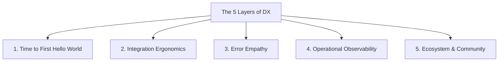

# Developer Experience is a Product Strategy

> **TL;DR:** Developer Experience (DX) is not a fluff metric or a subset of DevRel; it is a core business strategy and an unbeatable market moat. Companies like Stripe, Twilio, and GitHub did not win because they had unique underlying technology—they won because they made integration, deployment, and daily development incredibly fast and satisfying. If your product targets developers, your DX is your brand, your sales engine, and your retention strategy all rolled into one.

For a long time, the corporate world treated software developers as back-office wizards. They were the people who lived on caffeine, sat in dark rooms, and translated specifications into code. Because of this, software designed *for* developers was notoriously painful to use. It had dense, unreadable manuals, horrible Java-based command-line interfaces, non-standard APIs, and enterprise sales cycles that required three meetings and an NDA just to get a trial API key.

Then came Stripe. 

In 2011, seven lines of code replaced a multi-month negotiation with legacy banks and merchant accounts. Developers did not need to talk to a salesperson; they could copy the code block from the homepage, paste it into their local server, change a public key, and run a real test transaction in five minutes.

Stripe did not invent payment processing. They invented **World-Class Developer Experience**. And by doing so, they completely disrupted a multi-billion dollar industry and forced the entire tech ecosystem to realize a fundamental truth: **Developer Experience (DX) is the ultimate competitive advantage.**

In 2019, as developers hold more decision-making and purchasing power than ever before, understanding and optimizing DX is not an afterthought—it is a critical product strategy.

---

## What DX Actually Means (Beyond \"Good Docs\")

Too many companies think that improving Developer Experience simply means hiring a technical writer to clean up their API reference page, or throwing a SDK generator at their endpoints. This is a massive oversimplification. 

Just like User Experience (UX) covers the entire interaction a user has with a product, Developer Experience covers the entire lifecycle of a developer interacting with your technology. It is the friction they encounter from the moment they land on your marketing homepage to the day they deploy your integration to production at scale.

We can break down Developer Experience into five core layers:

### 1. Time to First "Hello World" (TTFHW)
This is the single most important metric for any developer product. How many minutes does it take for a brand-new developer to sign up, read your onboarding guide, execute a command, and see a successful, authenticated API response? If this takes longer than 15 minutes, you are losing 50% of your potential funnel. Every step—from email verification to installing dependencies—is a potential drop-off point.

### 2. Integration Ergonomics
This refers to the aesthetic and functional design of your APIs, SDKs, and CLIs. Are your endpoints intuitive and restful? Do your client libraries follow the idiomatic patterns of their host language (e.g., using promises in JavaScript, goroutines in Go, or decorators in Python)? If a developer has to fight your SDK because it feels like a poorly translated Java library, your ergonomics are broken.

### 3. Error Empathy
Errors are inevitable. What happens when a developer passes the wrong payload format or an expired token? Do you throw a generic `500 Internal Server Error` with an empty body, or do you provide a structured, helpful JSON response with a specific error code, a human-readable explanation, and a direct URL link to the exact documentation page that explains how to fix it? Helpful error messages save hundreds of hours of debugging and build immense goodwill.

### 4. Operational Observability
Once your tool is integrated, developers have to maintain it. If your API fails or behaves slowly in production, how easily can they debug it? Do you provide a clean dashboard showing request/response logs, latency graphs, and webhook delivery histories? If you make your operations opaque, developers will replace you with a tool they can observe and trust.

### 5. Ecosystem & Community
No developer product exists in a vacuum. A great DX includes a vibrant ecosystem of community-contributed libraries, stack overflow threads, guides, and forums where developers can help each other. When a developer runs into an issue, they should be able to google it and find a solution immediately.

---

## Why DX is Your Best Sales and Marketing Engine

The traditional software procurement model is dead. In the past, software was sold from the top down: an enterprise sales representative took an enterprise CIO out to golf, pitched a massive contract, and the engineering team was forced to use whatever software was purchased.

Today, software is bought from the bottom up. Developers are the gatekeepers. When a startup needs a search engine, they do not search for corporate brochures. They go to Algolia, try out the search API, build a prototype over the weekend, and present it to their CTO on Monday. By the time the purchasing decision is made, the product is already integrated.

This means **your API documentation is your primary sales page.** If your docs are messy, outdated, or hard to navigate, developers will leave and choose a competitor with better docs—even if your competitor's API is twice as expensive or lacks certain advanced features. Friction kills sales pipelines. Conversely, a delightful, low-friction onboarding experience converts developers into passionate internal champions who will fight to get your product approved and paid for.

---

## What Bad DX Costs You in Hidden Churn

Many organizations view DX as a "cost center" rather than a revenue driver. This is a catastrophic financial mistake. Bad developer experience is incredibly expensive—it simply hides in places that do not show up on a standard P&L statement:

* **Support Ticket Swarms**: When your docs are confusing or your error messages are vague, developers will overwhelm your support queues with basic integration questions. This forces you to hire more support engineers, raising your operating expenses.
* **Longer Sales Cycles**: If an integration prototype that should take three days takes three weeks because your SDKs are buggy, your sales cycles stretch out, slowing down your cash flow and revenue growth.
* **Developer Churn**: Developers hate fighting bad tools. If they spend their days wrestling with your brittle API, they will actively advocate to rip your product out and replace it with a competitor that respects their time.

Improving your Developer Experience is not about making developers "happy"; it is about maximizing your product-market fit, accelerating your sales velocity, and defending your market share against competitors who are eager to out-integrate you.

---

## Key Takeaways

- **TTFHW is Your North Star**: ruthlessly optimize the onboarding flow to minimize the time to first successful API call.
- **Error Messages are UI**: Treat API error responses with the same design discipline you would apply to a consumer-facing dashboard.
- **Procurement is Bottom-Up**: Developers are your actual buyers. Delight them first, and the business revenue will follow.

---

## Frequently Asked Questions

**Q: We have limited engineering resources. How should we prioritize DX improvements?**  
A: Start at the very beginning of the funnel. Set up a screen recording tool (like LogAssembly) or watch a non-team-member developer try to integrate your product live over Zoom. Note the exact moments they hesitate, get confused, or run a failing command. Fix those onboarding friction points first. Once the entry point is clean, move down to error messages and SDK ergonomics.

**Q: Should we write our SDKs manually or use automated generators?**  
A: While OpenAPI spec generators can save you time, pure automated generators often produce clunky, non-idiomatic code that feels alien to developers in different languages. The gold standard is a hybrid approach: generate the boilerplate, but write a custom, hand-crafted wrapper layer to ensure the SDK feels natural and idiomatic to a native JS, Python, or Go developer.

**Q: How do we measure the ROI of our developer experience initiatives?**  
A: Track metrics like developer onboarding drop-off rates, average Time to First Hello World, the volume of integration-related support tickets, and your documentation search query patterns (to identify where developers are getting stuck). A reduction in integration-related support tickets alongside an increase in API key activations is a clear sign of DX success.

---

*If this made you think, it'll do even more when shared. Hit that subscribe button — I write about developer experience, product strategy, and api design every week and I promise to keep it real.*

*— [Shantanu Vishwanadha](https://substack.com/@thecoderpanda)*
