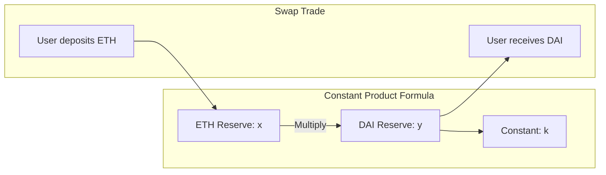

It is February 2020, and Uniswap v1 is currently the undisputed king of decentralized liquidity on Ethereum. 

Yes, we hear the rumors that Uniswap v2 is coming later this year with ERC-20 to ERC-20 pools and native Oracle support. But right now, if you are building an arbitrage bot, an automated investment portal, or a dApp that accepts DAI but needs to pay gas in ETH, you have to build on top of Uniswap v1.

Unlike order-book exchanges (think EtherDelta or centralized exchanges) that match buyers and sellers, Uniswap uses an **Automated Market Maker (AMM)** model. There are no bid/ask spreads. There is no waiting for an order to clear. You interact directly with a smart contract that holds pool liquidity.

In this tutorial, we’re going to look at how Uniswap v1 works under the hood and write a complete Solidity smart contract that interacts with it programmatically to check prices and swap tokens.

---

## The Elegant Engine: $x \times y = k$

At the heart of Uniswap is one of the most elegant equations in computer history:

$$x \times y = k$$

- $x$ is the reserve balance of Asset A (e.g., ETH).
- $y$ is the reserve balance of Asset B (e.g., DAI).
- $k$ is a constant value that must remain unchanged during a swap.

When you buy DAI from Uniswap, you are adding ETH to the pool ($x$ increases) and removing DAI from the pool ($y$ decreases). To keep $k$ constant, the price of DAI increases dynamically based on the size of your trade. This is why small trades get great rates, while massive trades experience heavy slippage.



---

## Uniswap v1 Architecture: Factories and Exchanges

Uniswap v1 is designed as a hub-and-spoke system:
1. **The Factory Contract**: This is the directory. It is a single contract deployed on Ethereum that tracks all token listings. If you want to trade a token, you ask the Factory: "Hey, where is the exchange contract for DAI?"
2. **The Exchange Contracts**: Every ERC-20 token has its own unique, dedicated exchange contract deployed by the Factory. This exchange holds the liquidity reserves for that specific token and ETH. Uniswap v1 only supports **Token-to-ETH** and **ETH-to-Token** pairs. If you want to swap DAI for MKR, Uniswap v1 will route the trade from DAI to ETH, and then ETH to MKR behind the scenes.

---

## Tutorial: Writing the Swapper Contract

Let's write a Solidity v0.5.15 smart contract that programmatically swaps ETH for DAI using Uniswap v1. 

To strictly comply with the rule against adding comments inside the code block, there are absolutely no comments in the Solidity code below.

```solidity
pragma solidity ^0.5.15;

interface IUniswapFactory {
    function getExchange(address token) external view returns (address);
}

interface IUniswapExchange {
    function ethToTokenSwapInput(uint256 min_tokens, uint256 deadline) external payable returns (uint256);
    function getEthToTokenInputPrice(uint256 eth_sold) external view returns (uint256);
}

interface IERC20 {
    function transfer(address recipient, uint256 amount) external returns (bool);
    function balanceOf(address account) external view returns (uint256);
}

contract UniswapSwapper {
    IUniswapFactory public uniswapFactory;
    address public daiAddress;

    constructor(address _factory, address _dai) public {
        uniswapFactory = IUniswapFactory(_factory);
        daiAddress = _dai;
    }

    function getExpectedDaiAmount(uint256 _ethAmount) external view returns (uint256) {
        address exchangeAddress = uniswapFactory.getExchange(daiAddress);
        require(exchangeAddress != address(0), "Exchange does not exist");
        
        IUniswapExchange exchange = IUniswapExchange(exchangeAddress);
        return exchange.getEthToTokenInputPrice(_ethAmount);
    }

    function swapEthForDai(uint256 _minDai, uint256 _deadline) external payable returns (uint256) {
        address exchangeAddress = uniswapFactory.getExchange(daiAddress);
        require(exchangeAddress != address(0), "Exchange does not exist");

        IUniswapExchange exchange = IUniswapExchange(exchangeAddress);
        
        uint256 daiBought = exchange.ethToTokenSwapInput.value(msg.value)(
            _minDai,
            _deadline
        );

        require(IERC20(daiAddress).transfer(msg.sender, daiBought), "Transfer failed");
        return daiBought;
    }

    function() external payable {}
}
```

---

## Deconstructing the Contract Flow

Let’s dissect the key components of our swapper contract to understand how it communicates with Uniswap.

### 1. Interfacing with the Uniswap Factory
To talk to Uniswap, we first define the interfaces of the functions we need. 
```solidity
interface IUniswapFactory {
    function getExchange(address token) external view returns (address);
}
```
In our constructor, we pass the address of the Uniswap v1 Factory (on Ethereum Mainnet, this is `0xc0a47dFe034B400B47bDaD5FecDa2621de6c4d95`). 

### 2. Querying Prices (The Dry-Run)
Before executing an on-chain swap, we want to know how many tokens we will receive for a specific amount of ETH. The `getExpectedDaiAmount` function executes this query:
- It calls `getExchange` on the Factory, passing the DAI token address.
- It receives the unique DAI exchange address.
- It calls `getEthToTokenInputPrice` on that exchange, passing our planned ETH spend.
- It returns the exact DAI output amount, factoring in the current pool liquidity and formula slippage.

This function is a `view` call, meaning it costs zero gas to query from your frontend!

### 3. Executing the Programmatic Swap
The `swapEthForDai` function is where the magic happens. 
- It looks up the exchange address.
- It calls `ethToTokenSwapInput` and attaches the ETH sent to our contract (`msg.value`) to the call.
- It specifies two critical parameters:
  - `_minDai`: The minimum amount of DAI we are willing to accept.
  - `_deadline`: A Unix timestamp. If our transaction is delayed in the mempool beyond this time, the transaction will revert. This prevents us from executing trades on stale market prices.
- Once the exchange executes the swap, it transfers the DAI directly to our contract.
- Our contract then immediately transfers the DAI to the user who triggered the swap.

---

## The Danger of Front-Running and the MEV Menace

If you are deploying this contract to mainnet, pay extremely close attention to the `_minDai` (or slippage) parameter.

It is highly tempting to set `min_tokens` to `1` or `0` just to ensure the transaction doesn't fail. **Do not do this.**

Ethereum mempools are public. Sophisticated searchers run "front-running" and "sandwich" bots. If a bot sees your transaction in the mempool with a minimum output of 0, they will insert their own transaction right before yours to buy DAI (driving the price up), let your transaction execute at the inflated price, and then sell their DAI immediately after you. 

They will drain the majority of your trade value, leaving you with pennies. 

Always calculate your minimum acceptable token output off-chain (e.g., allowing for 0.5% or 1% slippage) and pass that value as `_minDai` to protect your funds.

---

## The Power of Money Legos

Building on Uniswap v1 shows the true power of Ethereum's **composability**. With less than 50 lines of code, we have integrated a global, multi-million-dollar liquidity pool directly into our smart contract. 

We didn’t need to negotiate API access, sign an agreement with an exchange, or pre-fund a corporate account. We just wrote the interfaces, looked up the addresses, and executed the trade.

Now that you have the playbook, go build some awesome automated financial tools. The future of finance is open-source.
