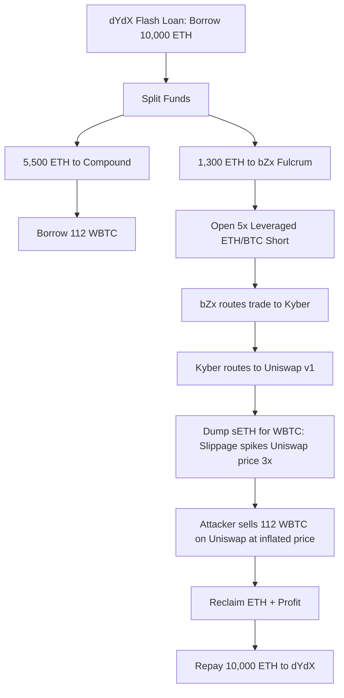

It’s February 2020, and if you’re anywhere near Denver right now, you’re probably nursing a craft beer hangover, arguing about Eth2 staking, and pretending you understand how quadratic funding works. The air is crisp, the hoodies are oversized, and the vibes are immaculate. 

But while the Ethereum community is busy clinking glasses and celebrating "money legos," a silent assassin just walked into the room, took a look at our shiny new playground, and decided to run a live-fire exercise.

I’m talking about bZx.

Over the span of a few days, an anonymous actor executed what can only be described as a beautiful, terrifying, and deeply educational masterclass in financial engineering. They walked away with nearly $900,000 across two separate attacks, using nothing but a laptop, some ether for gas, and the ultimate weapon of mass composability: the flash loan.

If you thought smart contract security was just about preventing reentrancy or checking integer overflows, grab your coffee. We’ve officially entered the era of economic exploit design.

---

## The Perfect Weapon: Enter the Flash Loan

Before we dissect the crime scene, we need to understand the weapon. 

Flash loans are a concept unique to decentralized finance. In the legacy financial system, if you want to borrow $10 million, you need collateral, a mountain of paperwork, three credit checks, and probably a blood oath. 

In DeFi? You can borrow $10 million with **zero collateral**, under one simple, atomic condition: you must pay it back in the exact same Ethereum transaction.

If you fail to return the funds by the end of the transaction execution, the entire block of operations rolls back as if it never happened. It’s like traveling back in time to undo a bad bet. For developers, this is a superpower. For hackers, it is a risk-free, infinitely funded war chest.

In the first bZx attack on February 15, the attacker didn't need to risk a single penny of their own capital to manipulate the market. They just borrowed 10,000 ETH from dYdX, split it up, and weaponized the composability of the Ethereum ecosystem against itself.

---

## Anatomy of the First Attack: The $350K WBTC Squeeze

The first exploit is a gorgeous piece of financial gymnastics. Let's trace the transaction flow step-by-step to see how the money legos were stacked—and then smashed.

### Step 1: The War Chest
The attacker borrows **10,000 ETH** from dYdX’s flash loan contract. 

### Step 2: The Collateral Setup
They send **5,500 ETH** to Compound. Using this ETH as collateral, they borrow **112 WBTC** (Wrapped Bitcoin). This is their escape vehicle.

### Step 3: The Short Position & The Oracle Squeeze
They send **1,300 ETH** to bZx’s Fulcrum platform to open a 5x leveraged short position against the ETH/BTC pair. 

Here is where the fatal flaw lies. Fulcrum needed to execute this trade on-chain. To do so, it routed the trade through Kyber Network, which in turn relied heavily on Uniswap v1 for its price feed. 

When the attacker’s 5x leveraged position dumped a massive amount of ETH for WBTC on Uniswap, it caused astronomical slippage. The price of WBTC on Uniswap skyrocketed to three times its actual market value. 

### Step 4: The Cash Out
Because the price of WBTC on Uniswap was now artificially inflated to insane heights, the attacker took the 112 WBTC they had borrowed from Compound and sold them directly back into the hyper-inflated Uniswap pool. 

They walked away with a massive pile of ETH, paid back the 10,000 ETH dYdX flash loan, and pocketed **1,193 ETH** (worth about $350,000 at the time) in pure, unadulterated profit.

The bZx smart contracts behaved exactly as they were written. There was no code injection, no private key theft, and no traditional exploit. It was pure economic arbitrage, powered by forced slippage on an illiquid price oracle.

---

## Act II: The $640K sUSD Oracle Trick

If you thought bZx would immediately patch their contracts and secure their oracles, you under-estimate the speed of DeFi growth in 2020. Just days later, on February 18, the same (or a highly copycat) actor struck again. This time, they targeted the Synthetix USD (sUSD) stablecoin peg on bZx.

1. **Borrow**: The attacker flash-loaned 7,500 ETH from dYdX.
2. **Pump**: They used 900 ETH on Kyber and Uniswap to buy up sUSD, driving the exchange rate of sUSD up to $2.27 on those pools.
3. **Dump**: bZx used these exact pools as its oracle feed. Believing sUSD was worth $2.27, bZx allowed the attacker to deposit sUSD and borrow 1,096,000 sUSD worth of ETH as collateral.
4. **Walk Away**: The attacker defaulted on the bad loan, returned the 7,500 ETH flash loan, and walked away with **2,378 ETH** (~$640,000).

Once again, a thin, easily manipulated liquidity pool was used as a single source of truth for a multi-million-dollar financial protocol.

---

## Why "Money Legos" Are High-Yield Explosives

The bZx attacks have exposed the dangerous underbelly of **composability**. 

In DeFi, we love to brag about how easily protocols integrate with one another. "Look! My contract talks to Uniswap, which talks to Kyber, which loans on Compound!" 

But composability is a double-edged sword. When you integrate with another protocol, you are inheriting its entire risk profile. If Uniswap’s price feed is illiquid, your lending protocol is vulnerable. If Kyber's routing logic has a quirk, your derivatives platform can be drained.

We are building a highly leveraged, interdependent financial skyscraper on top of a foundation made of sand. When one block wobbles, the entire tower threatens to collapse.

---

## How to Fix the Oracle Problem

If you are a smart contract developer, the bZx attacks should be carved into your brain. Here are the immediate takeaways for building secure on-chain systems:

- **Never use spot prices as an oracle**: If a contract reads the current price of an asset from a single DEX pool, it is vulnerable. An attacker can always use a flash loan to temporarily skew that pool's balance, execute an action on your contract at the distorted price, and restore the pool.
- **Implement TWAP (Time-Weighted Average Price)**: Uniswap v2 (which is coming later this year!) promises to introduce TWAP oracles. By averaging prices over multiple blocks, it becomes exponentially more expensive for an attacker to manipulate the price because they cannot do it atomically within a single block.
- **Use decentralized oracle networks**: Platforms like Chainlink that aggregate prices across multiple independent nodes and off-chain exchanges are proving to be the only reliable way to secure high-value lending pools.

---

## The Road Ahead

The bZx exploits are painful, but they are exactly what DeFi needs. Every hack is an expensive, public audit that makes the ecosystem more resilient. We are stress-testing the future of global finance in real-time, with real money, on a public ledger.

The next time someone tells you DeFi is ready for institutional mass adoption, smile and tell them the story of the $900,000 flash loan. We’ve got a lot of building to do before we're ready for prime time.

Now, if you'll excuse me, I need to go check if my collateral on Compound is still where I left it. Stay safe out there, anonyms.
