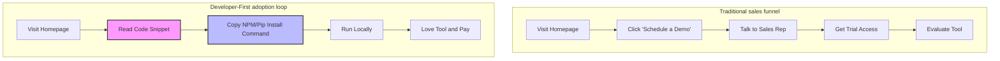

Let’s start with an undisputed, universal truth: **developers absolutely despise marketing**.

We have built-in, military-grade bullshit detectors. If we land on a product homepage and see copy like: "Leverage our paradigm-shifting, AI-driven, cloud-native synergy platform to optimize your enterprise velocity," our immediate physical reaction is to roll our eyes, press `Cmd + W`, and never return.

We block ads, we ignore sponsored emails, we roll our eyes at trade show booths, and we treat traditional salespeople with the same level of suspicion as a suspicious binary we downloaded from a sketchy forum.

And yet, developer tools (DevTools) are a multi-billion dollar, hyper-growth industry. Platforms like Stripe, Twilio, GitHub, and Datadog are valued in the tens of billions. 

They didn't grow by hiding from developers. They grew because they figured out how to market to developers without *feeling* like marketing. 

If you are a founder, a Developer Relations (DevRel) engineer, or a technical writer trying to grow a developer tool in 2020, you need to throw out the traditional B2B marketing playbook. Here is the developer-centric playbook that actually works.

---

## Principle 1: Show Me the Code (Ditch the "Schedule a Demo" Gate)

If your developer tool has a button on the homepage that says "Schedule a Demo" instead of "Read the Docs" or "Get Started for Free," you have already lost 80% of your audience.

Developers do not want to talk to a sales representative named Chad who doesn't know what a docker container is. They want to play with the tool, break it, run it locally, and see if it actually solves their problem before they ever enter a credit card.

Your marketing must lead with **technical artifacts**:
- Put a clean, realistic code snippet on the homepage showing exactly how your API is initialized.
- Place the install command (`npm install` or `pip install`) above the fold.
- Make your technical documentation public and searchable. Never, ever put documentation behind a login wall.

---

## Principle 2: The Documentation IS the Marketing

Here is a secret that most marketing directors don't understand: **your documentation is your actual homepage**.

When a developer is trying to decide whether to use your tool, they don't look at your customer testimonials page. They head straight to your API reference and installation guides. 
- If your docs are outdated, full of broken links, or missing basic getting-started guides, they will assume your software is equally buggy.
- If your docs are clean, fast, search-optimized, and contain copy-pasteable examples that work on the first try, they will trust your product implicitly.

Documentation is the ultimate form of high-converting content marketing. Stripe didn’t win the payment market because their processing fees were significantly cheaper than the banks; they won because developers could copy-paste their beautiful curl requests and have a working checkout flow running in five minutes.

---

## Principle 3: Write "Educational-First" Content (The Engineering Deep-Dive)

If you are running a blog for a developer tool, stop writing fluffy company updates or superficial industry listicles. Nobody cares that your CEO spoke at a local panel, and no serious developer is searching for "Top 5 software trends for 2020."

Instead, write high-quality, deeply technical educational content that teaches developers a concept, regardless of whether they use your tool.

- **Example**: If you are selling an API-first database, don't just write posts about how great your database is. Write an exhaustive, under-the-hood guide explaining how B-Tree indexes work, or a step-by-step tutorial on optimizing PostgreSQL queries.
- **Why it works**: Developers love to learn. When you write a legendary guide explaining a complex technical topic, developers will share it on Hacker News, Reddit, and Twitter. They will bookmark it and return to it. By providing massive value upfront with zero sales pitch, you build an immense amount of brand authority and goodwill. When they eventually need a database, your company will be the first one they think of.

---

## Principle 4: Embrace the Trade-Offs

Traditional marketing is about pretending your product is a perfect, flawless miracle that solves every problem in the universe.

Developers know this is a lie. Every piece of software has trade-offs. Every database has write bottlenecks. Every API has latency limits.

If you try to paint your developer tool as a silver bullet, technical users will instantly call bullshit. Instead, win their trust by being brutally honest about what your tool can and *cannot* do.

- **Write about your limitations**: "Our database is built for hyper-fast, low-latency reads, but if your application requires heavy, concurrent write loads, PostgreSQL is probably a better choice for you."
- **Publish your post-mortems**: If your system goes down, don't hide behind a generic "We experienced temporary network degradation" status page. Write a detailed, technical post-mortem explaining exactly what caused the database deadlock, how your team diagnosed it, and what architectural changes you are making to prevent it from happening again.

Developers respect nothing more than transparency, humility, and raw engineering honesty.

---

## The Three Content Pillars for DevTools

To structure your content calendar, focus on these three high-value content pillars:

| Content Pillar | Description | Example |
| :--- | :--- | :--- |
| **The "How-It-Works" Deep-Dive** | Deconstructing complex engineering systems, protocols, or algorithms. | "How TCP Handshakes Work: A Visual Guide" |
| **The Practical Integration Tutorial** | Step-by-step developer guides showing how to build a complete app using your tool and neighboring frameworks. | "Building a Real-Time Chat App with React, WebSockets, and [Your Tool]" |
| **The Comparative Analysis** | Objective, zero-fluff comparison of your tool against alternatives, including open-source options. | "[Your Tool] vs. Redis: When to Use Which" |

---

## Conclusion: Write for Your Peers

To market successfully to developers, you have to remember that developers are your peers. They are logical, curious, problem-solving human beings who just want to build cool stuff.

Stop trying to sell to them. Start helping them.

Write the documentation you wish you had. Write the blog posts you would bookmark yourself. Open up your code, show your trade-offs, and treat their intelligence with respect.

If you help developers build better software faster, they won't just buy your tool—they’ll tell all their friends about it. And that is the only developer marketing that actually matters.
