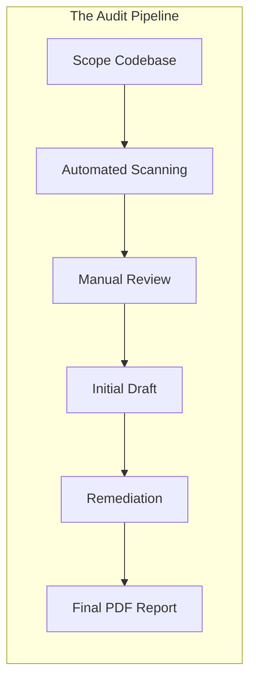
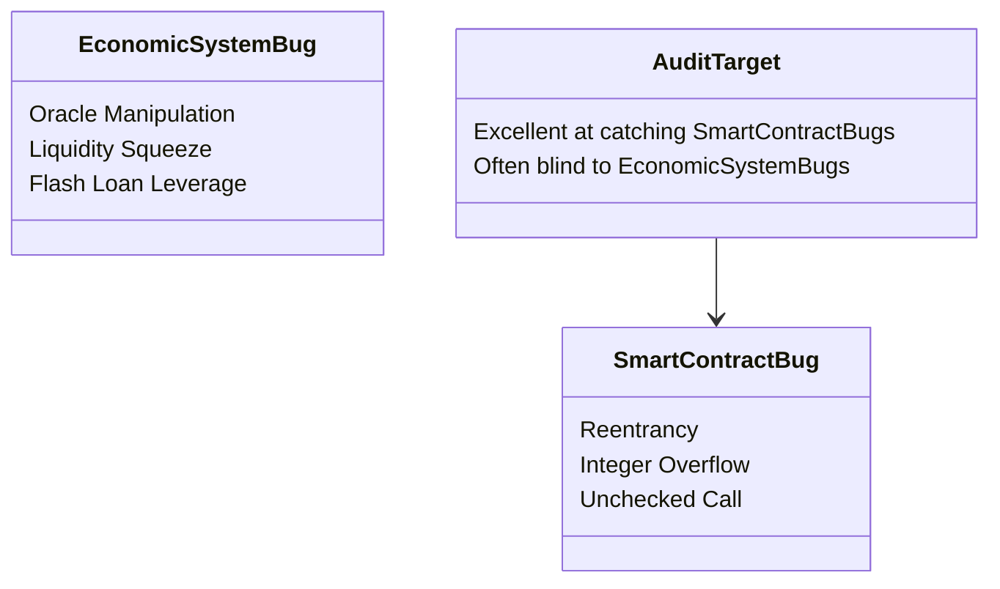

In the DeFi space right now, there is a magical PDF that holds the power of life and death over a project.

I’m talking about the **Smart Contract Audit Report**.

When a new lending protocol or decentralized exchange launches, the first thing the community asks in their Telegram channel is: "Is it audited?" 

If the founders can wave an audit report from a premier security firm like OpenZeppelin, ConsenSys Diligence, or Trail of Bits, it’s treated like a holy shield. Investors breathe a sigh of relief, deposit millions of dollars into the smart contracts, and assume their funds are 100% safe.

But then, a week later, some anonymous developer finds a loophole in the price oracle, leverages a flash loan, drains $10 million from the protocol, and walks away into the sunset. 

The community is left in shock, staring at their screen and screaming: "But the audit! The project was audited! How could this happen?!"

Today, let’s peel back the curtain. Let’s talk about how smart contract audits *actually* work, what security engineers find, what they consistently miss, and why an audit is never, ever a guarantee of safety.

---

## What a Smart Contract Audit Actually Is

Let’s start with what an audit is NOT. 

An audit is not a seal of approval from a digital pope. It is not an automated security check, nor is it a stamp of safety.

A smart contract audit is a **human-driven, manual peer review** of a specific snapshot of code at a specific moment in time. 

Think of it like an editor reviewing a book manuscript. The editor can catch spelling errors, plot holes, and logical inconsistencies. But if the author rewrites three chapters right before publishing, or if a reader finds a way to misinterpret the text to commit a crime, the editor cannot prevent that.

---

## Deconstructing the Audit Process

When a security firm audits a project, they follow a highly structured engineering pipeline. Here are the core stages:

### 1. Threat Modeling & Scope
Before reading a line of code, the auditors sit down with the developers to understand the protocol’s architecture. What is the intended business logic? Who has custody of the funds? What are the worst-case scenarios? If the auditors don't understand how the system is *supposed* to work, they can’t find where it fails.

### 2. Automated Static Analysis
Next, the team runs the codebase through static analysis tools. Programs like Slither, Mythril, and Securify parse the Solidity AST (Abstract Syntax Tree) to flag common programming mistakes:
- Reentrancy vulnerabilities
- Integer underflows/overflows
- Unchecked external calls
- Improper access control restrictions

Automated tools are fast and great at catching low-hanging fruit, but they are incredibly dumb. They have zero understanding of business logic or market economics.

### 3. Manual Code Review (The Real Meat)
This is where the magic happens. Two or three security researchers pull up the codebase in their IDEs and walk through it, line-by-line, trace-by-trace. 

They play the role of the antagonist. They ask themselves: 
- "What happens if I call this function with zero value?"
- "Can I trick the protocol into thinking I have more collateral than I actually do?"
- "What happens if a dependency I rely on goes down or changes its behavior?"

Manual review catches 90% of the critical logical vulnerabilities. It requires high technical expertise, deep knowledge of the EVM, and a highly creative, cynical mindset.

### 4. Reporting & Remediation
The auditors deliver an initial draft of the report to the dev team, detailing every finding categorized by severity: **Critical, High, Medium, Low, and Informational**. 

The dev team then rushes to write fixes, which the auditors verify before compiling the final public PDF report.

---

## Why Audited Projects Still Get Hacked

If some of the smartest engineers in the world are walking through these codebases line-by-line, why do we see multiple multi-million-dollar hacks every single month?

### 1. The "Moving Target" Fallacy
An audit is only valid for a specific git commit hash. 

Often, a startup will get an audit on commit `a1b2c3`. But during the three weeks of the audit, they realize they need to add a new feature, or fix a minor UI bug. They make some quick code edits, commit `x7y8z9` directly to production, and launch.

Even a three-line code change can introduce a fatal reentrancy bug. If the code deployed to the mainnet doesn’t match the exact commit audited, the audit report is effectively useless.

### 2. The Composable Blindspot (The Economic Bug)
Auditors are historically great at catching programming errors in Solidity. They can tell you if your math is off, or if your loops are too expensive.

But they are historically terrible at threat-modeling **economic and oracle dynamics**.

Take the bZx flash loan exploits. The smart contracts behaved perfectly. There was no Solidity bug, no compiler quirk, and no reentrancy loophole. The vulnerability lay in the fact that the protocol trusted Kyber/Uniswap for spot prices, allowing an attacker to use massive capital leverage to skew the market. 

Traditional auditors don’t run simulation engines to see how your protocol behaves under extreme market volatility, low liquidity, or highly leveraged flash-loan attacks. They check code correctness, not economic sanity.

### 3. The Dependency Trap
Your smart contract doesn’t live in a vacuum. It interacts with other ERC-20 tokens, lending pools, and decentralized exchanges. 

If your code is audited and secure, but you rely on an external protocol that gets upgraded, hijacked, or behaves unexpectedly, your contract can still be drained. You are inheriting the security risk of every single contract you compose with.

---

## How to Get the Most Out of an Audit

If you are a developer preparing for a security audit, don't treat it as an outsourced QA department. Here is how to prepare your project to ensure the auditors can find the bugs that actually matter:

- **Achieve 100% Test Coverage**: If your developers haven't written comprehensive unit and integration tests, you are wasting your money. Auditors should spend their expensive time looking for complex structural loopholes, not checking if your basic transfer functions work.
- **Write Extensive Documentation**: Provide clear specifications, architecture diagrams, and plain-English explanations of how every function is intended to behave.
- **Run Automated Tools Yourself**: Before handing your code to auditors, run Slither and Mythril. Clean up all the compiler warnings and low-hanging linting issues so the auditors can focus on the hard parts.

---

## Conclusion: Security is a Process, Not a PDF

An audit report is a valuable diagnostic tool, but it is not a silver bullet. 

In decentralized finance, security is not a milestone you reach and cross off your list. It is an ongoing, continuous battle. 

As long as the economic incentives to hack these protocols remain astronomical, hackers will continue to invent new ways to bypass our security designs. We must combine audits with bug bounties, economic simulations, multi-signature governance, and continuous on-chain monitoring.

Do not let an "Audited" stamp lull you into a false sense of security. Stay vigilant, stay skeptical, and write tests like your protocol's life depends on it. 

Because in DeFi, it actually does.
