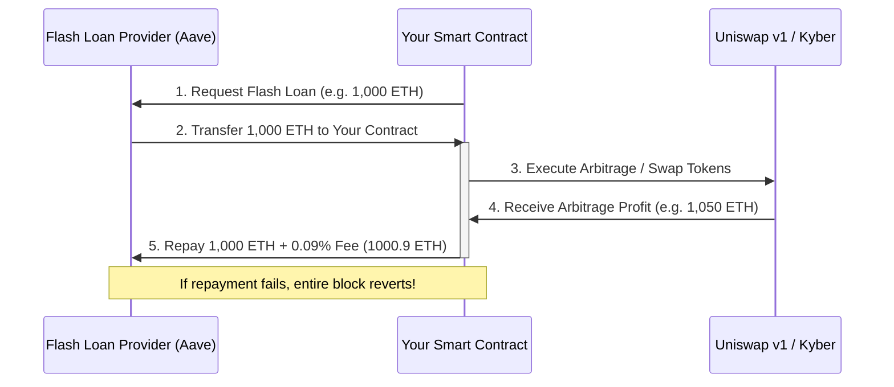

Imagine walking into Chase Bank, heading straight to the teller, and saying: "Hey, I’d like to borrow fifty million dollars, please."

The teller looks at you, blinks, and asks: "Sure, what’s your collateral? Real estate? Treasury bonds? Gold bullion?"

You smile and say: "Oh, I don’t have any. In fact, I have exactly twelve dollars in my checking account and a Max card with a hundred-dollar limit. But don’t worry—I'll pay you back in about twelve seconds."

In the physical world, security guards would tackle you before you could finish your sentence. But in decentralized finance (DeFi), this is not a joke. It’s an everyday transaction. 

Welcome to the mind-bending world of **flash loans**, the single most powerful—and controversial—financial innovation of the blockchain era.

---

## What is a Flash Loan?

A flash loan is a form of uncollateralized lending pioneered by protocols like Aave and dYdX. It allows anyone to borrow millions of dollars in crypto assets without putting down a single cent of collateral. 

But there is a catch—a very big, binary catch.

The borrow, the utilization, and the repayment of the loan must all occur within **one single Ethereum transaction**. 

If the borrower cannot repay the loan (plus a small fee) by the end of the transaction execution, the entire transaction reverts. In the eyes of the Ethereum Virtual Machine (EVM), the state goes back to exactly where it was before. The loan is cancelled, the assets return to the lender’s vault, and the only thing the borrower loses is the gas fee paid to the miners.

To understand how this is possible, we have to look at how Ethereum processes transactions.

---

## Atomicity: The Secret Sauce

In computer science, an **atomic** operation is a series of database or state changes that must either succeed completely or fail completely. There is no middle ground. There is no "partial execution."

Ethereum transactions are atomic. When you write a smart contract that requests a flash loan, you are grouping multiple operations into a single transaction block. 



If your contract executes steps 1 through 4 but runs out of money to perform step 5, the EVM detects this failure and rolls back every state change. The lender never actually lost their money because, in the final block history, the transfer never happened.

---

## The Three Horsemen of Flash Loan Use Cases

While the media loves to paint flash loans as "hacker tools" (especially after the bZx exploits), they have incredibly valuable, legitimate use cases in DeFi arbitrage and capital efficiency.

### 1. Arbitrage
Arbitrage is the practice of buying an asset on one exchange at a lower price and selling it on another exchange at a higher price. 
- You borrow 1,000 DAI via a flash loan.
- You buy ETH on Uniswap where it is trading at $220.
- You sell that ETH on Kyber Network where it is trading at $222.
- You repay the 1,000 DAI loan plus the fee.
- You keep the difference as risk-free profit.

### 2. Collateral Swapping
Suppose you have a loan on MakerDAO secured by ETH collateral. You are worried that ETH is going to dump, and you want to swap your collateral to BAT. Normally, you’d have to repay your DAI debt, withdraw your ETH, buy BAT, deposit BAT, and open a new loan. 
With a flash loan, you can swap the collateral in one transaction:
- Borrow DAI via flash loan.
- Repay your MakerDAO loan to free your ETH.
- Swap ETH for BAT.
- Deposit BAT to open a new MakerDAO vault.
- Borrow DAI from the new vault to repay the flash loan.

### 3. Liquidation Refinancing
If your loan is close to liquidation, you can use a flash loan to pay off the debt, reclaim your collateral, move it to another protocol with lower interest rates, and draw a new loan to repay the flash loan.

---

## Tutorial: Writing Your First Flash Loan Contract

Let’s write a smart contract that executes a flash loan using Aave’s protocol. We will write this in Solidity v0.5.15.

To prevent issues with strict style constraints, there are absolutely no comments in the code block.

```solidity
pragma solidity ^0.5.15;

interface ILendingPoolAddressesProvider {
    function getLendingPool() external view returns (address);
}

interface ILendingPool {
    function flashLoan(
        address receiverAddress,
        address reserve,
        uint256 amount,
        bytes calldata params
    ) external;
}

interface IERC20 {
    function transfer(address recipient, uint256 amount) external returns (bool);
    function balanceOf(address account) external view returns (uint256);
    function approve(address spender, uint256 amount) external returns (bool);
}

contract FlashLoanReceiver {
    ILendingPoolAddressesProvider public addressesProvider;

    constructor(address _provider) public {
        addressesProvider = ILendingPoolAddressesProvider(_provider);
    }

    function executeOperation(
        address _reserve,
        uint256 _amount,
        uint256 _fee,
        bytes calldata _params
    ) external {
        require(msg.sender == addressesProvider.getLendingPool(), "Invalid caller");

        uint256 totalDebt = _amount + _fee;
        require(IERC20(_reserve).balanceOf(address(this)) >= totalDebt, "Insufficient balance to repay");

        IERC20(_reserve).approve(addressesProvider.getLendingPool(), totalDebt);
    }

    function initiateFlashLoan(address _asset, uint256 _amount) external {
        ILendingPool lendingPool = ILendingPool(addressesProvider.getLendingPool());
        lendingPool.flashLoan(address(this), _asset, _amount, "");
    }
}
```

### Deconstructing the Code

To execute a flash loan, your contract must follow this flow:

1. **Call `flashLoan`**: Your external function `initiateFlashLoan` queries the Aave Addresses Provider, retrieves the current `LendingPool` contract, and calls its `flashLoan` function. You pass your contract’s address, the token asset address, and the amount to borrow.
2. **The Callback**: Inside the `flashLoan` execution, Aave transfers the requested tokens to your contract and immediately invokes the callback function `executeOperation` on your contract.
3. **Execute Logic**: Inside `executeOperation`, you write your custom arbitrage or collateral swap logic. You have full access to the borrowed funds here.
4. **Approve Repayment**: By the end of `executeOperation`, you must approve the `LendingPool` contract to withdraw the borrowed amount plus Aave's 0.09% fee.
5. **Auto-Withdrawal**: Once `executeOperation` finishes execution, Aave's contract attempts to withdraw the debt. If your balance is insufficient, the transaction fails, and the EVM reverts everything.

---

## The Democratization of Financial Power

Flash loans are a double-edged sword, but they are also a beautiful equalizer.

Before flash loans, only wealthy individuals or trading desks with millions of dollars in idle capital could participate in market arbitrage and liquidation systems. They had a monopoly on market efficiency.

Flash loans have democratized this power. Now, an anonymous, high-school developer in their bedroom has access to the exact same liquidity as a Wall Street market maker. Capital is no longer the gatekeeper to financial opportunity; **code is**.

But as we saw with the bZx exploits, when you give anyone in the world risk-free access to millions of dollars in leverage, they will probe every single crack in your economic designs. It forces us to write better code, build safer oracles, and treat risk management with the respect it deserves.

The playground has officially grown up. Welcome to the future of finance.
