If you listen to the venture capitalists on Sand Hill Road right now, they’ll tell you that the formula for building a successful software startup is set in stone.

Here’s the playbook: raise a seed round, sign an absurdly expensive five-year lease on a brick-walled office in SoMa, buy a couple of Herman Miller chairs and a Ping-Pong table, and mandate that every engineer must sit in that office from 9 AM to 7 PM. You need "serendipitous watercooler collisions," they say. You need "physical alignment," they argue.

I think they’re selling you a lifestyle from 2010.

It is February 2020, and you can feel a massive shift in the air. San Francisco rents have reached parody-level heights, global developer talent is exploding outside the US, and the tooling has finally caught up to the dream. 

Remote work isn’t just for digital nomads writing travel blogs from a hammock in Bali anymore. It is fast becoming the single greatest unfair advantage a technical startup can have. 

If you are starting a company in 2020, building a remote-first engineering team isn't just a lifestyle perk—it is an operational strategy for hyper-scale. Let’s break down the developer startup playbook for the decade of asynchronous output.

---

## The Illusion of Presence

The biggest obstacle to building a great remote team is the "butt-in-seat" management style inherited from the industrial revolution. 

Managers love physical presence because it’s an easy proxy for productivity. If Dave is sitting at his desk typing furiously, he must be working, right? Never mind that Dave has been staring at a CSS bug for three hours or browsing Reddit in a hidden tab. 

When you move a team remote, that proxy disappears. You can’t see people anymore. This terrifies traditional managers because they are forced to do something they’ve avoided for years: **measure actual output**.

In a remote-first team, presence is replaced by artifacts. Your git commits, your architectural RFCs, your closed Linear tickets, and your pull requests are the only things that prove you exist. And honestly? This is the best thing that can happen to a software engineering team. It filters out the political talkers and elevates the execution-focused builders.

---

## Principle 1: Asynchronous Over Synchronous

If you take an office-first culture and try to run it remotely without changing your philosophy, you will fail. You’ll end up with "Zoom fatigue" by week two. 

Office-first remote teams make the mistake of trying to recreate the physical office online. They mandate that everyone must be active on Slack at the same time, they schedule six stand-up meetings a day, and they treat instant messaging like a real-time tap on the shoulder.

This is a developer productivity death trap.

Software development requires deep, uninterrupted focus. It takes an engineer about 20 to 30 minutes to get back into "the zone" after a single interruption. If your Slack is pinging every five minutes with "quick questions," your engineers are spending 100% of their mental energy managing notifications instead of writing code.

```mermaid
gantt
    title Async vs. Sync Developer Day
    dateFormat  HH:mm
    axisFormat %H:%M
    
    section Sync Developer (Interrupted)
    Deep Work Focus :a1, 09:00, 10:00
    Slack Ping Interruption :after a1, 10:00, 10:30
    Deep Work Focus :after a1, 10:30, 11:15
    Standup Meeting :after a1, 11:15, 12:00
    Lunch :12:00, 13:00
    Deep Work Focus :13:00, 14:00
    "Quick Sync" Call :14:00, 14:45
    Deep Work Focus :14:45, 17:00

    section Async Developer (Uninterrupted)
    Deep Work Block 1 :active, b1, 09:00, 12:00
    Lunch :12:00, 13:00
    Review Docs & PRs :b2, 13:00, 14:00
    Deep Work Block 2 :active, b3, 14:00, 17:00
```

The remote-first playbook flips this on its head. You must design your systems to be **asynchronous by default**:
- **Ditch the daily standup**: Replace it with a written update in a dedicated Slack channel or on Linear. 
- **Normalize slow replies**: Answering a Slack message within 2 to 3 hours should be considered perfectly acceptable, not a sign of slacking off.
- **Write it down**: If you have a design decision to make, don’t jump on a call. Write a 1-page Notion RFC, tag the relevant stakeholders, and give them 24 hours to leave comments.

---

## Principle 2: The Written Culture (If it isn't documented, it doesn't exist)

In a physical office, knowledge is tribal. It lives in the heads of senior developers and is passed down via whispered conversations, whiteboards, and casual coffee chats. 

In a remote-first team, tribal knowledge is a systemic liability. If a developer in London has to wait for a developer in San Francisco to wake up just to ask where a database configuration is stored, your development speed drops to a crawl.

You must cultivate an extreme written culture:
- **Write RFCs for everything**: Before writing a single line of code for a major feature, write an architecture design document.
- **Maintain a single source of truth**: Use tools like Notion or Almanac to store team wikis, deployment guides, and onboarding playbooks. If a piece of information is updated, update the doc immediately.
- **Use video as a fallback, not a baseline**: Use Loom to record quick, 3-minute screen shares explaining a feature walkthrough or a bug repo. It’s far more efficient than dragging three people onto an ad-hoc Zoom call.

---

## Principle 3: Trust Through Automation (Tooling is Culture)

When you don’t see your developers, how do you know they are writing good code? Simple: you let the machine check it.

In a remote-first startup, your continuous integration (CI) pipeline is your head of engineering. It doesn't sleep, it doesn't have bad days, and it has no personal bias.
- **Strict linting and formatting**: Run automatic formatters (like Prettier, Black, or Rustfmt) on every pull request. No dev should ever argue about tabs vs. spaces in a PR review.
- **Automated test suites**: Your CI pipeline must run the full test suite on every branch push. If the tests fail, the PR cannot be merged. Period.
- **Continuous deployment**: Set up automated staging and production pipelines. Merging to the main branch should automatically deploy to a staging environment where anyone can test it.

By enforcing these automated guardrails, you eliminate the need for micro-managers. Developers have the freedom to build and deploy independently because they know the automated systems will catch them if they make a mistake.

---

## The Remote-First Tech Stack for 2020

To make asynchronous work feel seamless, you need the right tools. Here is the modern, remote-first stack we use to stay aligned:

- **Slack**: For team communication, but with notifications customized, channels organized strictly by topic, and real-time pings minimized.
- **Linear**: The cleanest, fastest issue tracker on the market. It makes Jira look like a dial-up modem. It’s built for keyboard-driven navigation and async alignment.
- **Notion**: Our global brain. Every team wiki, API spec, design doc, and meeting note lives here.
- **GitHub**: Not just for hosting code, but for running reviews, managing discussions, and acting as the final arbiter of truth.
- **Loom**: For asynchronous video walkthroughs and demo feedback.

---

## The Ultimate Arbitrage

If you build your company this way, you unlock the ultimate unfair advantage: **geographical hiring arbitrage**.

If your startup is in San Francisco, you are competing with Google, Facebook, and Uber for local talent. You’ll have to pay a fresh graduate $150k a year plus equity just to get them through the door, and they’ll probably leave for a competitor in 18 months.

When you go remote-first, the world is your talent pool. You can hire a legendary systems engineer in Kyiv, a front-end wizard in Buenos Aires, and an infrastructure beast in Tokyo. You can pay them highly competitive local rates—which are often far more cost-effective than SF prices—and they will be incredibly loyal because they don't have to leave their home, friends, and family to build world-changing software.

Geographical boundaries are dissolving. The startups that realize this first will eat the lunch of the brick-and-mortar legacy operations.

We’re building the future, and we don't need a lease to do it. See you on the boards.
