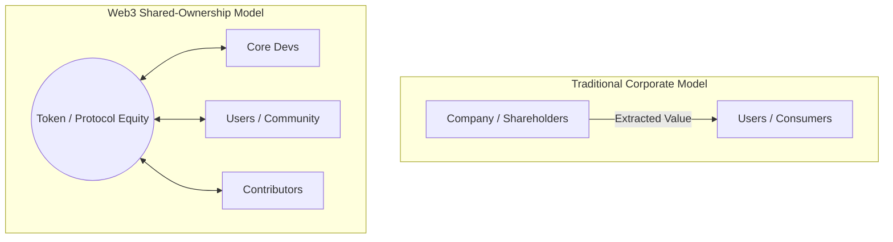

In the legacy corporate world, building "community" is usually a line item on some VP of Marketing’s quarterly spreadsheet. It’s treated as a transactional funnel. You spend money on Google ads, drag users into a forum, give them a free t-shirt with your logo on it, and call them a "community."

And then you wonder why nobody shows up unless there’s a raffle.

Meanwhile, in the wild world of Web3 and crypto, projects with zero physical offices, zero full-time marketing hires, and nothing but a shared GitHub repo and a Discord server are cultivating communities so intense they verge on religious cults. 

Look at Ethereum. Look at MakerDAO. Look at Yearn (which is starting to bubble up). These projects don’t have customers—they have *believers*. They have hundreds of high-quality developers contributing code for free, thousands of community members writing documentation, and an army of evangelists defending the project on Twitter 24/7.

How are online-first crypto projects pulling this off? What is the secret sauce that transforms internet strangers into a coordinated global workforce? 

Whether you’re building a DeFi protocol, an open-source tool, or a traditional SaaS startup, there are deep lessons to be learned from how decentralized networks build communities from scratch. Let’s look at the crypto community-building playbook.

---

## Lesson 1: Skin in the Game (The Financial Alignment of Incentives)

Let’s address the elephant in the room first: **incentives**.

In a traditional tech company, the relationship between the creator and the consumer is purely extractive. You build the app, the user pays for the app, and you keep the profit. The user’s only incentive to promote your product is if they really, really like it.

In Web3, the boundary between creator, contributor, and user is completely blurred. 

By introducing native tokens, protocols give early adopters and contributors a literal piece of the network’s future value. When a developer writes code for a protocol, or a user spends hours answering questions in the community Discord, they aren’t just doing charity work—they are directly increasing the utility and value of an ecosystem they own a part of.

This is the ultimate growth hack. It aligns incentives so perfectly that your users become your co-founders, your marketers, and your customer support representatives. 

*Actionable takeaway for startups:* You might not have a utility token, but you can achieve similar alignment through early-stage equity, contributor grants, or referral programs that reward users with a real stake in your startup’s growth.

---

## Lesson 2: Radical Transparency and "Building in Public"

Many legacy companies treat their internal workings like state secrets. Roadmaps are locked in private Jira boards, architectural debates happen in closed Slack channels, and code is hidden in private GitHub organizations.

Crypto projects do the exact opposite. They build in public to a degree that makes corporate lawyers sweat.
- **Open-source by default**: The codebase is public. Anyone can read it, fork it, and audit it.
- **Public communication channels**: The core team doesn’t hide behind email. They are in public Discord channels, answering questions, defending design decisions, and debating with users in real-time.
- **Transparent treasury management**: Multisig wallets are public. Anyone can track where funds are being spent and how much runway the project has.

This radical transparency builds an immense amount of trust. When a community can see the mistakes, the struggles, and the raw work behind a project, they stop viewing it as a faceless corporation. They view it as a human endeavor they want to support.

---

## Lesson 3: Designing a Clear "Contribution Ladder"

You can’t just open a Discord server and expect people to start writing smart contracts for you. A great community is a structured journey. You must design a clear ladder that guides people from passive observers to active co-creators.

Here is how a typical contributor moves up the ladder in a crypto project:

1. **The Lurker**: They find the project, read the docs, and join the Discord. They are quiet, observing the culture and looking for signs of life.
2. **The Participant**: They start chatting in the channels, asking questions, and sharing memes.
3. **The Helper**: They start answering questions from newer members, writing unofficial blog posts explaining the protocol, or reporting bugs on GitHub.
4. **The Contributor**: They pick up a labeled issue (like "Good First Issue" or "Help Wanted") and submit a pull request, or they write a new documentation page.
5. **The Core Contributor**: They are given moderator roles, repository write-access, or are paid via treasury grants to work on the project full-time.

Too many traditional projects fail because they don’t provide paths for people to transition between these stages. If a lurker wants to help but can’t find any low-barrier tasks or clear contribution guidelines, they will leave.

---

## Lesson 4: Asynchronous Governance and Shared Roadmap Voice

Humans have a deep, psychological need for agency. We want to feel like our voices matter and that we have a say in our collective future.

Crypto projects tap into this through decentralized governance (DAOs). Even if the governance model is primitive—like voting on snapshot proposals with token balances—it gives the community a tangible sense of ownership.
- If a user thinks the protocol fees are too high, they can write a governance proposal.
- If the community wants to prioritize an integration, they can coordinate a vote to fund a developer grant.
- If there’s an architectural split, the community debates it in public forums for weeks.

When your users realize they aren't just along for the ride but are actively steering the ship, their commitment to the project skyrockets. They are no longer passive consumers; they are active builders.

---

## Managing the Chaos: Discord and Telegram Survival

Let’s be honest for a second: managing a crypto community is not all sunshine and rainbow charts. It can be absolute, unmitigated chaos.

If you’ve ever spent five minutes in a crypto Telegram channel during a market dip, you know what I’m talking about. You’ll find an endless stream of:
- "When token?"
- "Why price dumping?"
- "Admin, do something!"
- A non-stop barrage of scammers impersonating your core team in DM.

To survive and build actual value in this environment, you must set boundaries.
- **Separate noise from signal**: Establish clear, dedicated channels for developers (`#dev-general`), governance (`#governance-chat`), and random banter (`#off-topic`).
- **Empower community moderators**: Find your most helpful, level-headed community members and elevate them to moderators. Give them the authority (and compensation) to ban toxic actors and keep the peace.
- **Focus on the builders**: It is easy to get distracted by short-term price speculators. Ignore the noise. Keep your focus on the developers who are actually building on your protocol. If the builders are happy, the utility will follow.

---

## The Ultimate Lesson

At the end of the day, virtual community building isn’t about software platforms or communication tools. It’s about **belonging**.

In an increasingly isolated, digital world, people are searching for tribes that align with their values, their skills, and their ambitions. Crypto projects have succeeded because they’ve built global, open-access playgrounds where anyone with an internet connection can show up, add value, and be rewarded for their intellect.

Stop treating your users like data points in a conversion funnel. Treat them as peers. Give them ownership, build with them in the open, and watch how fast your project takes on a life of its own.

I’ll see you on Discord.
