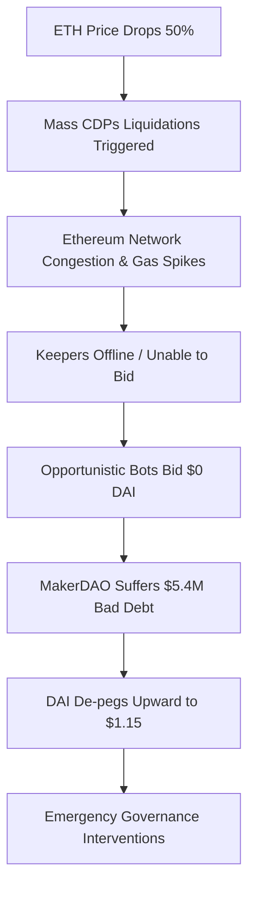

If you were sitting in front of a dual-monitor setup on March 12, 2020, with a cold cup of coffee and a sinking feeling in your chest, congratulations: you survived the day the music almost stopped. To the outside world, March 2020 will always be remembered as the month the physical world locked down and toilet paper became a luxury currency. But to those of us deep in the Ethereum trenches, March 12—affectionately and terrifyingly dubbed "Black Thursday"—was the day decentralized finance faced its first genuine existential crisis. 

We weren't just watching red candles on a trading chart; we were watching a beautifully designed, highly theoretical financial machine grind itself into a catastrophic feedback loop. It was the ultimate stress test, and for a few nail-biting hours, it looked like DeFi was going to fail it.

### The Perfect Macro Storm

Before we dive into the smart contract gore, let’s paint the macro picture. The traditional markets were in absolute freefall. The S&P 500 triggered its 15-minute circuit breakers almost immediately after opening. Gold—the ultimate "safe haven"—was being dumped as funds rushed to liquidate anything not bolted down to meet margin calls in fiat. 

Naturally, crypto didn't act as a "non-correlated hedge." It acted like a highly liquid risk asset on steroids. 

Ethereum (ETH) started the day around $194. By the time the dust settled on March 13, it had bottomed out near $95, representing an absolute bloodbath of nearly 50% in a single day. When the price of a base asset drops by half in 24 hours, any leverage in the system is going to get squeezed. And in 2020, the undisputed crown jewel of DeFi leverage was MakerDAO.

### The Mechanics of the MakerDAO Liquidation Engine

To understand how MakerDAO almost imploded, we need to quickly review how it was engineered. At the time, Maker allowed users to lock up ETH as collateral in smart contracts (then called Vaults or CDPs) to mint DAI, a stablecoin pegged to the US dollar. Because ETH is highly volatile, these Vaults had to be overcollateralized, typically requiring at least 150% collateral-to-debt ratio.

If the value of your ETH collateral fell below that threshold, the protocol would automatically trigger a liquidation process. The protocol would put the ETH collateral up for auction, selling it to automated bots known as "Keepers." These Keepers would pay DAI to cover the debt, and in return, they’d get the liquidated ETH at a discount, pocketing the arbitrage. Under normal conditions, this is a beautiful, self-balancing ecosystem.

But normal conditions assume the underlying highway is actually clear.

### The Great Ethereum Traffic Jam

As ETH plummeted, hundreds of Maker Vaults fell under the 150% threshold simultaneously. The liquidation engine dutifully fired up, generating thousands of collateral auctions. 

Here is where the engineering reality collided with economic theory. To bid on these auctions, Keepers had to submit transactions on the Ethereum network. At the exact same time, panicking retail users were trying to move their funds to exchanges, stablecoin arbitrageurs were trading furiously on Uniswap, and Vault owners were desperately trying to add collateral to avoid getting liquidated.

The result? The Ethereum network turned into a digital parking lot. Gas fees, which usually hovered around 10 to 20 gwei, suddenly spiked to over 1000 gwei. 

For the average developer, this was a mind-boggling gas war. If you wanted your transaction processed, you had to pay astronomical fees. Many Keepers simply weren't programmed to handle gas fees of this magnitude. Their bots either timed out, ran out of ETH to pay for gas, or shut down entirely because their profit margins vanished under the weight of transaction fees.

With the majority of Keepers priced out or offline, the liquidation auctions had no bidders. Well, almost none.

### Enter the $0 Bidders

A tiny handful of opportunistic Keepers realized they were the only ones whose transactions were getting through. Because Maker’s auction design at the time had no minimum bid requirement and relied on a fixed duration, these Keepers submitted transactions with exceptionally high gas fees—bidding exactly **0 DAI** for batches of 50 ETH.

Since there were no competing bids, the protocol’s smart contracts accepted these 0 DAI bids as the winning offers. 

Let that sink in. The system liquidated thousands of dollars worth of user collateral, handed it over to a bot for literally zero dollars, and left the Maker protocol with the debt but without the collateral to back it. Over the course of several hours, these $0 bids extracted roughly $8.3 million worth of ETH from the system, leaving MakerDAO with a massive $5.4 million bad debt deficit.

DAI, which was supposed to be pegged to $1, surged to $1.15 as users desperately scrambled to buy DAI on secondary markets to pay down their debts and save their vaults from being liquidated for nothing. It was a classic liquidity spiral.

### The Rescue and the Recovery

The DeFi community didn't panic-sell and run; instead, developers and community members hopped into Discord, Telegram, and forum threads. Over a sleepless weekend, the Maker community orchestrated a masterclass in decentralized crisis management:

1. **The USDC Emergency Valve**: Maker Governance quickly voted to introduce USDC (a centralized stablecoin) as a collateral type. While highly controversial for decentralization purists, it provided an immediate source of highly liquid, non-volatile collateral to stabilize the DAI peg.
2. **Auction Parameters Adjustments**: The auction durations were lengthened, and minimum bid increments were added to ensure that a $0 auction could never happen again.
3. **The First Debt Auction**: To patch the $5.4 million deficit, Maker initiated its first-ever debt auction on March 19. The protocol minted and auctioned off fresh MKR tokens to the public in exchange for DAI, which was then burned to cover the bad debt. The community stepped up, bidding aggressively and fully recapitalizing the system.

### What We Learned

Decentralized networks are only as decentralized as their underlying infrastructure. Black Thursday taught us that you cannot analyze a protocol’s risk in a vacuum; you must analyze it in the context of network congestion, gas economics, and human behavior under extreme duress.

It forced us to build more robust oracle networks, rethink liquidation auction designs, and appreciate the value of diverse collateral backing. More than anything, it proved that the community behind these protocols was willing to back them up when things went south. 

DeFi didn't die on March 12, 2020. It got punched in the mouth, spit out some blood, redesigned its auction contracts, and went on to kickstart the legendary DeFi Summer just three months later. If that isn't a story of resilience, I don't know what is. Keep your gas high and your collateral higher, friends. See you in the next block.