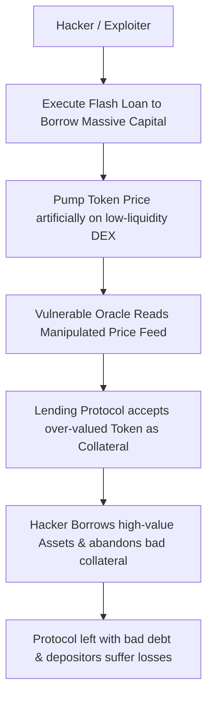

Let’s be honest: traditional banking is currently a joke. Your high-yield savings account is paying a pathetic 0.5% interest, while inflation is preparing to eat your purchasing power for breakfast. 

Then you discover Decentralized Finance (DeFi). You open Compound, Aave, or Uniswap, and you see double-digit interest rates. 10% on stablecoins? 15% on Ethereum? It looks like a financial paradise. You start calculating how quickly you can retire, move to a tropical island, and spend your days sipping coconut water.

But here is the hard, cold truth that nobody in the marketing department wants to tell you: **There is no such thing as a free lunch in finance.**

Those juicy double-digit yields are not magic. They are a risk premium. In DeFi, you aren't just lending capital; you are underwriting a highly complex, deeply interconnected stack of experimental software and economic incentives. If you don’t understand where the yield comes from and what risks you are absorbing, you aren’t an investor—you are the exit liquidity.

Having analyzed smart contract exploits and lived through the liquidity carnage of Black Thursday, I’ve put together the ultimate risk management guide for every DeFi user. Here are the four hidden risks you must evaluate before you deposit a single dollar into any smart contract.

---

### 1. Smart Contract Risk (The Code is the Law, and the Code Has Bugs)

In traditional finance, contracts are written in legal prose and enforced by courts. If a bank’s software glitch accidentally transfers your money to someone else, the bank has a legal and regulatory process to reverse the transaction.

In DeFi, the contract is written in Solidity, Vyper, or Rust, and enforced by the Ethereum Virtual Machine (EVM). There is no "customer support" number to call. There is no refund button. If there is a logical flaw or vulnerability in the smart contract code, a hacker will exploit it, drain the funds, and send them to an mixer like Tornado Cash in minutes.

Before interacting with a protocol, ask yourself:

- **Is the code audited?** Has the protocol undergone security reviews by reputable, top-tier audit firms (such as Trail of Bits, ConsenSys Diligence, OpenZeppelin, or PeckShield)? A PDF audit report on GitHub is not a guarantee of safety, but it proves the team has made a baseline effort to find obvious flaws.
- **Has the audited code been modified since the audit?** This is a classic trap. A team gets an audit for Version 1.0, then pushes a minor, unaudited upgrade right before launch. That unaudited upgrade is almost always where the vulnerability lies.
- **The Lindy Effect**: How long has the contract been live on-chain with a substantial amount of capital (Total Value Locked, or TVL) inside it? A protocol that has safely secured $100 million for six months is infinitely safer than a highly audited protocol that launched three days ago. Time in the wild is the ultimate security audit.

---

### 2. Oracle Risk (The Garbage In, Garbage Out Dilemma)

Smart contracts are sandboxed; they cannot natively read off-chain data. They don't know the price of ETH on Coinbase or the price of gold in London. To get this information, they rely on **Oracles**—data feeds that fetch off-chain information and write it to the blockchain.

If an oracle provides inaccurate price data, the consequences are immediate and catastrophic. For example, if an oracle is manipulated into reporting that ETH is trading for $1,000,000, a smart contract might allow a user to borrow millions of dollars of stablecoins against a tiny fraction of ETH collateral.

Many early-stage protocols use low-quality or single-source oracles, such as reading the price directly from a single decentralized exchange (DEX) pool like Uniswap. 

Attackers take advantage of this using **Flash Loans**—borrowing tens of millions of dollars of capital in a single transaction, manipulating the price of a token on Uniswap, letting the target protocol's vulnerable oracle read that manipulated price, borrowing all the protocol's assets against bad collateral, and returning the flash loan. All in a single Ethereum block.

**Risk Management Rule**: Ensure the protocol uses highly robust, decentralized oracle networks (like Chainlink) that aggregate price feeds across multiple independent exchanges and volume-weighted sources, preventing single-point-of-failure manipulation.

---

### 3. Admin Key & Governance Risks (The "Decentralized In Name Only" Problem)

Many DeFi protocols market themselves as fully decentralized, self-governing organisms. But if you peer into the admin settings on Etherscan, you will often find a single **Admin Key** that has the authority to unilaterally upgrade contracts, change fee structures, or pause withdrawals.

This is a massive centralization risk. If the founders' private keys are compromised, or if a rogue developer decides to go to the beach with your money, they can simply upgrade the smart contract to redirect all deposited funds to their personal wallet.

When evaluating a protocol's administration:

- **Is there a Multi-Sig?** The admin key should be held by a multi-signature wallet (e.g., a Gnosis Safe) requiring at least 3-out-of-5 or 5-out-of-9 trusted, independent signers to authorize any change.
- **Is there a Timelock?** A timelock is a smart contract mechanism that delays any admin action by a set duration (typically 24 to 72 hours). If the admin votes to upgrade the protocol, the timelock gives depositors a 48-hour window to review the changes and withdraw their funds if they suspect a malicious action or disagreement.
- **Can they halt withdrawals?** While an emergency pause button can protect funds during an active exploit, it can also be abused. Know if the team has the power to lock you out of your own capital.

---

### 4. Economic and Liquidity Risks (The Black Thursday Lesson)

Even if the code is perfect, the oracles are secure, and the keys are held by saints, a protocol can still fail due to systemic economic stress. 

As we saw during the March 12, 2020 crash, extreme market volatility can freeze the underlying network, causing gas fees to spike and liquidation engines to fail. If a lending protocol cannot liquidate undercollateralized loans fast enough, it will accumulate **bad debt**, making the protocol insolvent and leaving depositors unable to withdraw their principal.

### The Ultimate DeFi Due Diligence Checklist

Before depositing capital into any DeFi yield generator, run it through this quick checklist:

| Checkpoint | Low Risk | High Risk |
| :--- | :--- | :--- |
| **Audit Status** | Multiple audits from top-tier firms | No audit, or audit by unknown firm |
| **Code Age** | Live on-chain for 6+ months with high TVL | Launched less than 2 weeks ago |
| **Oracle Feed** | Decentralized, multi-source (e.g., Chainlink) | Custom, single DEX price feed |
| **Admin Controls** | Multi-sig keys with 48-hour+ timelock | Single admin key, no timelock |
| **Assets Held** | Standard, highly liquid assets (ETH, DAI, USDC) | Volatile, low-liquidity, algorithmic tokens |

### The Golden Rule of the Frontier

DeFi is the most exciting financial experiment of our generation. It is democratic, permissionless, and endlessly innovative. But make no mistake: **you are playing on a financial frontier without a net.**

Never deposit money you cannot afford to lose. Start small, verify everything on-chain, distribute your capital across multiple independent protocols to mitigate single-contract risk, and always prioritize security over yield. Stay safe, farm smart, and don't let the high APYs blind you to the underlying engineering reality. Your future self will thank you.