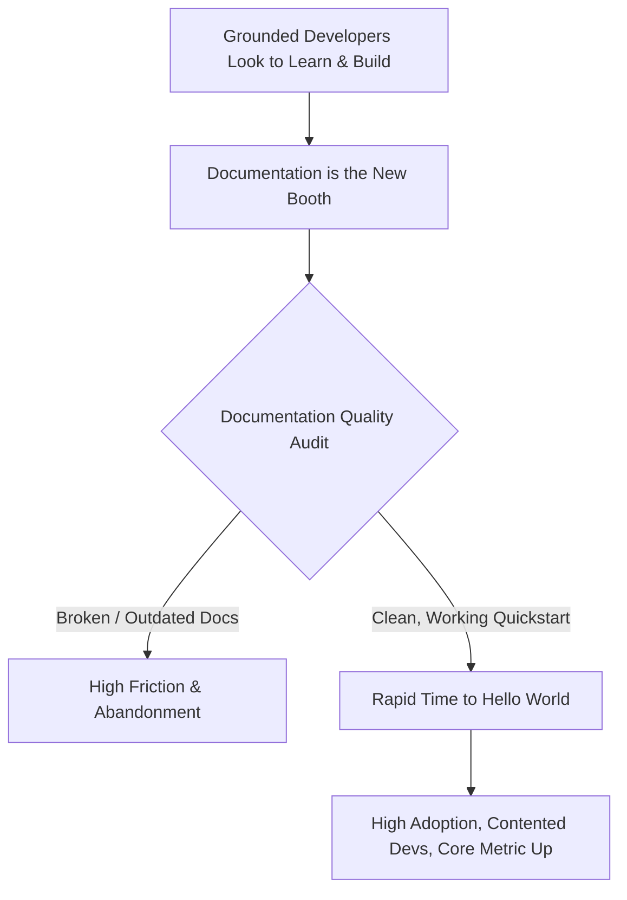

Just three short weeks ago, the typical Developer Relations calendar was a beautiful, hyper-active blur. You were packing your bags for San Francisco, Berlin, or Tokyo. Your suitcase was stuffed to the brim with branded hoodies, custom-designed laptop stickers, and high-quality socks. Your Twitter feed was a steady stream of airport lounge check-ins, panel selfies, and photos of late-night beer with fellow advocates. 

Then, the world changed.

Almost overnight, the global conference circuit vanished. Every major developer summit, local meetup, and regional hackathon for the next six months was cancelled, postponed, or shifted to an ambiguous "virtual format." 

If your entire definition of Developer Relations (DevRel) or Developer Advocacy was "giving 25-minute presentations on physical stages, shaking hands at a booth, and coordinating free pizza for local user groups," you are probably facing a major career crisis. Your travel budget is frozen, your Q1 key performance indicators (KPIs) are completely irrelevant, and your marketing team is asking: *"So, what exactly do you do all day now?"*

Let's take a deep breath and reset. 

Developer Relations is not about business-class flights, nor is it about the quality of your branded swag. DevRel is, and has always been, about **developer enablement**. It is about building digital bridges, lowering the friction between a developer and your API, and acting as the empathetic translator between the outside engineering community and your internal product team.

The physical stage was just one delivery mechanism. Now that the stage is gone, we must build robust, virtual-first mechanisms that actually deliver value to developers sitting at home. Here is how DevRel professionals can pivot, adapt, and stay deeply relevant in a locked-down world.

---

### 1. Optimize "Time to Hello World" (The Documentation Audit)

With developers grounded at home, they have fewer physical distractions and more focused, quiet time. Many are taking this opportunity to learn new frameworks, build side projects, or finally address technical debt.

If your product’s documentation is outdated, contains broken code snippets, or lacks a clear, 5-minute quickstart guide, you are hemorrhaging developers. 

Now is the perfect time to execute a comprehensive, ruthless **Documentation Audit**:
- Put yourself in the shoes of a complete beginner. Follow your own quickstart guide from scratch on a clean machine. Does it work? Or does it assume three global dependencies that aren't mentioned?
- Hunt down and fix broken links, outdated API references, and confusing error messages.
- Build highly targeted, copy-paste-ready sample applications. If you are an API company, don't just show the endpoints; build a fully functional, open-source boilerplate app on GitHub that devs can clone and deploy in under two minutes.

Your documentation is your new physical booth. Make sure it is warm, welcoming, and actually works.

---

### 2. Live-Coding Streams Over Polished Slide Decks

Developers are notoriously allergic to highly polished, corporate marketing pitches. They don't want to watch a pre-recorded, over-edited 45-minute webinar where a speaker reads slides about architectural scalability.

They want to see the code. They want to see the reality.

This is why **Live-Coding Streams** on platforms like Twitch and YouTube are exploding in popularity. Live-streaming is the ultimate form of authentic developer advocacy:
- **Keep it raw**: Don’t prepare a perfect, flawless script. Let developers see you make mistakes, run into terminal errors, read stack traces, and debug in real-time. It humanizes you, teaches them valuable troubleshooting techniques, and makes the stream highly engaging.
- **Interactive Q&A**: Let viewers influence the build in real-time. Ask them: *"Hey, should we write this endpoint using async/await, or should we stick to traditional promises?"* Answer their questions directly as they type them in the chat.
- **Focus on building things**: Don't just explain abstract concepts. Build a specific tool—a Slack bot, an automated alert system, a small DeFi dashboard—from scratch to completion over the course of a two-hour stream.

---

### 3. Rethink the Virtual Hackathon

Most early attempts at "virtual hackathons" are spectacular failures because organizers try to copy-paste the physical hackathon experience into a digital format. They expect developers to join a Zoom call, sit in front of their webcams for 48 consecutive sleepless hours, write code under extreme pressure, and submit a pitch video.

It doesn't work. Physical hackathons succeed because of the ambient social energy, the free meals, and the immediate physical collaboration. In a remote setting, that structure is exhausting and unsustainable.

Instead, design **Asynchronous, Multi-Week Virtual Hackathons**:
- **Extend the timeline**: Give developers two to three weeks to build. This allows them to balance participation with their normal work, families, and wellness routines.
- **Provide structured milestones**: Instead of a single final submission, create weekly check-ins. Week 1: Project Proposal & Architecture. Week 2: First working MVP. Week 3: Final polish and demo.
- **Build rich, async support hubs**: Set up a dedicated Discord server or Slack space with channels for finding team members, brainstorming ideas, and getting direct support from engineers. Host daily, 30-minute office hours where developers can drop in and screen-share their blockers.

An async hackathon lowers the barrier to entry, accommodates diverse timezones, and leads to significantly higher-quality project submissions that might actually evolve into real startups.

---

### 4. Direct, High-Empathy Outreach

Ultimately, developer advocacy is a relationship-driven profession. Right now, many developers in your community are feeling anxious, isolated, and uncertain about their jobs or companies.

Move beyond transactional, public marketing communication. Reach out to your community members individually:
- Send a simple, direct message to your top open-source contributors or active forum members: *"Hey, just wanted to check in. How are you holding up with the remote switch? Let me know if there is anything our team can do to support your projects or if you just want to jump on a quick call and talk shop."*
- Highlight their work publicly. If a community member built a cool integration or wrote an informative blog post, share it on your official channels and celebrate their contribution.

This genuine, care-driven outreach builds a foundation of trust and community loyalty that no physical conference sticker could ever buy.

---

### The Grounded Advocate

The loss of physical travel is not a death sentence for DevRel; it is a long-overdue evolutionary catalyst. It is forcing us to shed the superficial, travel-heavy elements of the job and return to our core mission: helping developers succeed.

The developer advocates who master the art of remote enablement, live-coding interaction, and high-empathy async community management right now are going to emerge from this crisis with the most loyal, active, and productive developer ecosystems in the industry.

Ditch the suitcase, fire up your IDE, open a terminal, and let's start building where the developers actually are: online. See you in the chat room!