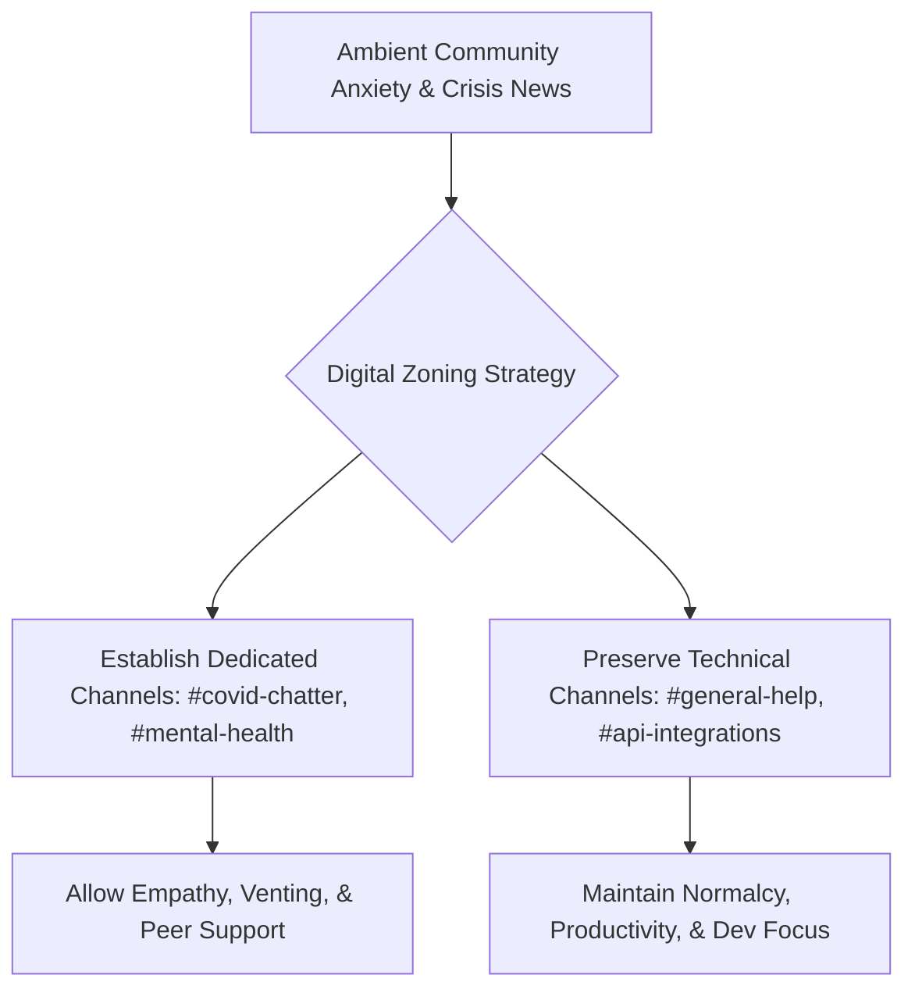

Over the course of last week, the physical spaces that define our daily lives—the bustling co-working lobbies, the local coffee shops where we solved architectural bugs on napkins, the conference halls, and the whiteboard-filled conference rooms—simply evaporated. 

Almost overnight, the entire world was thrust into a massive, involuntary remote experiment. As front doors locked and streets emptied, something fascinating happened: the focus shifted entirely to our screens. Our Slack workspaces, Discord channels, and Telegram groups ceased being mere "work tools" or "chat rooms." They became our primary social arenas, our town squares, and for many, our only emotional lifelines to the outside world.

If you are a community manager, developer advocate, founder, or moderate any digital space, congratulations: your job description just became twice as critical. You aren't just moderating discussions anymore; you are leading a human network through a collective global trauma.

Fortunately, those of us who have spent years navigating the chaotic, volatile, and digitally native world of cryptocurrency have a secret weapon: we’ve been practicing for this our entire professional lives. Crypto communities have always been decentralized, physically isolated, hyper-reactive, and perpetually operating in high-stress environments (usually triggered by a sudden 40% drop in asset values or a multi-million-dollar smart contract exploit).

Here is what the frontline of crypto community management can teach us about leading any digital community through the unprecedented challenges of COVID-19.

---

### Lesson 1: Curate the Noise (The Dedicated Venting Channel)

When a crisis hits, human anxiety demands an outlet. If you do not actively manage where that anxiety is expressed in your digital spaces, it will pollute every channel. 

In a developer community, you cannot have your `#general-help` or `#api-integrations` channels overwhelmed with terrifying links to pandemic infection charts or arguments about quarantine policies. It drowns out the core purpose of the community, frustrates people who come to escape the noise, and increases the overall ambient stress of the space.

The solution is not to ban crisis discussions. That is unnatural and breeds resentment. Instead, **actively redirect the noise**.

Create dedicated channels. Label them clearly, like `#covid-chatter`, `#isolation-station`, or `#mental-health`. 
- State the guidelines explicitly: *"Hey folks, we want to support each other during this wild time. Please keep all pandemic-related news, tips, and vents in `#covid-chatter` so our technical channels remain focused on building. Thanks for keeping our shared space organized!"*

This simple act of digital zoning gives your anxious members a safe, high-empathy space to share resources and seek support, while preserving the sanity of those who need your technical channels as a sanctuary of normalcy.

---

### Lesson 2: Ruthless Misinformation Hygiene

In a crisis, fear-mongering and speculative rumors travel ten times faster than official medical or technical documentation. Digital communities are highly susceptible to becoming echo chambers of panic.

As a community leader, you have a ethical responsibility to maintain high information hygiene. If someone posts an unverified blog post claiming a secret cure or an impending municipal curfew that has not been confirmed, you must act swiftly.

1. **Don’t just delete and ignore**: Deleting a post without explanation can feel like censorship and trigger conspiracy theories.
2. **Address it with facts**: Reply to the thread directly, citing official, reputable sources (like the WHO, CDC, or official press releases). 
3. **Set the policy clearly**: *"We want to keep this community safe and grounded in reality. Please refrain from sharing unverified rumors or speculative health advice. Only post information backed by official sources."*

If a member continues to violate these guidelines, do not hesitate to direct-message them and warn them. High-quality digital communities are built on trust. If your space becomes a breeding ground for rumors, your most valuable members will quietly exit.

---

### Lesson 3: Radical Empathy Over Synthetic Optimism

There is a huge difference between being a supportive leader and being a toxically positive cheerleader. 

Do not host virtual meetings or post announcements with forced corporate cheer, telling everyone that "this is a fantastic opportunity to optimize our workflows and learn three new coding languages!" For many members of your community, their lives are in disarray. They might be managing kids whose schools just shut down, caring for sick relatives, or dealing with the acute anxiety of job insecurity.

Instead, lead with **radical empathy and vulnerability**.

It is okay to say: *"This is a incredibly weird and stressful week. None of us have the perfect playbook for this, and it is completely normal if your productivity is not at 100% right now. We are going to prioritize flexibility, clear documentation, and looking out for one another."*

When you, as a leader, acknowledge the difficulty of the situation, you give everyone else permission to breathe a sigh of relief. You lower the defensive walls and establish a genuine, human connection that transcends the professional boundary.

---

### Lesson 4: Build Digital Rituals

In physical offices or meetups, communities are held together by informal "third spaces"—the watercooler chat, the lunch runs, the casual high-fives. In a remote world, those third spaces do not exist unless you intentionally build them.

You need to replace physical rituals with creative digital equivalents. Here are a few that have kept distributed crypto teams sane for years:

- **The Async Jam**: A pinned thread where people share what album or playlist they are listening to while writing code.
- **The "No-Agenda" Coffee**: A casual 15-minute video call where talking about work is strictly banned. You just drink tea/coffee and talk about your pets, your cooking experiments, or what bad Netflix show you are currently binging.
- **Show Us Your Setup**: Encourage members to post pictures of their makeshift home offices. It breaks the ice, shows the funny reality of working from a dining room table or a laundry room, and humanizes everyone.

---

### Digital Bridges Keep Us Human

The physical distance between us might be growing, but our social and emotional connectivity doesn't have to shrink. The communities we lead and nurture over the next few months will remember how they felt in our digital spaces. 

Did they feel ignored and overwhelmed by chaotic noise? Or did they feel supported, organized, heard, and connected?

Be the bridge. Build the digital spaces that you wish existed for yourself. We are physically isolated, but together, we are building the resilient social infrastructure of the future. Stay safe, stay empathetic, and keep the chats warm.