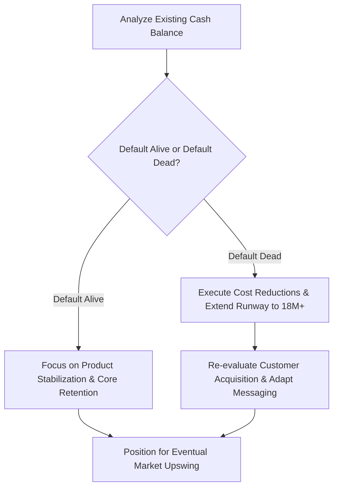

Sometime last week, the air in your office—or more likely, your newly established home workspace—shifted. The fundraising conversation you had scheduled for next Tuesday was suddenly "pushed back to assess market conditions." Your biggest enterprise customer just announced a freeze on all external vendor software budgets. Sequoia Capital dropped its infamous "Black Swan of 2020" slide deck, and suddenly, the spreadsheet you’ve been using to track your monthly burn rate looks less like a roadmap and more like a ticking countdown.

Welcome to wartime leadership.

If you’re a startup founder or leader right now, you are probably feeling an intense, heavy knot in your stomach. The rules of the game didn't just change; the board was flipped upside down, the table was kicked over, and the room is currently on fire. The "growth at all costs" mantra of the late 2010s is officially dead. Cash preservation is the new king.

Having steered projects through some incredibly hairy crypto market crashes and sudden liquidity squeezes, I’ve learned that panic is a useless emotion, but urgency is your best friend. Here is the playbook to help you assess, stabilize, and steer your startup through the economic shockwaves of March 2020.

---

### Step 1: Confront the Financial Gravity (The Runway Audit)

Your current financial spreadsheet is a work of fiction. It assumes a pre-COVID world where sales cycles are 30 days, customers pay invoices on time, and venture debt is easily accessible. You need to throw that model away and build three new, highly conservative scenarios.

1. **The "Optimistic" Model**: Revenue growth slows by 30%, sales cycles double in length, but your existing churn remains stable.
2. **The "Pessimistic" Model**: Revenue growth drops to zero for the next two quarters. Churn increases by 15% as companies cut non-essential tools.
3. **The "Apocalypse" Model**: Revenue contracts. You lose 20% of your existing monthly recurring revenue (MRR) because your clients go out of business or unilaterally break contracts, and no new customers sign for six months.

Look at your cash balance under the **Apocalypse Model**. Do you have at least 18 to 24 months of runway? If the answer is no, you have to make hard choices, and you have to make them this week. 

As Paul Graham famously coined, you need to know if you are **Default Alive** or **Default Dead**. If you are default dead in a market where capital is dry, waiting for a miracle is a death sentence. Cut expenses early and cut them deep enough that you only have to do it once. Multiple rounds of incremental cuts destroy team morale; one decisive, transparent cut establishes a stable bottom.

### Step 2: Protect the Core (Ruthless Prioritization)

When a ship is caught in a Category 5 storm, you don't spend time polishing the brass handrails. You batten down the hatches and make sure the engine doesn't flood. 

Look at your product roadmap. Any feature, product line, or research initiative that does not directly contribute to:
- Retaining your existing customer base,
- Reducing operating costs, or
- Generating near-term revenue

...needs to be paused immediately. 

That highly speculative, long-term AI-driven recommendation engine you were planning to build? Put it on ice. The developer expansion into three new languages? Pause it. Focus 100% of your engineering and product brainpower on making sure your core offering is absolutely bulletproof. Your existing customers are fighting for their own survival; if your product is buggy or hard to justify, they will hit the "Cancel Subscription" button without a second thought.

---

### Step 3: Radical Transparency with Your Team

The absolute worst thing you can do right now is play the stoic, silent executive who pretends everything is business-as-usual. Developers are smart. They read the news. They see the empty desks (even on Zoom) and notice the shift in tone. If you don't fill the information vacuum, their anxieties will fill it with the worst-possible-case scenarios.

Gather your team and lay out the facts. 

- **State the problem clearly**: "The market has changed dramatically. Our priorities are shifting from rapid growth to capital preservation and product stability."
- **Share the plan**: Explain the new focus areas, the runway target (e.g., "We are optimizing our operating model to ensure we have 24 months of runway without relying on external funding"), and what is expected of everyone.
- **Show empathy, not weakness**: It's okay to acknowledge that this is a stressful time. Establish clear asynchronous communication channels so people don't feel pressured to look busy on Slack 24/7 while dealing with families and health concerns.

Your team will respect honesty far more than forced optimism. Give them a clear, stable mission to rally around.

---

### Step 4: Adapt to the "New Normal" Value Proposition

The sales deck you used in January is obsolete. In January, you sold your product as an "innovative way to accelerate team velocity and scale operations." Today, nobody is thinking about scaling; they are thinking about keeping the lights on.

You need to pivot your product-market fit to align with the immediate pain points of a locked-down, cash-strapped economy:

- **Cost Savings**: Can your tool replace three other legacy subscriptions? Frame it as a consolidation play.
- **Efficiency & Automation**: If teams are hiring freezes, can your product help them do more with fewer resources?
- **Remote Collaboration**: Does your software make async communication and distributed work smoother? Double down on those features.

If you don't adapt your positioning, you will find yourself talking to empty rooms. Listen to your sales calls and support tickets. The market is telling you exactly what it hurts; go heal that specific wound.

---

### The Silver Lining

It is incredibly difficult to see right now, but recessions and market crises are the ultimate crucible for startups. When capital is cheap and easy, mediocre ideas and bloated teams get funded, creating a lot of noise. When capital dries up, the noise clears out. 

Some of the most iconic technology companies of our era—Stripe, Uber, Airbnb, Slack, WhatsApp—were built, launch-scaled, or deeply hardened during and immediately after the 2008 financial crisis. They succeeded because they had to be incredibly capital-efficient, customer-obsessed, and ruthlessly focused from day one.

You did not choose to run a startup during a global pandemic, but this is the hand you’ve been dealt. Take a deep breath, run the numbers, talk to your team, and execute with absolute clarity. We will get through this, one sprint at a time. Let's get to work.