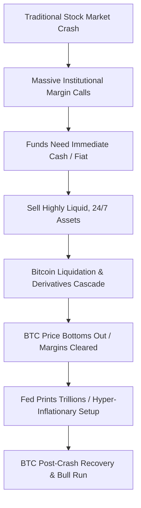

Well, that was a spectacular, jaw-dropping, absolutely horrifying 24 hours. 

If you opened your portfolio app today, you were greeted by a sea of deep, radioactive red. Bitcoin—the asset heralded by every Twitter maximalist as the "safe haven," the "digital gold," the "uncorrelated insurance policy against global catastrophe"—got absolutely obliterated. In a matter of hours, BTC plunged from a respectable $7,900 to a gut-wrenching bottom near $3,800. 

The mainstream financial media is having an absolute field day. The skeptics are dancing on Bitcoin's grave for the thousandth time, declaring the "digital gold" narrative officially dead and buried. "If Bitcoin is digital gold," they sneer, "why did it crash harder than the stock market?"

It's a fair question. If you don't understand how global market liquidity works under extreme stress, it looks like a fatal flaw. But if you peer under the hood of the global financial plumbing, you'll realize that today’s crash didn't prove Bitcoin failed. It proved that Bitcoin is the most efficient, friction-free liquidation valve on the planet. And once this systemic liquidity panic subsides, the macroeconomic stage is set for a massive, unprecedented bull run.

Here is why Bitcoin crashed with everything else, and why this is actually the ultimate buying opportunity.

---

### The Law of the Liquidity Squeeze: "Sell What You Can, Not What You Want"

To understand why a global crisis causes all assets—including gold and Bitcoin—to drop simultaneously, we have to look at the behavior of institutional traders and funds during a market crash.

When the stock market dropped 10% in a day, traditional funds that were trading on leverage faced massive **margin calls**. A margin call is a polite way of a broker saying, "Give us more cash right now, or we are shutting down your trades and taking your house." 

In a systemic panic, funds don't have time to wait for real estate to sell or venture capital to clear. They need cold, hard cash immediately. Under these conditions, traders obey a fundamental rule of survival: **You sell what you can, not what you want.**



Where do they turn? They turn to the most liquid, friction-free, instantly settlement-ready asset classes available. Bitcoin has no circuit breakers. It doesn't close on weekends. It doesn't have trading halts or regulatory approvals to move money. It operates 24/7/365. 

So, when a fund manager needs to raise $10 million in fiat to prevent their entire portfolio from getting wiped out at 9:30 AM EST, they sell their Bitcoin. They do it not because they lost faith in the sovereign censorship-resistance of cryptocurrency, but because it is the only market open and liquid enough to absorb a multi-million-dollar sell order in seconds.

Gold suffered the exact same fate during the 2008 financial crisis. In the initial phase of the subprime meltdown, gold crashed by nearly 30% as traders liquidated it to cover losses in equities. Once the margin calls were settled and the money-printing presses started rolling, gold went on a massive multi-year rally to historic highs. History is repeating itself right now.

---

### The BitMEX Cascade: Leveraged Retail Bloodbath

While institutional liquidations initiated the selling pressure, the sheer velocity of the crash was amplified by the unique mechanics of crypto derivatives markets, specifically BitMEX.

In 2020, BitMEX was the undisputed king of crypto leverage, allowing retail and institutional traders to buy and sell Bitcoin with up to **100x leverage**. This means a minor 1% move in Bitcoin’s price can either double your money or completely liquidate your position.

As the spot price of Bitcoin began to slide due to macro selling, leveraged long positions on BitMEX started getting liquidated. When a 100x long position gets liquidated, the exchange's engine automatically market-sells that Bitcoin to close the debt. This market-selling pushes the price down further, which triggers liquidations for the 50x long positions, then the 25x long positions, then the 10x positions, and so on.

This is what we call a **liquidation cascade**. It’s a mechanical domino effect that feeds on itself, driving the price down far below where reasonable supply and demand would dictate. At one point today, Bitcoin was trading on BitMEX for hundreds of dollars cheaper than on spot exchanges like Coinbase.

The cascade was so aggressive that the BitMEX insurance fund was on the verge of running out of money. The liquidation engine was jammed with sell orders, and there were literally no buy orders left on the book. 

Then, in a classic twist of crypto drama, BitMEX went down for "scheduled maintenance" for about 25 minutes. While critics accused the exchange of pulling the plug to save itself (and they probably did), this outage actually saved Bitcoin. It halted the forced derivative sell orders, allowing spot buyers on Coinbase and Kraken to step in, buy the cheap coins, and establish a stable price floor.

---

### Non-Correlation Does Not Mean Crisis-Proof

Many developers and retail investors feel cheated because they believed the "non-correlated asset" marketing pitch. But non-correlation does not mean "always moves in the opposite direction of the stock market." 

Non-correlation means that the underlying structural drivers of the assets are independent. The value of a stock is tied to corporate earnings, supply chains, and consumer spending. The value of Bitcoin is tied to hash rate, network adoption, block space demand, and mathematically enforced scarcity.

During a systemic liquidity panic, all correlations converge to **1.0**. Everyone dumps everything for cash. But once the initial shock passes, the correlations break apart again. The stock market will continue to struggle with broken supply chains and corporate bankruptcies. Meanwhile, Bitcoin's fundamentals remain completely unaffected.

---

### The Macro Bull Case: Enter the Money Printers

Why am I incredibly optimistic right now? Because the traditional financial system is broken, and central banks have only one tool in their toolkit to fix it: **The Money Printer.**

Over the next few weeks, you are going to see the Federal Reserve, the European Central Bank, and every other major monetary authority launch monetary stimulus programs that will make the 2008 bailouts look like pocket change. They are going to cut interest rates to zero, print trillions of dollars out of thin air, and inject it into the banking system to keep the credit markets from freezing.

When you flood the world with trillions of newly printed fiat units, two things happen:
1. The purchasing power of the fiat currency goes down.
2. Hard, scarce assets with a mathematically fixed supply go up.

Bitcoin has a hard limit of 21 million. You cannot bail out a bad bank by printing more Bitcoin. You cannot inflate away its scarcity to appease a political base. 

```
Federal Reserve Supply:   [Uncapped] ──> [Trillions Printed] ──> Value Dilutes
Bitcoin Supply:           [Fixed 21M] ──> [Halving May 2020] ──> Value Appreciates
```

Furthermore, we are still on track for the **Bitcoin Halving in May 2020**. In less than two months, the daily issuance of new Bitcoin will be cut in half, from 12.5 BTC per block to 6.25 BTC. The demand for hard money is about to spike at the exact same moment that the supply growth is cut by 50%.

### Survival of the Hardest Asset

Today was a terrifying day to look at your screens. But don’t confuse a short-term liquidity squeeze with a failure of the core thesis. Bitcoin did exactly what it was designed to do: it remained liquid, peer-to-peer, and open to anyone who wanted to buy or sell without a centralized authority stepping in to close the market.

The weak hands and high-leverage tourists have been completely washed out. The system has been thoroughly deleveraged. The central banks are preparing to turn their monetary printers up to eleven.

Take a deep breath, close your charts, and remember why we are here. The math hasn't changed. The code hasn't changed. Bitcoin is alive, well, and ready for its next chapter. See you on the other side of the halving.