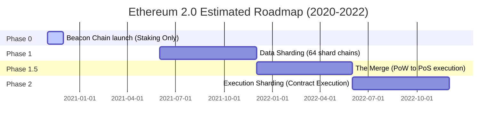

If you’ve tried to send an Ethereum transaction in the last 48 hours, you probably experienced a brief moment of cardiac arrest. 

As DeFi activity heats up, gas costs are climbing to levels we haven’t seen since the height of the 2017 ICO craze. Normal transactions that used to cost five cents are now running up to $5 or $10. If you’re trying to execute a complex smart contract swap or interact with a yield farming pool, you might easily pay $30 to $50 in transaction fees.

We are officially hitting the scaling wall. 

Ethereum’s current Layer-1 capacity is capped at roughly 15 transactions per second. When millions of users are trying to trade, borrow, lend, and mint tokens simultaneously, the fee market does exactly what it is designed to do: it prioritizes the highest bidders. The wealthy whales can afford to pay 100 Gwei to get their transactions processed in the next block, while the retail users get completely priced out of the ecosystem.

But help is on the horizon. The core development teams are working around the clock on the most ambitious, high-wire upgrade in software history: **Ethereum 2.0 (Serenity)**.

As of today, we are roughly six months away from the scheduled launch of Phase 0—the Beacon Chain. Let’s do a comprehensive audit of where Ethereum stands today, analyze the roadmap of ETH 2.0, and discuss how we are going to survive the scaling crunch in the meantime.

---

### **The Current Bottleneck: EVM and Gas Dynamics**

To understand why ETH 2.0 is necessary, let’s look at the current engine: the Ethereum Virtual Machine (EVM) running on a Proof-of-Work (PoW) consensus mechanism.

Currently, every single node in the Ethereum network must execute every single transaction and store the entire state of the blockchain. This is highly secure, but it is the antithesis of scalable. The throughput of the entire network is restricted to the execution speed of a single, slow computer.

To manage this, the network uses **Gas Limits** per block. Miners recently voted to increase the gas limit from 10 million to **12.5 million gas per block**. 

While this temporary fix allows about 25% more transactions to fit into each block, it has a dark side: it increases state bloat, makes it harder to run a full node on consumer-grade hardware, and increases the rate of uncle blocks (orphaned blocks). It is a short-term band-aid on a structural hemorrhage.

---

### **The Ethereum 2.0 Architecture: Serenity in Phases**

Ethereum 2.0 replaces Proof-of-Work with **Proof-of-Stake (PoS)** and replaces the single EVM chain with a multi-chain architecture called **Sharding**. 

This transition is so complex that it has been broken down into multiple phases to ensure that the system does not collapse in flight. Let’s walk through the three key phases as they stand on our 2020 horizon:

#### **Phase 0: The Beacon Chain (Target: Late 2020)**
The Beacon Chain is the coordination layer. It introduces Proof-of-Stake to the network, managing validators, choosing block proposers, and distributing staking rewards. 

However, Phase 0 does *not* support smart contracts or user transactions. It is a coordination spine. 

To participate in consensus, users must deposit **32 ETH** into the official deposit contract, which will launch over the coming months. Once deposited, this ETH is permanently locked. You cannot withdraw it, transfer it, or use it in DeFi. It is a absolute test of faith. Validators must keep their nodes online and synced; if they go offline or attempt to double-sign blocks, they will suffer inactivity leaks or slashing penalties.

#### **Phase 1: Sharding (Target: 2021)**
Phase 1 introduces **64 shard chains**. 

Instead of forcing every node to process every transaction, the database is divided into 64 separate segments (shards). This increases the data throughput of the network by up to 64x. However, in Phase 1, these shards are still read-only data vaults. They do not support smart contract execution or user accounts yet.

#### **Phase 1.5: The Merge (Target: Late 2021 / Early 2022)**
This is the big event. 

The existing Ethereum mainnet (running PoW) will be "plugged into" the Beacon Chain as one of the 64 shard chains. In one single block transition, the entire historical state, account balances, and smart contracts of Ethereum will transition from Proof-of-Work to Proof-of-Stake. The energy-guzzling mining rigs will be turned off forever, replaced by virtual validator nodes.

#### **Phase 2: Execution Sharding (Target: 2022+)**
The final phase, where all 64 shards become fully functional execution environments, capable of running smart contracts and processing user transactions in parallel.

---

### **The Rollup-Centric Paradigm Shift**

If you looked closely at the timeline above, you probably noticed a massive problem: **we are years away from fully functional, executing shards in Phase 2.**

How is the DeFi ecosystem supposed to survive two or three years of skyrocketing gas costs on Layer-1 in the meantime?

The answer lies in a paradigm shift that is gaining massive traction among core researchers: **The Rollup-Centric Roadmap.**

Instead of waiting for Phase 2 to bring execution scaling, the community is moving aggressively toward **Layer-2 scaling solutions**, specifically **Rollups**. 

Rollups work by executing transactions off-chain in a highly optimized secondary layer, bundling (rolling up) hundreds of these transactions into a single batch, and submitting a compressed cryptographic proof to the Ethereum mainnet. Because the execution happens off-chain, transaction throughput increases by orders of magnitude, while gas costs drop to pennies. 

There are two primary flavors of rollups currently in development:

1. **Optimistic Rollups**: Developed by teams like Optimism and Arbitrum. They assume all transactions are valid by default and use a "fraud-proof" window where anyone can challenge a bad transaction. They are highly compatible with existing EVM contracts, making it easy to migrate Uniswap or MakerDAO to L2.
2. **ZK-Rollups (Zero-Knowledge)**: Developed by teams like Loopring and StarkWare. They use highly advanced mathematical proofs (validity proofs) to guarantee the correctness of every transaction in the batch instantly. While they are mathematically complex and harder to adapt for general-purpose smart contracts right now, they offer unparalleled throughput and instant finality.

---

### **Closing Thoughts: The Great Migration**

We are living through the most critical transition in blockchain history. 

Ethereum is trying to rebuild its entire engine while flying the plane at Mach 2, carrying billions of dollars in financial transactions. It is a highly risky, incredibly exciting experiment. 

Over the next six months, as we watch the final testnets launch and the deposit contract deploy, the tension will only grow. If ETH 2.0 succeeds, it will cement Ethereum as the unstoppable, global settlement layer for programmable finance. If it fails or suffers catastrophic delays, the high gas fees will choke out adoption, forcing capital to migrate to cheaper, centralized alternative chains.

But if there is one thing we’ve learned from Ethereum’s history, it is that the developer community thrives in chaos. 

*Strap in, start saving your 32 ETH, and let’s watch the beacon light up.*