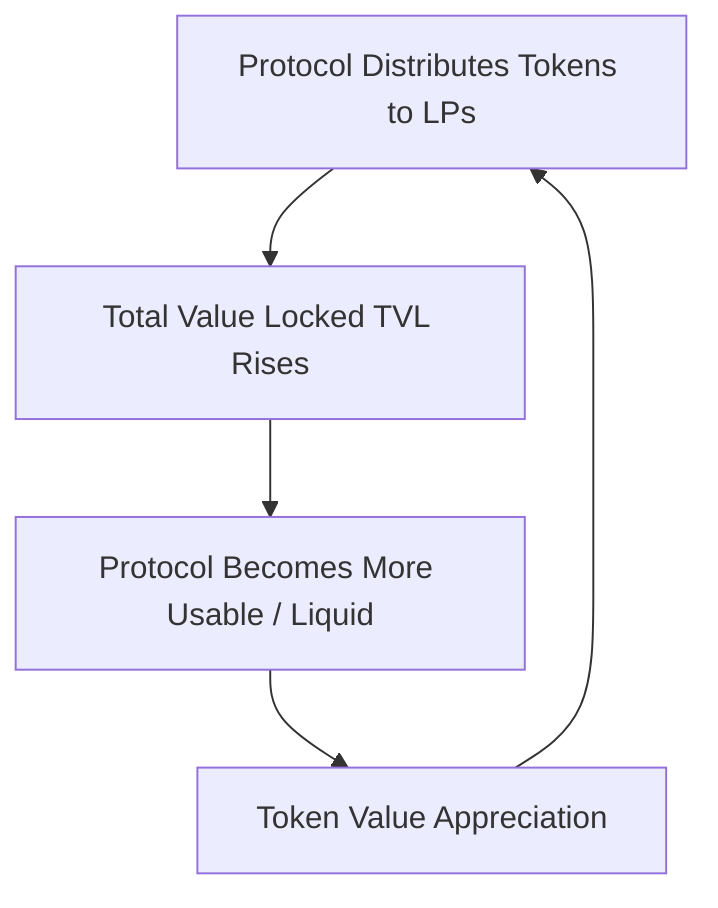

If you’ve spent any time on Ethereum-Twitter over the last few weeks, you’ve probably heard people throwing around the term "Yield Farming." It sounds like some weird, futuristic hybrid of Stardew Valley and financial engineering. And in a way, that’s exactly what it is.

Right now, we are witnessing the birth of a new decentralized finance (DeFi) meta-game. People are moving millions of dollars in capital across obscure smart contracts, chaining transactions together like crazy-mad scientists, and boasting about earning 30%, 50%, or even 100% annual percentage yields (APY). 

But what actually *is* yield farming? Is it a sustainable financial revolution, or is it a giant, highly sophisticated game of musical chairs that’s destined to crash when the music stops?

As developers, we shouldn’t just look at the flashing APY numbers on frontends. We need to look at the smart contract architectures, the economic flywheels, and the transaction pipelines that make this work. Grab your farming overalls and your MetaMask wallet, and let's build a conceptual map of the yield farming landscape.

---

### **The Cold Start Problem: Bootstrapping Liquidity**

To understand why yield farming exists, we must first understand the core problem of any two-sided marketplace: **liquidity**.

If you launch a new decentralized exchange, you need traders. But traders won't use your platform if there are no liquidity providers (LPs), because their trades will suffer from massive slippage. Conversely, LPs won't deposit capital if there are no traders, because they won't earn any transaction fees. 

This is the classic chicken-and-egg problem of Web3. 

Historically, platforms had to rely on professional market makers or massive venture capital injections to bridge this gap. But in DeFi, protocols are choosing to solve this problem by distributing ownership. Instead of paying a centralized firm to provide liquidity, protocols are paying *you*, the user, in the form of native governance tokens.

This is **Liquidity Mining**: the act of providing liquidity to a protocol (e.g., depositing stablecoins into a pool) and receiving the protocol's newly minted governance tokens in return.

---

### **The Capital Incentive Flywheel**

Let’s trace the economic loop that is fueling this craze. When a protocol launches a liquidity mining program, it creates a powerful incentive flywheel:

1. **The Incentive**: Protocol A offers to distribute its native token, `$TGIF`, to anyone who deposits stablecoins into their contract.
2. **The Capital Migration**: LPs see the high APY and flood the protocol with capital, driving up the Total Value Locked (TVL).
3. **The Utility**: The deep liquidity makes Protocol A highly efficient, attracting traders who generate actual transaction volume and fees.
4. **The Speculation**: The growing usage and hype around `$TGIF` drives up its token price.
5. **The Yield Spike**: As the price of `$TGIF` rises, the calculated APY for LPs increases even further, attracting *more* capital.

This is a beautiful flywheel when it works, but as you can probably tell, it is highly circular. The yields are denominated in the token being distributed. If the token price drops, the yield drops, the capital flees to the next farming hotness, and the protocol's liquidity evaporates overnight. 

---

### **A Developer's Walkthrough of a Yield Loop**

How do farms achieve those triple-digit APYs? The secret lies in **composability** and **leverage**. Because smart contracts are open and composable, you can chain borrowing and lending together to multiply your yields.

Let's look at a typical yield farming sequence:

#### **Step 1: The Initial Deposit**
You deposit $10,000 worth of DAI into a lending protocol (like Compound or Aave). In return, the protocol mints cDAI to your wallet. You are now earning a baseline interest rate of, say, 3% APY on your DAI.

#### **Step 2: Leveraging the Collateral**
You take your cDAI and use it as collateral to borrow a different stablecoin, say USDC, at a 75% loan-to-value (LTV) ratio. You now have $7,500 of USDC. You are paying, say, 4% interest to borrow this USDC, but the protocol is *also* distributing its native governance token to borrowers. If the token distribution rate is worth 6% APY, you are actually getting *paid* 2% net APY to borrow!

#### **Step 3: Plugging into the AMM**
You take your borrowed $7,500 USDC, head over to an AMM like **Curve Finance** or **Uniswap**, and deposit it into a liquidity pool (such as the USDC/USDT pool). You receive Liquidity Provider (LP) tokens representing your share of the pool. This pool earns trading fees plus Curve's native token (`CRV`).

#### **Step 4: The Staking Tier**
You take those Curve LP tokens and stake them into a governance gauge or another reward contract (like Yearn or Synthetix) to earn additional token rewards.

By compounding these steps, your initial $10,000 is earning interest in multiple places simultaneously, while accumulating governance tokens from multiple protocols. Your effective APY goes from 3% to 40%+.

---

### **The Emerging Stack: Yield Aggregators**

Manually executing this strategy is a nightmare. It requires writing custom scripts, constantly monitoring interest rates, and paying massive Ethereum gas fees every time you move capital between protocols.

This friction has birthed a new layer in the DeFi stack: **Yield Aggregators**.

Protocols like **yearn.finance** (which started as Andre Cronje's iEarn project earlier this year) act as decentralized yield-optimizing funds. When you deposit capital into a Yearn Vault, the smart contracts automatically rotate your funds to the highest-yielding pool in real-time. 

These vaults pool user funds together, allowing them to socialize the gas costs of executing these complex rotations. They harvest rewards, sell them for the underlying asset, and compound the pool automatically. It is a set-it-and-forget-it interface for decentralized wealth generation.

---

### **The Survival Guide: Understanding the Risks**

Before you throw your life savings into a farm promising 300% APY, you need to understand that there is no such thing as a free lunch. Yield in crypto is a function of risk. Here is what you are exposing yourself to:

1. **Smart Contract Risk**: This is the big one. If there is a bug in the smart contract code of *any* protocol in your chain, your funds can be drained. Flash loan exploits, reentrancy attacks, and administrative key compromises are real threats. Remember, your yield is compounding, but so is your risk.
2. **Impermanent Loss (IL)**: If you provide liquidity to a pool with highly volatile assets (like ETH/WBTC), and the price ratio of those assets diverges drastically from when you deposited, you can end up with *less* dollar-denominated value than if you had simply held the assets in a cold wallet.
3. **Liquidation Risk**: If your leveraged borrowing positions are backed by volatile collateral (like ETH) and the market crashes, your position can be liquidated, incurring a penalty fee.
4. **Gas Fee Escalation**: Ethereum mainnet is not built for high-frequency transactions. Executing a complex yield farming strategy can cost hundreds of dollars in gas. If your capital pool is small, gas fees will completely eat your yields before you can compound them.

---

### **Closing Thoughts: The Horizon of Yield Farming**

Yield farming is a spectacular, chaotic playground. It has succeeded in bringing billions of dollars of capital into Ethereum's smart contracts, proving that financial incentives are the ultimate bootstrap mechanism. 

But make no mistake: we are in the experimental phase. Many of these tokens being distributed have no current utility beyond governance speculation. We are printing digital equity to pay for short-term loyalty. Eventually, the distribution rates will drop, the speculative premium will cool, and yields will normalize toward traditional market rates.

But the infrastructure we are building—the automated vault systems, the composable liquidity pools, and the permissionless market-making loops—is here to stay. 

*Work hard, farm responsibly, and never deposit more capital than you can afford to lose in a smart contract exploit.*