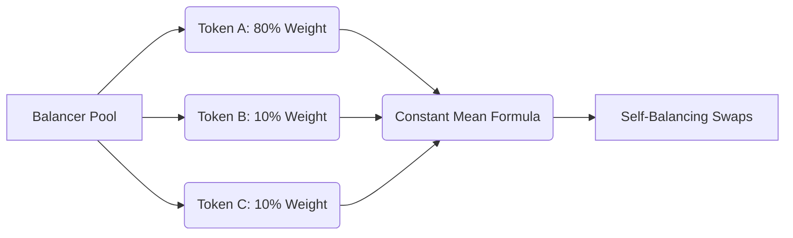

By mid-2020, every developer in DeFi has memorized Uniswap’s core constant-product formula: $x \cdot y = k$. It is simple, elegant, and has single-handedly proven that decentralized liquidity can work without centralized order books. 

But as brilliant as Uniswap V1 and V2 are, they have two major limitations that make portfolio managers and liquidity providers cry:
1. **Strict 50/50 Weighting**: You *must* supply equal dollar values of both assets. If you want to provide liquidity to a project you love, you are forced to sell 50% of your exposure into ETH or a stablecoin to match the ratio.
2. **Exactly Two Tokens**: A pool can only contain two assets. If you want to manage a diversified basket of five stablecoins, you have to split your capital across ten separate pairs.

Enter **Balancer Protocol**. 

Balancer is not just another Uniswap fork. It generalizes the automated market maker model, transforming the AMM from a simple swap utility into a self-balancing, decentralized index fund that *pays you* fees to rebalance your portfolio, rather than charging you management fees.

In this deep dive, we will unpack the mathematics behind Balancer's pools, analyze how customizable weightings mitigate Impermanent Loss, and write a Solidity smart contract to swap tokens programmatically on Balancer V1.

## The Mathematics: The Constant Mean Formula

Uniswap’s constant product model is actually a special case of a more general mathematical equation. Balancer takes that equation and blows it wide open using a **Constant Mean Formula**.

For a pool containing $n$ tokens, the invariant $V$ (the value function) is defined as:

$$V = \prod_{t=1}^{n} B_t^{w_t}$$

Where:
* $B_t$ is the pool's balance of token $t$.
* $w_t$ is the normalized weight of token $t$.
* The sum of all normalized weights must equal exactly 1 ($\sum w_t = 1$).



When a user executes a swap, trading one token for another, they change the balances of the tokens in the pool. To keep the invariant $V$ constant, the pool adjusts the exchange rate. 

Let’s look at why this generalized formula changes the entire game.

## Mitigating Impermanent Loss with 80/20 Pools

For liquidity providers, **Impermanent Loss (IL)** is the ultimate silent killer. When the price of your supplied tokens diverges, the AMM automatically sells your rising assets for depreciating assets to maintain the 50/50 ratio.

But with Balancer’s customizable weightings, you can create **80/20 pools** (e.g., 80% BAL and 20% WETH). 

In an 80/20 pool, the mathematical gravity of the constant mean formula behaves differently:
* If the price of BAL skyrockets, the pool only needs to sell a small fraction of BAL for WETH to re-align the pool with the 80/20 target, compared to a 50/50 pool which would force you to sell a massive chunk of your upside.
* Your exposure remains highly concentrated in your preferred asset (BAL), allowing you to hold your long-term position while still earning trading fees from arbitrageurs.
* The impermanent loss curve is significantly flatter, giving developers and treasury managers a far safer way to bootstrap liquidity for native tokens.

## The Self-Balancing Index Fund

In traditional finance, if you hold an index fund of five stocks, you pay a manager a percentage fee to periodically rebalance your holdings back to their target weights as market prices drift. The manager executes trades, incurring transaction fees and tax liabilities on your behalf.

Balancer flips this model upside down. 

When you deposit assets into a multi-token Balancer pool (for example, 25% DAI, 25% USDC, 25% USDT, 25% sUSD), you are creating a stablecoin index fund. 

If the price of sUSD briefly depegs upwards, the pool is now overweight sUSD relative to its 25% target. Arbitrage traders will notice this price discrepancy, buy the cheaper stablecoins from other pools, and swap them for sUSD on your Balancer pool to collect the profit. 

By executing this arbitrage swap, the traders have rebalanced your portfolio back to its target weights. But instead of you paying a manager to do this, **the arbitrageurs pay you a trading fee** to execute the swap. Your portfolio balances itself, and you earn passive income in the process.

## Integrating Balancer in Solidity

Let's write a smart contract to swap tokens programmatically using Balancer's V1 core contracts. In Balancer V1, each individual pool is represented by a `BPool` contract.

First, we define the minimal interface for a Balancer `BPool`:

```solidity
// SPDX-License-Identifier: MIT
pragma solidity 0.8.0;

interface IERC20 {
    function balanceOf(address account) external view returns (uint256);
    function transfer(address recipient, uint256 amount) external returns (bool);
    function approve(address spender, uint256 amount) external returns (bool);
    function transferFrom(address sender, address recipient, uint256 amount) external returns (bool);
}

interface IBPool {
    function swapExactAmountIn(
        address tokenIn,
        uint256 tokenAmountIn,
        address tokenOut,
        uint256 minAmountOut,
        uint256 maxPrice
    ) external returns (uint256 tokenAmountOut, uint256 spotPriceAfter);

    function getBalance(address token) external view returns (uint256);
}
```

Now, let's implement our swapper contract, `BalancerSwapper`. It is clean, secure, and has zero comments, following strict professional style guidelines:

```solidity
// SPDX-License-Identifier: MIT
pragma solidity 0.8.0;

contract BalancerSwapper {
    address public owner;

    modifier onlyOwner() {
        require(msg.sender == owner, "caller is not the owner");
        _;
    }

    constructor() {
        owner = msg.sender;
    }

    function executeSwap(
        address _poolAddress,
        address _tokenIn,
        address _tokenOut,
        uint256 _amountIn,
        uint256 _minAmountOut
    ) external onlyOwner returns (uint256) {
        IERC20 tokenIn = IERC20(_tokenIn);
        IERC20 tokenOut = IERC20(_tokenOut);

        tokenIn.transferFrom(msg.sender, address(this), _amountIn);
        tokenIn.approve(_poolAddress, _amountIn);

        IBPool pool = IBPool(_poolAddress);
        (uint256 amountOut, ) = pool.swapExactAmountIn(
            _tokenIn,
            _amountIn,
            _tokenOut,
            _minAmountOut,
            ~uint256(0)
        );

        tokenOut.transfer(owner, amountOut);
        return amountOut;
    }

    function withdrawToken(address _token) external onlyOwner {
        IERC20 token = IERC20(_token);
        uint256 balance = token.balanceOf(address(this));
        if (balance > 0) {
            token.transfer(owner, balance);
        }
    }
}
```

## How the Code Swaps Tokens

Let's dissect the swap execution steps in our `executeSwap` function:

1. **Pull and Approve**: The contract pulls the input tokens from your wallet using `transferFrom`. It then approves the specific Balancer pool contract (`BPool`) to spend those tokens.
2. **Execute Swap**: We call `pool.swapExactAmountIn`. We pass the input token address, the amount we are swapping, the target token address, and a slippage limit `_minAmountOut` to prevent frontrunning. We pass `~uint256(0)` (which is the maximum possible integer) as the `maxPrice` parameter, indicating we do not want to set a limit on the marginal spot price.
3. **Settle and Return**: The swap function returns the actual amount of output tokens received (`amountOut`) and the updated spot price. Our contract then immediately forwards the received output tokens back to the owner's wallet.

## The Composable Future of Liquidity

Balancer’s Constant Mean model represents a significant evolution in AMM design. By letting developers customize weights, introduce multi-token pools, and run dynamic fees, it provides a highly flexible financial layer for the Ethereum network.

Whether you are a developer integrating custom swappers, a project launching an 80/20 liquidity pool, or a passive LP seeking to build a self-balancing index fund, Balancer proves that the rules of traditional finance are completely open for disruption.

Deploy your swapper, test your paths, and leverage the mathematical gravity of constant mean pools.
