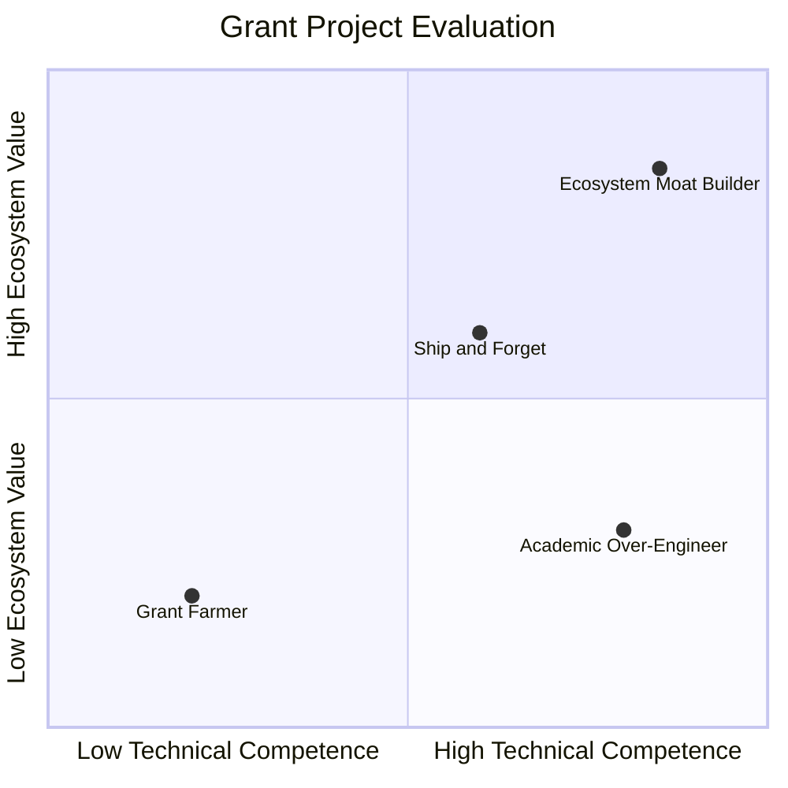

You would think that giving away free money to highly intelligent software developers would be the easiest job in the world. 

You write a blog post announcing: *"We are launching a $5 million ecosystem grant program to support builders on our protocol!"* You sit back, put your feet up on your desk, and wait for a wave of brilliant, production-ready developer tools, SDKs, and integrations to wash over your GitHub repository.

Then, six months pass. 

You have successfully disbursed $1.2 million in grants. You open your ecosystem directory and realize that:
* Three projects took the 50% upfront payment and literally disappeared into thin air, deleting their Twitter accounts and ignoring your emails.
* Two teams built incredibly complex, academically interesting tools that solve problems absolutely nobody has, and which have sat in un-updated GitHub repositories with zero commits since the day they received their final payout.
* One project built a beautiful dashboard that worked perfectly on testnet, but completely broke on mainnet due to gas inefficiencies, and the developers are now asking for another $50,000 "maintenance grant" just to fix their own bugs.

Welcome to the reality of **Developer Relations** and ecosystem funding in Web3. 

Giving away capital is easy. Giving away capital in a way that actually results in high-quality, production-ready, long-term maintained software is one of the hardest, most frustrating challenges a protocol team will ever face.

Let’s look at the classic failure modes of developer grant programs, and how you can structure your funding pipeline to turn free money into a thriving, self-sustaining developer ecosystem.

## The Three Archetypes of Grant Failure

To build a great developer program, you first have to understand the people who are applying. Just like in open-source development, different incentives drive different behaviors. In the grants world, three classic "failure archetypes" emerge:

### 1. The Professional Grant Farmer
These teams are highly sophisticated, but not at writing code—they are experts at **writing proposals**. They know exactly what keywords to use. They read your forum posts, figure out your team’s pet priorities, and draft gorgeous PDF applications with perfect milestone breakdowns and ambitious timelines.

But they have no intention of building a long-term business on your protocol. They are mercenary builders. They collect the upfront payment, do the bare minimum amount of work required to trigger the next milestone, and then immediately move on to apply for a grant from your layer-1 competitor. Their code is usually a copy-paste of an existing template with a different CSS skin.

### 2. The Academic Over-Engineer
These are brilliant developers who love solving hard computer science problems. They don’t care about market demand or user adoption. They want to build an automated, zero-knowledge, recursive multi-signature compiler optimization framework for your smart contract system.

You award them a grant because they sound incredibly smart. 

Six months later, they deliver exactly what they promised. It is technically flawless, beautifully formatted, and completely useless. Nobody uses it because the user experience is too complex, and it solves an edge-case problem that only three people in the world care about. 

### 3. The "Ship and Forget" Team
These are solid developers who build a genuinely useful tool—say, a Python SDK for your protocol’s API. They complete all their milestones, collect their final payment, and celebrate.

But software is a living organism. Two weeks later, you push a breaking upgrade to your smart contracts. The Python SDK breaks. 

Because the grant team has moved on to their next paying job, your SDK lies abandoned. New developers try to use it, spend three hours debugging cryptic errors, get frustrated, and leave your ecosystem entirely. A broken, unmaintained tool is actually worse than no tool at all because it actively damages developer trust.

## The Blueprint for a Successful Grants Program

How do we solve this? How do we attract the **Ecosystem Moat Builders**—the teams who write clean, maintainable code, integrate deeply into your community, and build tools that attract thousands of other developers?

You have to change the structure of the game.

### 1. Kill the "Upfront" Payout
Never, under any circumstances, pay more than 10-15% of a grant upfront. If a team requires $100,000 to build an integration, and they demand $50,000 before they write a single line of code, walk away. 

High upfront payouts attract scammers and mercenary grant farmers. Low upfront payouts filter for teams who are either already capitalized or have enough confidence in their technical ability to deliver on milestones.

Structure your payouts on a strict, verifiable, milestone-based escrow model:
* **Milestone 1 (15%)**: Technical specification and architecture design doc approved by your lead protocol engineer.
* **Milestone 2 (35%)**: Core functionality working on local test fork, with 90%+ test coverage, open-source on GitHub.
* **Milestone 3 (35%)**: Mainnet deployment, public documentation, and functional frontend/UI.
* **Milestone 4 (15%)**: Retained after 3 months of active maintenance and addressing community issues on GitHub.

### 2. Pivot from "What do you want?" to "Here is what we need"
The most inefficient grant programs are passive. They put up a blank submission form that asks: *"What do you want to build on our protocol?"* This results in dozens of redundant proposals for generic block explorers, basic wallets, and simple dashboards.

Instead, be **highly opinionated**. Create a public, active registry of **RFPs (Requests for Proposals)**. 

Identify the exact missing pieces in your developer experience:
* *"We need a Go library to parse our event logs. Budget: $25,000."*
* *"We need a sub-graph on The Graph to index our liquidations. Budget: $15,000."*
* *"We need a Hardhat plugin to automate deployment of our lending pools. Budget: $40,000."*

By defining the exact specification, you eliminate the noise, align developer energy with your immediate technical roadmap, and can easily compare different teams bidding on the same RFP.

### 3. Subject Applications to Technical Peer Review
Grant applications should not be evaluated by marketing managers, business development leads, or venture capitalists. They must be vetted by **engineers who actually write code on the protocol**.

An experienced developer can look at a team's past GitHub commits and immediately tell if they write clean, idiomatic code, or if they are just copy-pasting codebases. They can spot architectural flaws in the proposal before the project begins, saving you months of wasted time and capital.

### 4. Provide "Non-Dilutive Support" Over Pure Capital
High-quality developer teams in Web3 aren't just looking for cash—capital is abundant in 2020. What they actually want, and what is incredibly hard to find, is **engineering bandwidth and distribution**.

The most successful grant programs act as accelerators:
* They pair grant recipients with a dedicated **Developer Advocate** who can answer technical questions, run code reviews, and help them debug complex smart contract behaviors.
* They offer **free security audits** or access to trusted auditors (like Trail of Bits or OpenZeppelin) to ensure the code is safe before mainnet deployment.
* They use their main protocol marketing channels to showcase the completed tools, driving instant user adoption and developer eyeballs to the project.

## Capital is a Commodity; Ecosystem is Everything

A developer grant program is not an expense category on your balance sheet; it is a long-term capital allocation strategy. 

If you treat it like a corporate charity program, you will end up with a graveyard of broken code and a community of disgruntled builders. But if you treat it like a highly structured, technically rigorous, milestone-driven investment vehicle, you will build the ultimate competitive moat for your protocol.

Build for the long term. Protect your code, support your builders, and never pay for a proposal before you see the commits.
