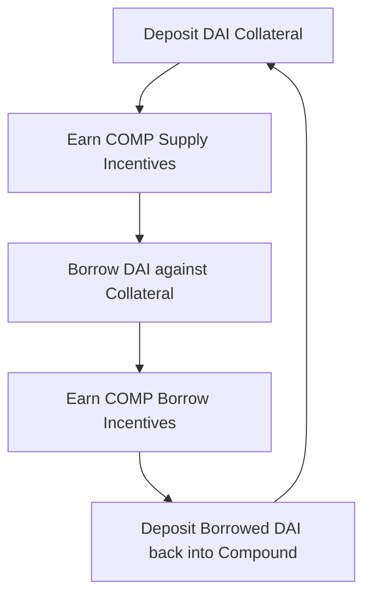

If you were sitting in your sweatpants in mid-June 2020, staring at a Zoom screen while the world outside seemed to be undergoing a slow-motion collapse, you probably missed the exact moment the matches were struck. 

We were all doomscrolling Twitter, trying to figure out if we should wash our groceries with soap, when Robert Leshner and the team at Compound Finance quietly flipped a switch on Ethereum mainnet. 

The date was June 15, 2020. The event? The distribution of the COMP governance token to the protocol’s users. 

Nobody knew it at the time, but this was the big bang of **DeFi Summer**. Within days, the sleepy world of Ethereum-based lending would mutate into a multi-billion-dollar casino of programmatic yield, leverage loops, and internet money printing. It was beautiful, terrifying, and profoundly weird.

Let’s unpack exactly what happened on that fateful Monday and how a single ERC-20 token distribution model completely re-architected on-chain finance.

## The Cold Start Problem and the Solution That Broke the internet

Before June 15, decentralized finance was a niche hobby for cryptography nerds, cypherpunks, and developers who enjoyed losing money on gas fees. Compound was a solid protocol—you could deposit DAI or ETH to earn a modest 3-4% yield, or you could borrow against your collateral. But it faced a classic network-effects problem: why would liquidity providers deposit assets if there weren't enough borrowers? And why would borrowers pay interest if there wasn't enough deep liquidity to borrow from?

This is the "cold start" problem. Traditional startups solve this by burning venture capital on Facebook ads and Uber discounts. Compound solved it by giving away the protocol itself.

The mechanism was deceptively simple. The protocol would distribute 2,880 COMP tokens every single day. Half of these tokens went to suppliers, and the other half went to borrowers. The distribution was proportional to the dollar value of the assets being supplied or borrowed in each of Compound’s markets.

This was not an ICO. You couldn't buy COMP from the team. The only way to get it was to *use* the protocol.

Suddenly, the interest rate math broke in the most delightful way possible.

## The Mathematical Alchemy of Negative Interest Rates

Imagine you go to a bank to borrow $10,000. The bank tells you, "The interest rate on this loan is 8%. However, because you are borrowing from us, we are also going to hand you $1,200 worth of stock in our bank." 

Your net cost of borrowing isn't 8%—it's actually +4%. The bank is literally paying you to borrow their money.

This is exactly what happened on Compound. On June 15, as COMP began trading on secondary markets like Uniswap and later Coinbase, its price found a footing. It didn't just drift at some nominal penny valuation; it exploded. It rocketed from $30 to nearly $100, and then climbed over $300 in a matter of days.

At those valuations, the dollar value of the daily COMP distributed to borrowers and lenders completely dwarfed the actual interest being paid or earned. 

The developer brain immediately realized what this meant: **Recursive Leverage Loops**.

If borrowing DAI cost you 10% in interest but earned you 25% in COMP distribution value, the logical developer move was not to just sit there. The logical move was to:
1. Deposit DAI as collateral.
2. Borrow DAI against that collateral.
3. Deposit the borrowed DAI back into the protocol.
4. Borrow more DAI.
5. Repeat until you hit the maximum safe collateralization ratio.

Suddenly, users were running 4x or 5x leverage loops on stablecoins, earning astronomical yields paid out in a token that the market was repricing higher by the hour. 

This was the birth of **Yield Farming**.

## The On-Chain Gold Rush

What followed was one of the most intense capital migrations in human history. 

On June 15, Compound's Total Value Locked (TVL) was roughly $100 million. By the end of June, it had soared past $600 million. Capital was being sucked out of traditional bank accounts, centralized exchanges, and cold wallets, all of it rushing into Ethereum smart contracts to feed the giant COMP farming machine.

The Ethereum network itself began to buckle under the strain. Gas prices, which we used to complain about when they hit 20 gwei, started climbing to 100, 200, and eventually 500 gwei. A single transaction to execute a leverage loop could cost $50, $100, or more in ETH. 

But nobody cared. When you are making $2,000 a day in COMP tokens by supplying $50,000 of stablecoins, a $100 transaction fee is just a minor cost of doing business. It was the cost of admission to the greatest show on earth.

Developers became the kings of this new frontier. If you could write a Solidity script to automate the recursive supply-and-borrow process, or if you could deploy a smart contract that pooled user funds to share gas costs (the precursor to Yearn Finance), you were suddenly managing tens of millions of dollars.

## The Tokenomics Paradigm Shift

The COMP launch didn't just launch DeFi Summer; it changed the paradigm of web3 tokenomics forever. 

Before June 2020, tokens were primarily used for fundraising (ICOs). They were utility tokens that you needed to pay for API calls, or security-like tokens that promised future dividends. After COMP, tokens became **incentive engines**.

Every founder in the space looked at Compound's skyrocketing TVL and realized they had a new playbook:
* Step 1: Build a decentralized protocol.
* Step 2: Allocate 40-50% of the token supply to "liquidity rewards."
* Step 3: Let the market price the token.
* Step 4: Watch billions of dollars of mercenary capital flood into your system.

Within weeks, Balancer launched BAL incentives. Then came Curve with CRV. Then came the food tokens—Yam, Sushi, Spaghetti—each one pushing the yield farming model to more extreme, degenerated, and hilarious heights. 

We had transitioned from the "build cool tech and hope they come" era to the "liquidity mining arbitrage" era.

## The Hangover and the Legacy

Of course, mercenary capital is just that—mercenary. The yield farmers who flooded into Compound on June 15 weren't there because they passionately believed in decentralized interest rate markets. They were there for the arb. The moment a different protocol offered a higher APY, they packed up their digital bags and moved their capital elsewhere.

But to dismiss the COMP launch as a mere bubble is to miss the forest for the trees. 

The June 15 launch proved that decentralized communities could bootstrap liquidity and network effects without relying on traditional gatekeepers. It turned users into owners. It proved that Ethereum wasn't just a platform for theoretical whitepapers—it was a highly functional, highly composable global financial computer.

If you survived DeFi Summer, you know how chaotic it was. You remember the sleepless nights, the constant anxiety of smart contract audits, and the sheer thrill of watching a token code itself into a multi-billion-dollar ecosystem in real-time.

And it all started with a single, elegant distribution mechanism on a Monday morning in June. What a time to be alive and writing code.
