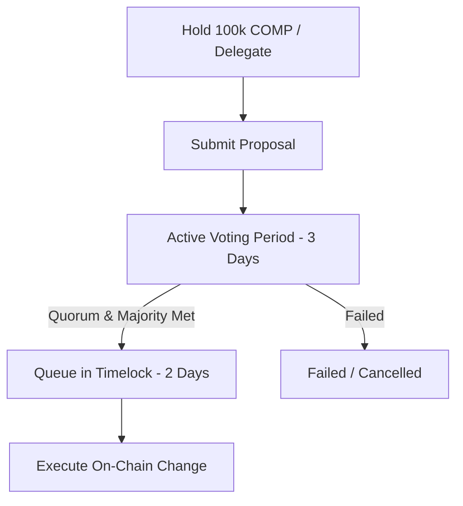

If you read the whitepapers circulating on crypto Twitter, decentralized governance sounds like an absolute paradise. It’s painted as a digital Athenian democracy where globally distributed sovereign individuals align their incentives through beautiful, trustless smart contracts to govern multi-billion-dollar protocols. No boardrooms. No corrupt executives. Just pure, mathematical consensus.

Then, you participate in your first DAO vote and reality hits you like a cold bucket of liquidation water.

You realize that a tiny handful of venture capital firms and founders hold 90% of the voting tokens, the average voter turnout is lower than a local municipal election, and the entire system is held together by off-chain Discord debates and high-stress multisig wallets.

But despite the gap between the utopian marketing and the messy reality, protocol DAOs are currently managing real, massive pools of capital. Compound’s **GovernorAlpha** contract, deployed alongside the COMP launch, has quickly become the gold standard for on-chain governance.

Let’s look past the press releases and explore how protocol DAOs *actually* work under the hood, how the plumbing is configured, and why coin-weighted voting is a deeply flawed—yet incredibly fascinating—experiment.

## The Plumbing: Anatomy of an On-Chain Proposal

To understand how a DAO functions, you have to look at the code of its governance contracts. In Compound's GovernorAlpha model, the lifecycle of a protocol change is highly structured, slow, and defensive. It is designed this way because when you are governing code that secures hundreds of millions of dollars, "move fast and break things" is an excellent way to go bankrupt.

An on-chain proposal must progress through four distinct phases:

### 1. The Proposal Threshold
You cannot just wake up and propose that a protocol change its interest rate model. To prevent the system from being spammed with frivolous votes, you must meet the **Proposal Threshold**. In Compound’s system, this requires holding or being delegated at least 1% of the total token supply (which translates to 100,000 COMP). 

Because very few individuals hold $20 million worth of COMP, this threshold forces founders and developers to gather support from other large holders before they can even write a proposal to the blockchain.

### 2. The Voting Period
Once a proposal is submitted, it enters an active voting state after a brief delay. The voting period usually lasts for a specified number of blocks (roughly 3 days). During this time, token holders can cast votes: `For`, `Against`, or `Abstain`. 

Crucially, voting power is calculated at the exact block the proposal was submitted (via a checkpointing mechanism) to prevent whales from buying up tokens on the secondary market mid-vote to swing the result, and then immediately dumping them.

### 3. The Quorum Limit
For a proposal to pass, it’s not enough to get a simple majority. It must also cross the **Quorum Requirement**—usually 4% of the total token supply (400,000 COMP voting yes). If 10,000 COMP votes yes and 0 COMP votes no, the proposal fails because it didn't meet quorum. This protects the protocol from being hijacked by a small, highly coordinated group of active voters when everyone else is asleep.

### 4. The Timelock Queue
This is the ultimate line of defense. If a proposal passes, it is not executed immediately. Instead, it is queued in a **Timelock contract** for a minimum of 2 days. 

This delay serves a vital security purpose: if a malicious or catastrophic proposal somehow passes (either due to a smart contract exploit or a sudden governance attack), users have a 48-hour window to withdraw their capital from the protocol before the change goes live. The timelock gives the market time to react.

## The delegation Solution (And its Cluster Risk)

Let’s be honest: most token holders do not want to read smart contract diffs or analyze risk parameters on a Tuesday evening. They want to farm yield. This leads to massive voter apathy. Turnout on most on-chain proposals often hovers around 1-3%.

To solve this, modern DAOs use **Delegate structures**. 

You don’t have to give up ownership of your tokens or transfer them out of your wallet to participate. Instead, you can delegate your *voting power* to a representative—a developer, a risk researcher, or an active community member who has the technical competence to review proposals.

It’s an elegant solution, but it introduces a new set of dynamics:
* **The VC Hegemony**: Major venture funds like a16z, Paradigm, and Bain Capital hold massive blocks of tokens. By delegating their massive reserves to select university blockchain clubs (like Stanford Blockchain or Harvard Blockchain) or industry figures, they effectively control the voting outcomes while maintaining an appearance of decentralization.
* **Centralization of Influence**: A tiny club of "super-delegates" emerges. If five delegates control 50% of the active voting power, governance is no longer a decentralized network; it’s a boardroom meeting of five people.

## The Flaws of Coin-Weighted Voting

The core assumption of most 2020 DAOs is that **1 token = 1 vote**. This is coin-weighted voting, and it is a model imported directly from corporate shareholder governance. 

But public blockchains are not corporate registries. They are open, permissionless, highly adversarial financial environments, and coin-voting has three structural vulnerabilities that we are just beginning to see play out:

### 1. Capital Dictates Truth
In a corporate board, major shareholders have fiduciary duties and legal liabilities. In a pseudonymous DAO, there are no fiduciary duties. A whale can vote for a proposal that benefits them personally at the expense of the long-term health of the protocol, execute the transaction, dump their tokens, and disappear into the digital night. Capital has all the power, and labor (the developers building the protocol, the community managers moderating the chat) has none.

### 2. The Flash Loan Threat
This is the developer's nightmare scenario. With the rise of flash loans, an attacker doesn't even need to buy or own tokens to hijack governance. 

They can:
1. Borrow millions of dollars of a governance token from a lending pool in a single transaction block.
2. Call a governance function or vote on a proposal.
3. Repay the loan.
4. Complete the transaction block.

While GovernorAlpha's checkpointing system protects against this for proposal voting, newer, less-vetted governance implementations are highly vulnerable to flash-loan manipulation.

### 3. Plutocracy vs. Meritocracy
The people who are best suited to make risk decisions for a lending protocol are rarely the people who have the deepest wallets. Coin-voting naturally favors capital accumulators over technical contributors.

## The Path Forward: What Comes Next?

We are in the absolute infancy of decentralized coordination. Nobody has solved these problems yet, but the conversations happening on forums in June 2020 are pushing the boundaries of political science.

We are seeing early debates around **Quadratic Voting** (where the cost of a vote scales quadratically, giving more weight to the number of unique supporters than the depth of their wallets). We are seeing discussions about **Reputation-based governance** (where voting power is earned through contributions and cannot be bought or sold). We are seeing the rise of **Optimistic Governance** (where a multisig or a small council executes changes, but token holders can veto them if they act out of line).

Protocol DAOs are messy, experimental, and frequently frustrating. But make no mistake: they are a live, real-time stress test of new forms of human coordination. We are writing the laws of decentralized organizations in Solidity, one block at a time.
