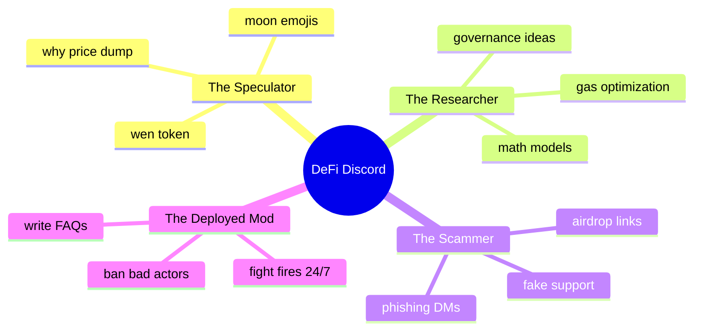

Welcome to the trenches. 

If you think community management is all about scheduling cute tweets, posting memes, and celebrating "Friday vibes," I invite you to spend exactly 15 minutes inside a fast-growing DeFi Discord server during DeFi Summer.

Managing a typical Web2 community is like moderating a fan club. Managing a DeFi community is like running a 24/7 global financial exchange, a technical support desk, a cypherpunk research lab, and a psychiatric ward all at the exact same time—inside a single, chaotic, high-speed chat client.

The stake isn't "brand engagement" or "click-through rates." The stake is **real, hard money**. When gas prices spike, a transaction fails, or a smart contract behaves unexpectedly, the chat doesn't politely ask for help. It erupts into a psychological pressure cooker of panic, fury, and absolute chaos.

Let’s talk about the daily reality of managing a DeFi Discord server that has just crossed 10,000 members, the archetypes that define this world, and the tactical playbook you need to survive.

## The Cast of Characters in a DeFi Discord

When a protocol launches yield-mining rewards, the Discord community changes overnight. It goes from a quiet watering hole of technical builders to a massive, hyper-diverse ecosystem. 

You quickly learn to identify the four main archetypes:

### 1. The "Wen Token" Speculator (The Degen)
This is the most vocal, high-volume member of your server. They don't know what a smart contract is, they have never read a whitepaper, and they have no interest in decentralized liquidity pools. 

Their entire vocabulary consists of:
* "wen token?"
* "why APY dropping?"
* "marketing team doing nothing"
* "is this project dead?"

They are highly emotional, easily panicked, and immune to long-form technical explanations. If the price of your token drops 3%, they will flood the chat with warning messages and accuse the founders of exit-scamming. If the price rises 3%, they will post 500 rocket emojis and declare the lead developer a god.

### 2. The Deep-Tech Researcher
The absolute soul of your project. They spend their time in `#research` or `#governance` channels. They discuss gas-saving storage layouts, mathematical efficiency curves for automated market makers, and MEV (Miner Extractable Value) strategies. 

They speak in precise, technical terms and ask incredibly difficult questions. If you ignore them, they will take their brilliant ideas and deep capital to a competitor. If you nurture them, they will write the proposals that secure the protocol's future.

### 3. The Clueless Farmer
They are just trying to make a living. They read a medium post about "earning 100% APY on stablecoins" and decided to deposit their life savings. 

They don't understand network fees, they don't know how Metamask works, and they are constantly running into issues like: "I sent ETH directly to the contract address, where is my money?" 

They need immense patience, clear step-by-step guides, and constant reminders that "support will never DM you first."

### 4. The Lurking Scammer
The most dangerous creature in the ecosystem. They do not talk in `#general`. Instead, they lurk in the member list, waiting for a user to express confusion or post a support question. 

The moment they spot a target, they slide into their DMs with a name like `Support_Admin_01` and a profile picture copied from your lead dev. They offer to "validate their wallet" through a phishing site that drains every single token they own.

## The Tactical Playbook: How to Keep the Peace

Moderating this environment requires a mix of military discipline, technical tooling, and psychological counseling. Here is the blueprint for keeping a 10k-member financial Discord from collapsing into anarchy:

### 1. Lock Down the DMs (The Anti-Phishing Setup)
The number one rule of crypto community management is: **Protect your users from themselves**. 

You must set up a prominent `#welcome` verification channel where users must complete a captcha or agree to strict rules before accessing the rest of the server. 

But more importantly, your server’s first automatic message to every single new joiner must be a screaming warning in red letters: **ADMINS WILL NEVER DM YOU FIRST. TURN OFF YOUR DIRECT MESSAGES.**

### 2. Segment the Noise
If you put your developers, your speculators, and your support team in the same room, everyone will leave. You must compartmentalize your server:
* `#announcements`: Read-only. Locked down to lead admins with 2FA enabled. No exceptions.
* `#general-chat`: The public square. Let the degens post memes, talk about price, and blow off steam. Keep the moderation light here, but watch for scams.
* `#technical-support`: Integrate a ticket bot (like Ticket Tool). Do not let users post transaction details or ask for support in public channels. Force them to open a private ticket where a verified moderator can assist them safely.
* `#governance-proposals`: Keep this clean, professional, and moderated. Ban anyone who posts price speculation or rocket emojis in this channel. This is the boardroom.

### 3. Let the Bots Do the Heavy Lifting
In a fast-moving market, you cannot rely on human moderators to keep up with the volume. You must integrate custom tooling:
* **Gas Tracker**: A bot that pinned-updates the current Ethereum gas price (low, average, high) in the sidebar. This immediately reduces the "why is my transaction pending?" spam.
* **Transaction Bot**: A webhook that streams major protocol events—like large deposits, massive swaps, or newly submitted governance proposals—directly into a dedicated read-only channel. This satisfies the appetite for real-time on-chain data.
* **Auto-Mod Filters**: Set up aggressive filters for common scam phrases like "airdrop link," "metamask support," "unstake wallet," or "trust swap."

## Managing the Crisis: The ultimate Test

Every DeFi community manager eventually faces "The Event." It could be a smart contract exploit, a major oracle failure, a network halt, or a sudden market-wide collapse.

When a crisis hits, the atmosphere in the Discord turns instantly toxic. Five hundred people are typing at the same time, asking if they have lost their life savings, while the team is frantically trying to analyze the smart contract state.

The instinct of many founders is to panic, shut down the server, or go completely silent until they have a perfect solution. **This is a fatal mistake.** Silence is interpreted as a confession of guilt. It breeds panic, which breeds bank runs.

The crisis playbook is simple:
1. **Never Go Silent**: Even if you have zero answers, post immediately. Let the community know: "We are aware of the issue. The technical team is investigating right now. We will provide updates here every 15 minutes."
2. **Set the Chat to Slowmode**: Instantly set `#general` to a 2-minute or 5-minute slowmode. This stops the manic scrolling, slows down the collective heart rate, and allows users to actually read the pinned announcements.
3. **Be Radically Honest**: Do not try to spin the situation or sugarcoat a exploit. If capital was lost, admit it. If code failed, own it. Crypto communities are surprisingly forgiving of technical failures if the founders are transparent and take responsibility. They are completely unforgiving of lies and cover-ups.

## The Ultimate Moat

It is incredibly easy to look at the chaos of a DeFi Discord and wonder why anyone would bother. Why not just build in a quiet, centralized bubble?

Because in Web3, **Community is the ultimate moat**.

In a world of open-source software, any developer can fork your smart contracts in five minutes. They can copy-paste your code, change the name, launch a new token, and deploy a prettier website. 

But they cannot fork your Discord. They cannot copy-paste the relationships, the shared history, the technical debates, and the collective trust of 10,000 highly active on-chain participants. 

Your community isn't just a marketing channel; it is the protocol itself. Treat it with the respect, the security, and the tactical attention it deserves.
