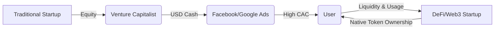

If you have ever tried to launch a startup, you know the absolute horror of the "cold start" problem. 

You build an elegant, beautifully architected marketplace. You write flawless code, set up CI/CD pipelines, and design an interface that would make Jony Ive weep. You deploy. And then... absolute silence. 

No drivers because there are no passengers. No passengers because there are no drivers. It’s the classic chicken-and-egg dilemma.

In the Web2 world, we solved this with a brutal brute-force strategy: **Venture Capital subsidization**. You raise a massive Series A from a Sand Hill Road firm, and then you spend 80% of that money on Facebook ads, Google AdWords, and direct user subsidies. You give riders free $20 credits. You pay drivers $30 an hour just to sit in their cars. You burn cash to buy a synthetic network effect, hoping that by the time the money runs out, you have achieved monopoly lock-in and can finally raise prices.

It’s an incredibly inefficient, highly dilutive, and deeply painful way to build a company. 

But as DeFi Summer is currently showing us, there is a brand-new playbook. It’s called **Token Incentives**, and it’s the most powerful startup growth hack that traditional tech founders are completely ignoring.

Let’s talk about how on-chain networks are using token distribution to bypass traditional VC-backed marketing spend entirely, and why this represents a fundamental rewrite of startup economics.

## Redefining Customer Acquisition Cost (CAC)

In traditional SaaS or marketplace startups, the holy trinity of metrics is **CAC** (Customer Acquisition Cost), **LTV** (Lifetime Value), and **Churn**. Your goal is simple: make sure your LTV is at least three times higher than your CAC, and keep churn low enough that you don't leak capital.

But what if you could drive your CAC to *zero*? Actually, what if your CAC could be **negative**?

This is the magic trick that Compound Finance just pulled off with the COMP token. By distributing ownership of the protocol to its users in real-time, Compound didn't need to spend a single dollar on Google ads. They didn't need to hire an expensive enterprise sales team. They didn't even need a marketing budget.

Instead, they took their native token—which represents governance and ownership in the network—and distributed it to anyone who supplied or borrowed capital. 

To the user, this token is a liquid asset with real-world market value. It acts as an immediate financial discount on the transaction. For a borrower, it turned an interest rate expense into an interest rate profit. 

Look at the structural efficiency of this loop:
* The startup dilutes its equity/token supply directly to the **end-user**, rather than diluting to a venture capitalist who then hands the cash to a Web2 advertising duopoly.
* The early adopters—who are taking the highest risk by using an unvetted, potentially buggy smart contract—are rewarded with the highest ownership stake.
* The interests of the platform, the developers, and the users are perfectly aligned. Everyone wants the network to succeed because everyone owns a piece of it.

This is decentralized bootstrapping. It is a highly competitive, incredibly aggressive alternative to traditional marketing spend.

## The Early Adopter Risk Premium

One of the hardest things for traditional product designers to understand is why anyone would use a buggy, complex, and highly experimental Web3 product over a polished Web2 equivalent.

The answer is the **early adopter risk premium**.

In 2020, depositing stablecoins into a DeFi protocol is objectively risky. Smart contracts get hacked. Flash loan exploits happen. Admin keys can be compromised. The user interface is confusing, and if you lose your private key, your money is gone forever.

If a DeFi protocol offered the exact same interest rates as a traditional bank (say, 0.5% APY), absolutely nobody in their right mind would take that risk.

But by introducing token rewards, the protocol compensates early users for taking on that high systemic risk. The tokens act as an interest rate kicker. As the token price appreciates, the early users are handsomely rewarded for being the pioneers who stress-tested the system.

As the network grows, the smart contracts become battle-tested, the security risks decrease, and the user experience improves. Consequently, the token incentive can naturally taper off because the product’s organic utility has taken over. 

It’s an elegant, self-regulating feedback loop.

## The Mercenary Capital Trap

But let's be real for a minute. Token incentives are not a magic wand that solves all your problems. If you design them poorly, they can destroy your startup faster than any Web2 competitor ever could.

The biggest danger of this model is **Mercenary Capital**.

When Compound launched COMP, billions of dollars flooded in. But a huge chunk of that capital wasn't there because they loved Compound. It was hot, highly active capital managed by yield-maximizing bots and professional hedge funds. 

The moment a competitor (like Balancer or Curve) launched a different yield farm with a higher APY, that capital evaporated in a single block.

If your startup’s entire value proposition is "we pay you to use us," the moment you stop paying, your users will leave. You haven't built a community or a product; you’ve built a high-cost capital distribution system.

To survive the mercenary capital phase, you must convert financial users into organic users:
1. **Utility Beyond the Token**: The token should bootstrap the network effect, but the core product must provide real, non-financial value (e.g., fast transactions, deep liquidity, unique borrow markets).
2. **Value Alignment**: Design your token incentives so they reward *long-term alignment* rather than short-term rent-seeking. Introduce vesting schedules, lockups, or boost multipliers for users who lock their tokens for 6 to 12 months.
3. **Build the Sink**: A sustainable token economy needs "sinks" (places where tokens are spent or locked) to balance the "sources" (places where tokens are printed). If your token is purely an inflation vector, its price will eventually trend to zero.

## The Web3 Venture Capital Renaissance

This shift doesn't mean venture capital is dead. Rather, it means VC is being forced to evolve. 

Instead of writing massive checks to fund marketing burn, the best VCs in 2020 are acting as active network participants. They are running validator nodes, providing early liquidity to protocols, participating in governance, and helping founders design robust tokenomic models.

The startups of the next decade will not look like the startups of the last decade. They won't spend years pitching enterprise sales leads or burning millions on Facebook ads. 

Instead, they will write excellent smart contracts, design highly aligned token distribution curves, launch their products directly to the global internet, and let the mathematical gravity of token incentives do the rest.

It’s wild, it’s chaotic, and it’s happening right now on a terminal window near you. Time to adjust your playbook.
