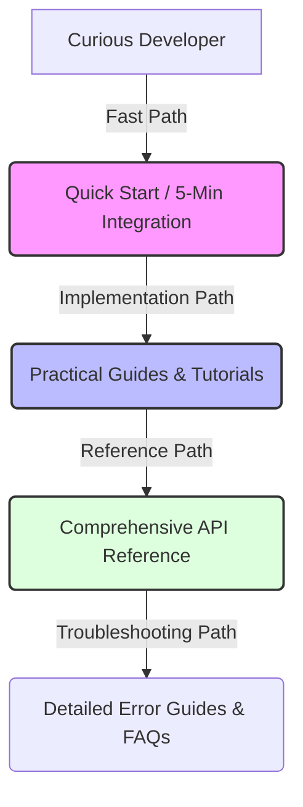

# API Documentation Kills (Or Saves) Your Developer Product

> **TL;DR:** Developers don't buy your product because of your elegant backend code—they buy it because they can integrate it in fifteen minutes. Your documentation is not an accessory to your API; your documentation *is* the API. If your docs are hard to read, missing error codes, or outdated, your product is dead in the water.

Let's start with a hard truth that many engineering founders hate to hear: nobody cares how elegant your database schema is. Nobody cares about your ultra-fast Rust microservices or your highly optimized Kubernetes clusters. 

When a developer integrates your product, the only window they have into your entire engineering organization is your documentation. 

If your documentation is bad, your product is bad. Period. It doesn't matter if your API has 99.999% uptime and sub-millisecond response times. If a developer gets an undocumented `HTTP 500` error or can't find a copy-pasteable curl example within thirty seconds of landing on your site, they will close the tab and find a competitor. 

Yet, in most software startups, documentation is treated as a chore. It's the thing squeezed into the final hours of a sprint, written by a sleep-deprived engineer who wants to get back to writing code. We undervalue technical writers, treat API reference pages as automated outputs from Swagger, and wonder why our conversion rates are abysmal.

Let's talk about why great documentation is your ultimate competitive moat, and how to build docs that developers actually love to use.

---

## The "Afterthought" Catastrophe

We’ve all experienced the frustration of integrating a poorly documented API. You find a page with a list of endpoints. You click on `/v1/transactions`. 

The description says: "This endpoint retrieves transactions." 

*No kidding.*

You look for the parameters. They are listed without types, or with vague descriptions like `status: string (optional)`. What status values are allowed? "pending"? "COMPLETED"? "failed"? Nobody knows. You have to make trial-and-error API calls, digging through raw JSON responses, trying to guess what the backend expects.

This is what happens when documentation is treated as an afterthought. It is catastrophic for your business. It drives up your support costs, slows down your sales cycle, and damages your brand. 

Developers are highly cynical buyers. They have a built-in detector for marketing fluff. They don't want to talk to a sales rep to understand how your product works; they want to see the code. If your docs are public, comprehensive, and clear, you are telling the developer: "We respect your time. We are a technical company that actually understands how developers work."

---

## What Stripe Got Right (And Why Everyone Cargo-Cults Them)

Whenever anyone talks about "great developer experience," Stripe is inevitably brought up. Why? Because Stripe was the first company to realize that the API *was* the product, and that the documentation was the marketing.

Before Stripe, integrating online payments meant downloading a 150-page PDF from a legacy bank, filled with obscure XML schemas and outdated Java examples. Stripe changed the game by offering a two-column, interactive, beautiful doc site.

Here is what Stripe got right that everyone else tried to copy:

1. **Contextual Authentication**: If you are logged into your Stripe dashboard, the code snippets in the documentation automatically populate with your *actual test API keys*. You don't have to copy a template, open a terminal, and manually edit the keys. You literally copy, paste, and run.
2. **Synchronized Code and Shells**: The left column explains the concept, the middle column shows the parameters, and the right column shows the code snippets in five different programming languages, alongside the exact JSON response you should expect.
3. **No Dead Ends**: Every error code has its own page explaining why it occurs and how to fix it. 

The mistake most dev-tool startups make is copy-pasting Stripe's layout without understanding Stripe's philosophy. They make a beautiful dark-mode three-column layout, but populate it with dry, auto-generated OpenAPI schemas that don't explain the business logic or the flow of a typical integration.

---

## The Anatomy of Great API Documentation

Great developer documentation is structured like a funnel. It must cater to different stages of a developer's journey, from curiosity to deep implementation.

### 1. The Quick Start (The "5-Minute" Rule)
The sole purpose of the Quick Start guide is to get a developer to their first successful API call as quickly as possible. This is your "Aha!" moment. It should require minimal configuration, use a simple curl command or a basic SDK import, and output a visible, rewarding response. If your Quick Start takes more than five minutes or requires a long setup process, you've lost them.

### 2. Conceptual Guides (The "Why" and "How")
API references tell you *what* an endpoint is, but they don't tell you *how* to use it in a real-world scenario. You need step-by-step guides for common use cases. For instance: "How to handle subscription upgrades," or "How to securely process webhooks." These should be written in conversational English, explaining the business logic, edge cases, and security practices.

### 3. The API Reference (The Ground Truth)
This must be absolutely exhaustive. Every endpoint, parameter, type, and return value must be documented. Never assume a parameter is "obvious." If a parameter can be null, say so. If a list is paginated, explain how the pagination headers work. Show realistic, full-payload JSON examples for both success and error responses.

### 4. Self-Service Troubleshooting
When a developer runs into an error, they shouldn't have to email your support team. Your documentation should have an exhaustive error directory. Every error response should return a human-readable message, a unique error code, and a link directly to a doc page that explains exactly how to resolve it.

---

## Why Technical Writers Are Your Super-Weapon

Stop expecting your core product engineers to write all your documentation. They are too close to the codebase. They suffer from the "curse of knowledge"—they assume certain setups or patterns are obvious because they built them.

Hire dedicated technical writers early. 

A great technical writer is a unique hybrid: they are part software engineer, part educator, and part product manager. They approach your API from the perspective of an outsider. They ask the stupid questions that your core engineers are too embarrassed to ask, and they find the friction points in your developer onboarding before your customers do.

Treat documentation as software. It should live in Git, go through a pull request and code review process, and have automated checks to catch broken links or invalid code snippets.

---

## Key Takeaways

- **Your Docs Are Your Product**: Treat them with the same engineering rigor as your core features.
- **Provide Real-World Context**: Auto-generated Swagger pages are not enough. Write guides that explain the business logic and complete integration workflows.
- **Invest in Developer Experience**: Simple touches—like active API keys in code snippets—dramatically increase activation rates.

---

## Frequently Asked Questions

**Q: Should we write our own documentation engine or use a SaaS tool?**
A: Don't spend engineering resources building a custom docs site from scratch unless you have Stripe-level resources. Use open-source documentation frameworks like Docusaurus, Nextra, or Mintlify. They look great, support Markdown, and let you keep your docs inside your Git repository.

**Q: How do we keep documentation from going stale as the API evolves?**
A: Use docs-as-code practices. Your documentation should live in the same repository as your code. When an engineer modifies an endpoint in a pull request, they must update the corresponding markdown docs in that same PR. If the PR does not contain the documentation updates, the build fails.

---

*If this made you think, it'll do even more when shared. Hit that subscribe button — I write about developer relations, api docs, and product building every week.*

*— [Shantanu Vishwanadha](https://substack.com/@thecoderpanda)*
