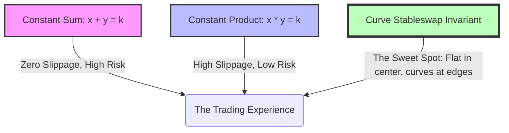

If Ethereum is the global decentralized computer, stablecoins are its blood supply. In July 2020, assets like DAI, USDC, USDT, and TUSD are the absolute foundation of everything we do in DeFi. They are the collateral in MakerDAO, the assets borrowed in Aave, the lending deposits in Compound, and the routing fuel in Yearn Finance vaults.

But there is a major technical bottleneck that almost broke the ecosystem earlier this year: **slippage**.

Imagine you are a whale or a yield aggregator bot trying to move $5 million of USDC into USDT to capture a 2% interest rate spike. If you execute that trade on a traditional Constant Product automated market maker (like Uniswap v1 or v2), the pricing curve is designed to handle extreme price ranges (from $0 to infinity). Because of this wide range, the liquidity is stretched incredibly thin. Swapping a large sum of money would push the price off the peg, costing you 3-5% in slippage losses. You’d literally burn $150,000 in transaction friction just to move between two assets that are both supposedly worth exactly one US dollar.

Enter Michael Egorov and **Curve Finance**.

Launched in early 2020, Curve has quietly become the most important infrastructure protocol in DeFi. It solves the stablecoin slippage problem using a masterpiece of financial engineering: the **Stableswap Invariant**. 

Let’s lift up the hood and break down the brilliant mathematics that powers low-slippage trading on Curve.

---

## The Two Extremes: Constant Product vs. Constant Sum

To understand Curve's genius, we have to look at the two extreme models of liquidity pools.

### Extreme 1: Constant Product (Uniswap)
Uniswap uses the elegant and robust formula:
$$x \times y = k$$

This formula is incredibly resilient. It can handle any trading price and can never be fully drained of either asset because as the supply of token $x$ decreases, its price increases exponentially. 

However, because the liquidity is distributed infinitely along a curve, the slippage is quite high for large transactions, even if the two assets are tightly pegged to each other (like USDC and USDT).

### Extreme 2: Constant Sum
If you want absolutely zero slippage, you could use a Constant Sum formula:
$$x + y = k$$

In this pool, you can swap USDC for USDT at a perfect 1:1 ratio with zero slippage, regardless of transaction size. 

But this model has a fatal flaw: **vulnerability to de-pegging**. If USDT ever loses its peg and drops to $0.90 on external markets, arbitrageurs will immediately dump all their cheap USDT into your pool and drain all your valuable USDC. Your pool will end up containing 100% dead USDT and 0% USDC, leaving your liquidity providers completely wiped out.

---

## The Stableswap Solution: A Mathematical Marriage

Michael Egorov’s breakthrough was to combine these two formulas into a single, hybrid invariant. He created a formula that behaves like a **Constant Sum** pool when the asset prices are close to 1:1, but dynamically shifts to behave like a **Constant Product** pool if the asset prices begin to diverge.

This ensures that traders get virtually zero slippage during normal pegged operations, but the pool remains safe from being drained if one of the stablecoins suffers a genuine de-pegging event.

Let's look at how these curves compare visually:

Mathematically, the Stableswap formula is represented by this equation:

$$A n^n \sum x_i + D = A n^n D + \frac{D^{n+1}}{n^n \prod x_i}$$

Let's break down what these variables actually mean in plain developer-speak:
- **$n$**: The number of assets in the pool (e.g., $n = 3$ for the popular 3Pool containing DAI, USDC, and USDT).
- **$x_i$**: The balances of each individual coin in the pool.
- **$D$**: The total inventory of coins in the pool when they are perfectly balanced at a 1:1 ratio. It acts as the "target" pool size constant.
- **$A$**: The **Amplification Coefficient**. This is the magic knob that controls the behavior of the pool.

### How the Amplification Coefficient ($A$) Works:
- If **$A = 0$**, the Stableswap equation simplifies and behaves exactly like Uniswap’s **Constant Product** ($x \times y = k$).
- If **$A \to \infty$** (approaches infinity), the equation behaves exactly like the **Constant Sum** ($x + y = k$) model.

By setting $A$ to a carefully selected value (such as 100 or 1000), Curve creates a "flat" pricing zone around the 1:1 peg. Within this flat zone, traders can execute multi-million dollar stablecoin trades with almost zero slippage. 

But if a massive external shock pushes the price away from the peg, the formula's Constant Product elements take over, causing the curve to bend sharply and protecting the remaining liquidity providers from total depletion.

---

## Why Curve is the Engine of DeFi Yields

The low-slippage environment created by Stableswap unlocked the next phase of DeFi Summer.

Yearn Finance’s automated yield vaults would be completely impossible without Curve. Because Yearn is continuously moving massive blocks of capital (often $10 million to $50 million) between different stablecoin strategies to chase yield, they rely on Curve’s deep, flat pools to execute these rotations without losing their profits to slippage.

Furthermore, Curve created the **CRV** token and liquidity gauge system, initiating the early phases of the "Curve Wars." 

Protocols like Yearn, Synthetix, and Ren are actively competing to accumulate CRV tokens so they can vote to direct the highest liquidity mining rewards to their own respective stablecoin or wrapper pools. This has turned Curve into the ultimate battleground for decentralized liquidity on Ethereum.

## Conclusion

Uniswap v2 is the king of general trading, but Curve Finance is the specialized sniper of stablecoin efficiency. By applying deep mathematical analysis to the mechanics of automated market makers, Michael Egorov built a protocol that maximizes capital efficiency and secures the foundation of DeFi liquidity routing.

As you build your own protocols, remember: you don't always need to build a general-purpose tool. Sometimes, focusing on a single, highly specialized problem—like stablecoin swaps—and solving it with mathematical perfection is the fastest way to become the backbone of an entire ecosystem.

Watch your slippage, pick your $A$ parameter wisely, and happy trading.

— Shantanu
