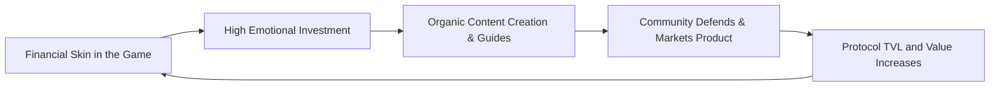

It’s 3:00 AM on a Tuesday. The gas price on Ethereum is sitting at a painful 180 gwei. To do a single transaction on Uniswap will cost me about $45 in ETH. Yet, my Discord notification feed is light-years ahead of the speed of sound. Thousands of people from across the globe are furiously typing in various channels, sharing custom Excel spreadsheets, posting MS Paint memes of cartoon pickles, and debating whether a new liquidity pool offering 800% APY is a brilliant financial breakthrough or a highly sophisticated exit scam.

Welcome to the world of the **DeFi Degenerate** (or simply "Degen").

In the summer of 2020, the term "Degen" has transitioned from a self-deprecating Twitter joke into a highly coveted badge of honor. These are the yield-chasers, the on-chain pioneers, and the risk-hungry liquidity providers who have bootstrapped a multi-billion-dollar decentralized financial economy in a matter of weeks.

To the outside world, this hyper-active subculture looks completely bizarre. But to anyone interested in community building, developer relations, or marketing, the yield farming culture of DeFi is the most fascinating masterclass in digital coordination ever observed.

Let's dissect the degen culture and see what it teaches us about building hyper-engaged communities.

---

## 1. The Alignment of Financial and Emotional Stakes

Traditional community building is centered around **advocacy**. You build a great product, you treat your customers well, and you hope they write nice reviews, wear your branded socks, and recommend your tool to their friends.

DeFi replaces this hope with **programmable incentives**.

When a yield farmer stakes their stablecoins to farm a protocol’s native token, they are doing more than just testing a product. They are acquiring ownership. 

This financial "skin in the game" creates a level of alignment that traditional marketing can only dream of. A degen doesn't just want the protocol to succeed because they like the UI; they want it to succeed because their own net worth is directly tied to the value of the token. 

This shared economic destiny turns passive users into active guardians:
- They write the user guides.
- They build custom dashboards to track yield analytics.
- They moderate the Telegram channels for free.
- They defend the project against FUD (Fear, Uncertainty, and Doubt) on Twitter.



---

## 2. Meme-First Communication: Complex Math, Simple Jokes

The underlying technology of DeFi is intimidatingly complex. We are talking about smart contract composability, non-custodial custody, price slippage, impermanent loss, and automated market-maker invariant equations.

How does the DeFi community explain these concepts to the average retail user?

Through **memes**.

```
DeFi Tech: "An invariant constant-product market maker model with dynamic gas-cost optimization."
Degen Translation: "Deposit banana into pool, get 4 banana back. Number go up!"
```

In the degen lexicon, a meme is worth a thousand whitepapers. When YFI launched, the community rallied around a simple cartoon mascot, a yield-farming "degen" holding a pitchfork, and phrases like "It ain't honest work, but it's much."

This meme-first culture democratizes access to complex financial concepts. It lowers the barrier to entry, transforming dry, academic financial jargon into a fun, interactive, and highly social game. By speaking the language of internet humor, DeFi communities have bypassed the sterile corporate branding of traditional banks and created a movement that feels alive, rebellious, and deeply human.

---

## 3. Permissionless Participation: Let Anyone Cook

In a traditional company, if you want to contribute to a project, you have to submit a resume, go through four rounds of behavioral interviews, sign a non-disclosure agreement, and wait for HR approval.

In DeFi, the model is **completely permissionless**.

If you want to contribute to Yearn Finance or Balancer, you don't ask for permission. You simply join the Discord, find a problem that needs solving, and start writing code or creating designs.

Some of the most valuable contributions in DeFi are created by completely anonymous developers who go by pseudonyms and have cartoon avatars.
- They write automated bots that alert the community when a whale makes a massive transaction.
- They design localized versions of the documentation.
- They compile gas-saving tips into viral Twitter threads.

By eliminating the friction of gatekeeping, DeFi protocols unleash the long tail of human talent. The community acts as an open-source meritocracy where the best ideas win, regardless of who you are, where you went to school, or what your legal name is.

---

## 4. The Power of Shared Adversity

You don’t truly know how strong your community is until your smart contracts get exploited, your token drops 50% in a day, or Ethereum gas fees spike to 300 gwei.

In DeFi, these high-risk events are a regular occurrence. Degens refer to them as "surviving a rug pull" or "getting rekt."

While these events are painful, they are also the ultimate bonding mechanism. There is a weird, tight-knit camaraderie that forms when you and 5,000 other people are sitting in a Telegram channel at 2:00 AM, watching a multi-sig transaction queue up to patch a contract vulnerability.

Surviving these crises together transforms a collection of individual speculators into a real community. It creates a shared narrative of survival, resilience, and loyalty that keeps users around long after the initial high-yield rewards have normalized.

---

## What Traditional Builders Must Learn

The degen culture is noisy, chaotic, and occasionally reckless. But underneath the food-themed tokens and the high-yield craziness is a profound shift in how digital communities operate.

Traditional software companies, community managers, and marketers need to understand that the internet is moving away from passive consumption and toward active ownership. 

Your users don't just want to buy your software; they want to contribute to it, represent it, and share in its financial success. If you can find a way to align your users' incentives with your company's growth, you can unleash a force of community coordination that no marketing budget can match.

Now if you'll excuse me, my stablecoin harvest contract is ready to claim, and gas just dropped to 140 gwei. Time to go to work.

— Shantanu
