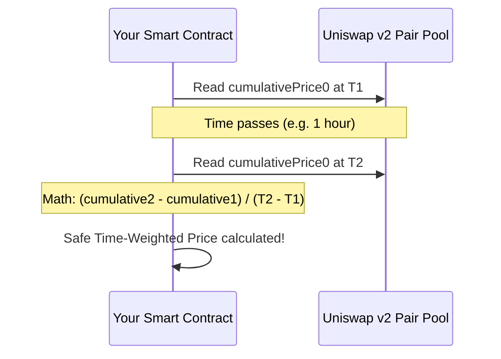

If you’re a smart contract developer in 2020, you can no longer ignore Uniswap. Since launching its v2 upgrade in May, Uniswap has solidified itself as the decentralized exchange (DEX) king. It is handling hundreds of millions of dollars in daily volume, and its constant-product formula ($x \times y = k$) is the heartbeat of DeFi liquidity.

But Uniswap v2 isn’t just for trading on a frontend UI. The real magic happens when you integrate Uniswap v2 directly into your own Solidity smart contracts. Whether you’re building an automated yield harvester, a collateral-swapping lending tool, or an algorithmic trading bot, you need to know how to talk to Uniswap on-chain.

In this guide, we are going to write a clean, production-ready Solidity contract that does two things:
1. Programmatically executes a **multi-hop swap** using the Uniswap v2 Router.
2. Interacts with Uniswap's new **Time-Weighted Average Price (TWAP)** oracle to fetch manipulation-resistant asset prices.

Grab your morning coffee, fire up VS Code, and let's write some Solidity.

## Prerequisite Interfaces

Before writing our integration, we need the interface for the Uniswap v2 Router. This is the contract that handles the math, finds the optimal routing path, and interacts with the individual pool pairs on our behalf.

```solidity
pragma solidity ^0.6.6;

interface IUniswapV2Router02 {
    function swapExactTokensForTokens(
        uint amountIn,
        uint amountOutMin,
        address[] calldata path,
        address to,
        uint deadline
    ) external returns (uint[] memory amounts);

    function getAmountsOut(
        uint amountIn,
        address[] calldata path
    ) external view returns (uint[] memory amounts);
}

interface IERC20 {
    function transferFrom(address sender, address recipient, uint256 amount) external returns (bool);
    function approve(address spender, uint256 amount) external returns (bool);
    function balanceOf(address account) external view returns (uint256);
}
```

## Step 1: Programmatic Multi-Hop Swaps

Let’s write a contract called `UniswapSwapper`. Its job is to take an input token (e.g., DAI), swap it for an intermediate token (e.g., WETH), and output a target token (e.g., LINK). This is known as a "multi-hop" swap. It allows you to swap assets even if there isn't a direct trading pair with deep liquidity between them.

Here is the implementation:

```solidity
pragma solidity ^0.6.6;

contract UniswapSwapper {
    // Address of the Uniswap v2 Router on Ethereum mainnet
    address private constant UNISWAP_V2_ROUTER = 0x7a250d5630B4cF539739dF2C5dAcb4c659F2488D;

    // Execute an exact input swap across a specific path
    function swapTokens(
        address _tokenIn,
        address _tokenOut,
        uint _amountIn,
        uint _amountOutMin,
        address _to
    ) external {
        // Safe-transfer the input tokens from the user to this contract
        require(
            IERC20(_tokenIn).transferFrom(msg.sender, address(this), _amountIn),
            "Transfer failed"
        );

        // Approve the Uniswap router to spend our input tokens
        require(
            IERC20(_tokenIn).approve(UNISWAP_V2_ROUTER, _amountIn),
            "Approval failed"
        );

        // Define the swap routing path: TokenIn -> WETH -> TokenOut
        address[] memory path = new address[](3);
        path[0] = _tokenIn;
        // In Uniswap v2, we route through WETH for optimal multi-hop liquidity
        path[1] = 0xC02aaA39b223FE8D0A0e5C4F27ead9083C756Cc2; 
        path[2] = _tokenOut;

        // Execute the swap
        IUniswapV2Router02(UNISWAP_V2_ROUTER).swapExactTokensForTokens(
            _amountIn,
            _amountOutMin, // Minimum amount acceptable to prevent slippage attacks
            path,
            _to, // Destination address
            block.timestamp + 300 // 5-minute deadline
        );
    }
}
```

### Key Considerations for On-Chain Swaps:
- **Slippage Protection**: Never pass `0` for `_amountOutMin` in production. If you do, MEV (Miner Extractable Value) searchers will sandwich-attack your transaction, draining your value. Always query `getAmountsOut()` off-chain or on-chain first and apply an acceptable slippage tolerance (e.g., 1-2%).
- **Token Approval**: Your contract must explicitly approve the router to spend the tokens. If you forget this, the router call will revert with a generic, unhelpful EVM error.

---

## Step 2: Querying Manipulation-Resistant Prices (TWAP)

Earlier this year, DeFi suffered several high-profile hacks (most notably the bZx flash loan attack) because smart contracts relied on *spot price* oracle queries. Spot price is the current price of an asset in a single liquidity pool. If a hacker takes a massive flash loan and dumps millions of dollars of DAI into a Uniswap pool, they instantly distort the spot price of DAI, which they can then exploit in a vulnerable lending contract.

Uniswap v2 solved this vulnerability by introducing **Time-Weighted Average Prices (TWAPs)**.



Instead of displaying the instantaneous spot price, Uniswap v2 records the cumulative price of an asset over time. To compute a TWAP, your contract must read this cumulative value at two different points in time, calculate the difference, and divide by the elapsed seconds.

Here is a simple TWAP implementation:

```solidity
pragma solidity ^0.6.6;

// Minimal interface to fetch cumulative prices from a Uniswap pair pool
interface IUniswapV2Pair {
    function price0CumulativeLast() external view returns (uint);
    function price1CumulativeLast() external view returns (uint);
    function getReserves() external view returns (uint112 reserve0, uint112 reserve1, uint32 blockTimestampLast);
}

contract UniswapPriceOracle {
    address public pair;
    uint public price0CumulativeLast;
    uint public price1CumulativeLast;
    uint32 public blockTimestampLast;

    constructor(address _pair) public {
        pair = _pair;
        IUniswapV2Pair pairContract = IUniswapV2Pair(_pair);
        price0CumulativeLast = pairContract.price0CumulativeLast();
        price1CumulativeLast = pairContract.price1CumulativeLast();
        (, , blockTimestampLast) = pairContract.getReserves();
    }

    // Call this function periodically (e.g. once every 1 hour) to update the TWAP
    function update() external {
        IUniswapV2Pair pairContract = IUniswapV2Pair(pair);
        uint price0Cumulative = pairContract.price0CumulativeLast();
        uint price1Cumulative = pairContract.price1CumulativeLast();
        (, , uint32 blockTimestamp) = pairContract.getReserves();

        uint32 timeElapsed = blockTimestamp - blockTimestampLast;
        require(timeElapsed >= 3600, "Oracle: Time window too short"); // Require at least 1 hour

        // Compute the time-weighted average price (fixed-point math omitted for simplicity)
        uint price0Average = (price0Cumulative - price0CumulativeLast) / timeElapsed;
        uint price1Average = (price1Cumulative - price1CumulativeLast) / timeElapsed;

        // Save state for the next update interval
        price0CumulativeLast = price0Cumulative;
        price1CumulativeLast = price1Cumulative;
        blockTimestampLast = blockTimestamp;
    }
}
```

### Why This is Hack-Resistant:
Because the price is averaged over a full hour (or longer), a flash-loan attacker who manipulates the price in a single block will have virtually zero impact on the TWAP. To manipulate a TWAP oracle, an attacker would have to keep the pool price distorted for hours on end, which is prohibitively expensive because arbitrageurs would continuously extract value from them.

## Putting It All Together

Integrating with Uniswap v2 is the ultimate superpower for your smart contracts. It gives your code access to the deepest liquidity pool in the world and provides a robust, decentralized price feed that keeps your protocol safe from flash loan exploits.

When building your integration, always remember to write unit tests using a mainnet fork (using Hardhat or Ganache) so you can test against real Uniswap states without paying actual Ethereum gas fees.

Now go forth, compile those contracts, and build the future of decentralized finance.

— Shantanu
