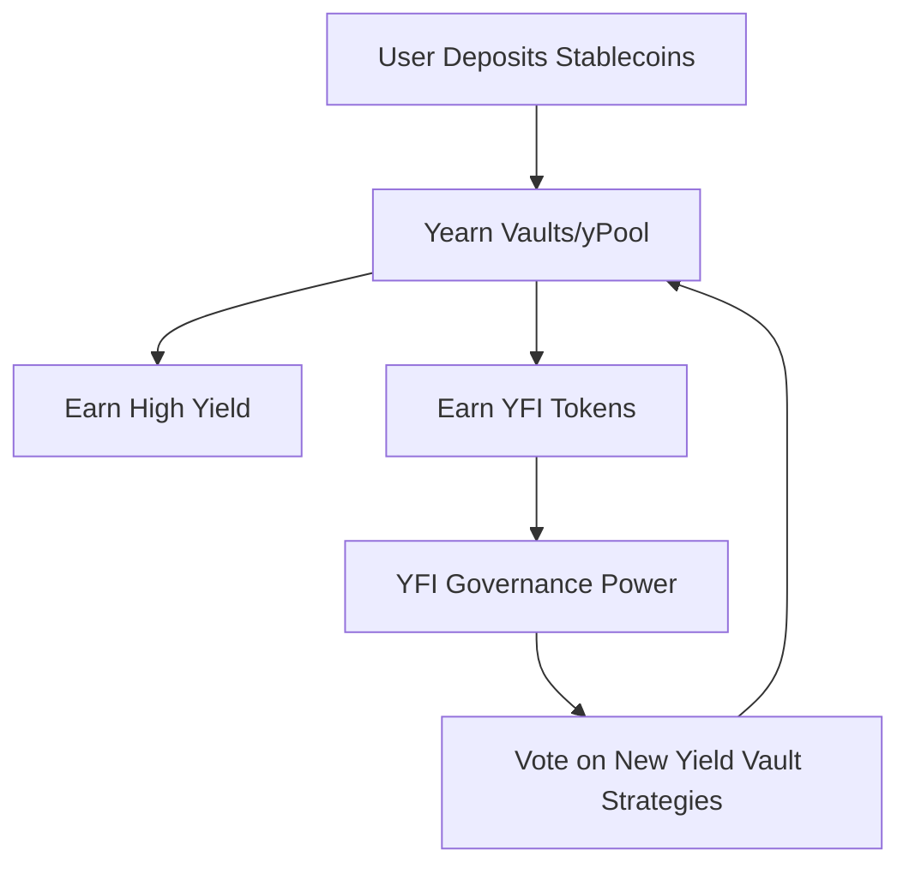

DeFi Summer is officially out of hand. If you had told me in January that we would be staying up until 4:00 AM staking synthetic stablecoin pool tokens to farm some weird asset named after a sleepy blue-faced cartoon character, I would have told you to go touch some grass. Yet here we are in July 2020, and the entire Ethereum network is collectively losing its mind over a yield aggregator called Yearn Finance and its newly minted governance token, YFI.

But Yearn isn't just another food coin. It is the catalyst of a fundamental shift in how decentralized networks are built, governed, and valued.

On July 17, 2020, a lone developer named Andre Cronje published a Medium post that changed the course of crypto history. He introduced YFI with a disclaimer that was so aggressively dismissive it functioned as the ultimate reverse psychology masterclass:

> "In an effort to give up this control (mostly because we are lazy and don't want to do it), we have released YFI, a completely valueless 0-value token. We reiterate, it has 0 financial value. There is no pre-mine, there is no founder reward, there is no VC allocation, there is no presale, there is no team allocation."

It was a bold, almost ridiculous claim. In an industry dominated by massive VC-funded treasuries, heavily guarded pre-mines, and early-stage advisor allocations, Cronje literally threw his creation into the wild and said: "Here, you deal with it." 

And the crowd went wild. Let's break down how this "valueless" token became the most expensive asset in DeFi.

## The Mechanics of the Fair Launch

To appreciate YFI's meteoric rise, you have to understand the environment it was born in. DeFi Summer was kicked off by Compound’s COMP token liquidity mining. COMP was a massive success, but it still had a massive team and VC allocation. Balancer followed with BAL, employing a similar model. 

YFI was different. There were only **30,000 tokens** ever created. To get them, you had to actually use the protocol. You had to provide liquidity to Yearn’s stablecoin pools or the Balancer pools containing Yearn products, take those liquidity provider (LP) tokens, and stake them in the distribution contracts.

There was no way to buy YFI from Andre. There were no private sales. A multi-billion-dollar venture capital firm had the exact same starting line as a degenerate yield farmer with $500 in MetaMask: they had to pay gas, deposit capital, and farm it.

This pure, unadulterated distribution model is what we call a **Fair Launch**. By ensuring that 100% of the token supply was distributed directly to active participants, Cronje bypassed the typical adversarial relationship between retail investors and VCs. There was no "dump" from early investors waiting to happen because there were no early investors.

## The yPool Flywheel

Before YFI, Yearn Finance (previously iEarn) was already a brilliant piece of engineering. It was a yield router. If you deposited DAI, it would automatically route it to Compound, Aave, or dYdX depending on which protocol was offering the highest interest rate at that exact block. 

When Curve Finance created the `yPool` (a pool containing Yearn-wrapped tokens: yDAI, yUSDC, yUSDT, and yTUSD), it created a super-charged yield machine. Stakers earned stablecoin lending interest, Curve transaction fees, and eventually, YFI tokens.

This created an irresistible flywheel:
1. Users deposit stablecoins to Yearn to farm YFI.
2. The massive capital inflow increases Yearn's Total Value Locked (TVL).
3. Higher TVL means deeper liquidity in the Curve yPool, resulting in lower slippage for traders.
4. More traders use the yPool, generating more fees for Yearn depositors.
5. More yield attracts more capital, further pumping the value of YFI.

Within days, Yearn's TVL skyrocketed from under $10 million to over $300 million. 

## The Math of the $30,000 Limit

One of the biggest psychological drivers of YFI’s price was its incredibly small supply. Bitcoin has 21 million. Ethereum has no hard cap but had around 110 million in circulation at the time. YFI had exactly **30,000**.

When liquidity mining began, demand for this rare yield-generating governance token exploded. Because the market cap was divided by such a tiny denominator, the unit price of YFI did something unprecedented. Within a week of launch, YFI went from being worth a few dollars on Uniswap pools to trading at $1,000, then $4,000, and eventually flipping the price of Bitcoin itself, trading north of $30,000 per token.

Traditional financial analysts were baffled. How could a token that its founder explicitly labeled "valueless" trade at such astronomical heights?

The answer lies in the power of **decentralized governance**. YFI was not just a meme; it was the keys to the kingdom. Holders of YFI had complete control over the Yearn protocol’s treasury, its fee-switching mechanisms, and the future development of its vault strategies. To own YFI was to own a piece of the most efficient yield engine ever built on Ethereum.

## Why Traditional Startups Are Trembling

The success of YFI exposed a major flaw in the traditional venture capital model of building tech startups. 

In the traditional SaaS world, a founder spends months pitching VCs, giving away equity, and signing restrictive covenants just to secure enough runway to build a product. It takes years of grind before the founders, employees, or early users see any liquidity.

Yearn Finance bypassed this entire paradigm. Andre Cronje built the protocol by himself, launched it, and let the community fund, manage, and scale it. The liquidity was instant. The community was highly incentivized to contribute because they were literal owners of the network from day one.

Yearn didn't need a marketing department because 30,000 highly motivated token holders acted as the sales team. They didn't need a customer support team because Discord moderators were working for the future appreciation of their farmed YFI.

## The Legacy of YFI

Is the fair-launch model perfectly repeatable? Probably not. We are already seeing copycats attempt "fair launches" that turn into absolute dumpster fires of rug pulls and smart contract exploits. The success of YFI depended heavily on Andre Cronje’s unique reputation, the perfect timing of DeFi Summer, and the absolute novelty of the event.

But YFI proved that a decentralized community, united by a fair incentive structure, can bootstrap a multi-million-dollar financial protocol in a matter of days without a single dollar of venture capital.

Andre Cronje might have wanted to give up control because he was "lazy," but in doing so, he accidentally built the most elegant economic experiment of the modern era.

Keep your eyes on the vaults, watch your gas fees, and happy farming.

— Shantanu
