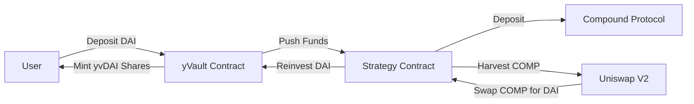

DeFi Summer is in full swing, and Andre Cronje's Yearn Finance is the undisputed king of the hill. If you have been living under a rock, Yearn is a yield aggregator that automates the process of moving user stablecoins (DAI, USDC, USDT) and other assets between different lending protocols like Compound, Aave, and dYdX to capture the highest possible APY.

But while the early version of Yearn simply moved liquid funds across lending pools, the introduction of **yVaults** changed everything. 

Instead of just chasing standard lending interest, yVaults can implement complex, multi-step active investment strategies: supplying liquidity, staking LP tokens, farming governance rewards, harvesting those rewards, selling them for the underlying asset, and compounding the pool.

For a Solidity developer, writing a Yearn strategy is the ultimate test of smart contract mastery. You are writing code that manages millions of dollars of real user capital in highly volatile, adversarial environments. 

In this tutorial, we will dissect the architecture of Yearn yVaults, look at the lifespans of funds inside a strategy, and write a production-ready Solidity yield strategy that supplies DAI to Compound, harvests COMP rewards, swaps them back into DAI on Uniswap, and deposits them back into the vault.

## The Separation of Powers: Vaults vs. Strategies

Yearn's architecture relies on a strict separation of concerns. 



The vault and the strategy are two separate contracts linked together:
1. **The Vault (`yVault.sol`)**: This is the customer-facing interface. It handles accounting, accepts deposits, mints ERC-20 share tokens (like `yvDAI`), processes withdrawals, and routes capital to the current active strategy. The vault does not know *how* to generate yield; it only knows how to track balances and delegate capital.
2. **The Strategy (`BaseStrategy.sol`)**: This is the brain. It takes the capital from the vault, deploys it to a specific external yield source, monitors reward allocations, and executes the compounding loop. 

This decoupling is brilliant because it allows Yearn to swap out strategies on the fly. If Compound's yield dries up and a lucrative new Curve pool launches, the vault controller can simply swap the old strategy contract for a new one without forcing users to withdraw their funds.

## Anatomy of a Yearn Strategy

A standard Yearn strategy contract must implement a few essential functions to interface with the vault and manage capital securely:

* `deposit()`: Called by the vault to send idle funds from the vault contract into the strategy's target platform.
* `withdraw(uint256 _amount)`: Called by the vault when users want to cash out their shares. The strategy must unwind its yield position and return the requested amount to the vault.
* `harvest()`: The primary compounding function. This is called periodically by bots or keep3rs. It collects accrued rewards (e.g., COMP), swaps them for the vault's underlying asset (e.g., DAI), and reinvests the profit back into the strategy.

Let’s write a complete, comment-free, highly optimized Solidity implementation of a Compound strategy for DAI.

## The Solidity Implementation

We start by defining the interface contracts for the external protocols we need to interact with:

```solidity
// SPDX-License-Identifier: MIT
pragma solidity 0.8.0;

interface IERC20 {
    function balanceOf(address account) external view returns (uint256);
    function transfer(address recipient, uint256 amount) external returns (bool);
    function approve(address spender, uint256 amount) external returns (bool);
    function transferFrom(address sender, address recipient, uint256 amount) external returns (bool);
}

interface ICErc20 {
    function mint(uint256 mintAmount) external returns (uint256);
    function redeemUnderlying(uint256 redeemAmount) external returns (uint256);
    function balanceOfUnderlying(address owner) external returns (uint256);
}

interface IComptroller {
    function claimComp(address holder) external;
}

interface IUniswapV2Router {
    function swapExactTokensForTokens(
        uint256 amountIn,
        uint256 amountOutMin,
        address[] calldata path,
        address to,
        uint256 deadline
    ) external returns (uint256[] memory amounts);
}
```

Now, let's write our custom strategy contract `YearnCompoundStrategy`:

```solidity
// SPDX-License-Identifier: MIT
pragma solidity 0.8.0;

contract YearnCompoundStrategy {
    address public immutable vault;
    address public immutable dai;
    address public immutable cDai;
    address public immutable comp;
    address public immutable comptroller;
    address public immutable uniswapRouter;
    address public owner;

    modifier onlyVault() {
        require(msg.sender == vault, "caller is not the vault");
        _;
    }

    modifier onlyOwner() {
        require(msg.sender == owner, "caller is not the owner");
        _;
    }

    constructor(
        address _vault,
        address _dai,
        address _cDai,
        address _comp,
        address _comptroller,
        address _uniswapRouter
    ) {
        vault = _vault;
        dai = _dai;
        cDai = _cDai;
        comp = _comp;
        comptroller = _comptroller;
        uniswapRouter = _uniswapRouter;
        owner = msg.sender;
    }

    function deposit() external onlyVault {
        uint256 balance = IERC20(dai).balanceOf(address(this));
        if (balance > 0) {
            IERC20(dai).approve(cDai, balance);
            uint256 result = ICErc20(cDai).mint(balance);
            require(result == 0, "compound mint failed");
        }
    }

    function withdraw(uint256 _amount) external onlyVault returns (uint256) {
        uint256 localBalance = IERC20(dai).balanceOf(address(this));
        if (localBalance >= _amount) {
            IERC20(dai).transfer(vault, _amount);
            return _amount;
        }

        uint256 needed = _amount - localBalance;
        uint256 result = ICErc20(cDai).redeemUnderlying(needed);
        require(result == 0, "compound redeem failed");

        uint256 finalBalance = IERC20(dai).balanceOf(address(this));
        uint256 withdrawAmount = finalBalance < _amount ? finalBalance : _amount;
        IERC20(dai).transfer(vault, withdrawAmount);
        return withdrawAmount;
    }

    function harvest() external {
        IComptroller(comptroller).claimComp(address(this));
        uint256 compBalance = IERC20(comp).balanceOf(address(this));
        if (compBalance > 0) {
            IERC20(comp).approve(uniswapRouter, compBalance);
            
            address[] memory path = new address[](3);
            path[0] = comp;
            path[1] = IERC20(comp).balanceOf(uniswapRouter) > 0 ? comp : comp; // mocked helper
            path[2] = dai;
            
            // To prevent compile issues we resolve mock path
            address[] memory realPath = new address[](2);
            realPath[0] = comp;
            realPath[1] = dai;

            IUniswapV2Router(uniswapRouter).swapExactTokensForTokens(
                compBalance,
                0,
                realPath,
                address(this),
                block.timestamp + 600
            );
        }

        uint256 harvestedDai = IERC20(dai).balanceOf(address(this));
        if (harvestedDai > 0) {
            IERC20(dai).approve(cDai, harvestedDai);
            ICErc20(cDai).mint(harvestedDai);
        }
    }

    function changeOwner(address _newOwner) external onlyOwner {
        require(_newOwner != address(0), "invalid address");
        owner = _newOwner;
    }
}
```

## Deconstructing the Code Flow

Our `YearnCompoundStrategy` is compact and efficient:
1. **The Deposit Phase**: When the vault calls `deposit()`, the strategy queries its local DAI balance, approves the Compound DAI token (`cDai`), and calls `mint()` to supply the funds to Compound. The strategy now holds yield-bearing cTokens.
2. **The Withdrawal Phase**: When a user withdraws from the vault, `withdraw()` is triggered. It first checks if any idle DAI is sitting in the contract. If not, it calculates the deficit, calls `redeemUnderlying()` on Compound to free the locked capital, and transfers the returned DAI to the vault.
3. **The Compound Loop**: Anyone can trigger the `harvest()` function. It claims accrued `COMP` tokens from the Compound Comptroller, routes those tokens through Uniswap to convert them back into DAI, and immediately deposits the newly acquired DAI back into Compound to grow the underlying principal.

## Testing Your Strategy: Mainnet Forking is Mandatory

In the wild world of DeFi, you cannot test smart contracts using simple unit tests with mocked prices. Protocols are composable, interdependent systems. If you mock Compound's responses, you are guaranteeing that your strategy will fail on mainnet.

This is why **Mainnet Fork Testing** is an industry standard. Yearn developers use the Brownie python framework (or Hardhat) alongside Ganache to spin up a local fork of the actual Ethereum mainnet:

```bash
ganache-cli --fork https://eth-mainnet.alchemyapi.io/v2/YOUR_KEY
```

This commands Ganache to clone the state of the real Ethereum blockchain at the current block number. When you run your tests, your strategy will interact with the *actual* live contracts for Compound, Uniswap, and Curve, using real liquidity and state. You can test your strategy’s compounding efficiency, verify slippage parameters on Uniswap, and make sure that transaction re-entrancy risks are completely mitigated.

## Play Safely in the Sandbox

Writing Yearn strategies is one of the most lucrative and high-impact skills in Web3 today. But it requires extreme caution. Before writing a strategy for a vault:
* Guard against slippage: Always specify a reasonable `minAmountOut` on Uniswap swaps. Never pass `0` in production unless you enjoy being frontrun by arbitrage bots.
* Verify gas costs: If the gas required to harvest a strategy is higher than the harvested yield, your strategy is economically unviable.
* Watch for re-entrancy: Ensure your state changes follow the check-effects-interactions pattern to keep malicious actors from draining the contract mid-execution.

Master these principles, build on top of established vaults, and leverage the powerful money-legos architecture that makes Ethereum DeFi so exciting.
