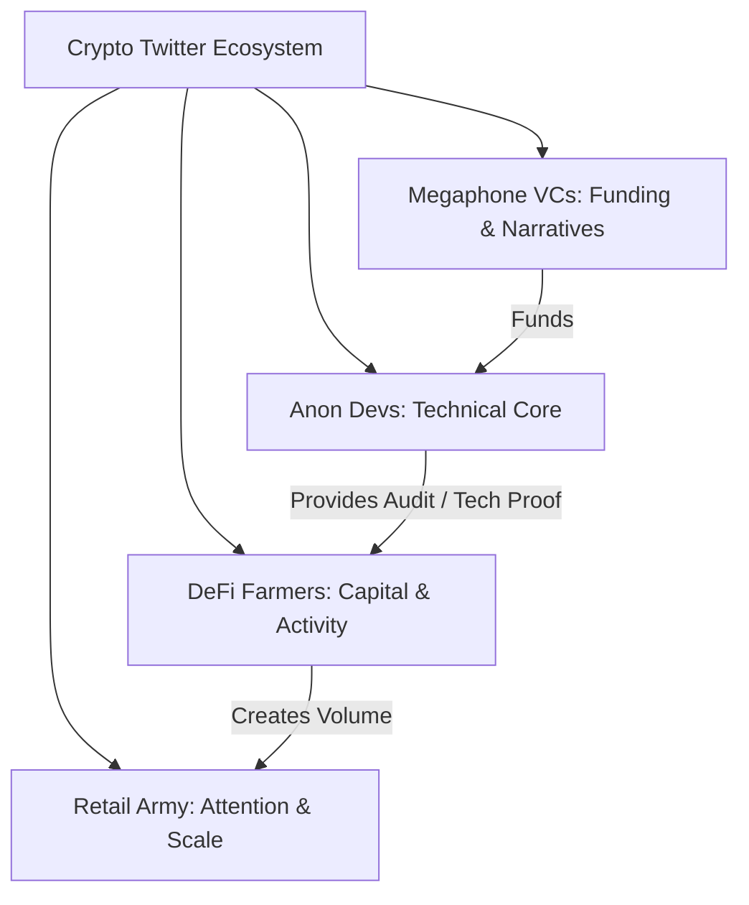

If you are a software engineer, you probably have a deep, instinctual distaste for marketing. You believe in the pure meritocracy of technology: write elegant code, build a superior product, and the world will beat a path to your door. You think that self-promotion is a shallow pursuit reserved for MBA graduates who don't know the difference between a hash table and a database query.

I used to believe that comforting lie, too. 

But as we navigate the hyper-speed, open-source wilderness of 2020, I have realized something crucial: **great code does not speak for itself. You have to speak for it.**

In a world where any developer can fork your smart contracts in a single click, your primary competitive advantage is your **distribution channel**. And in Web3, there is only one distribution channel that actually matters: **Crypto Twitter (CT)**.

CT is the real-time, decentralized, highly chaotic town square of our industry. It is where multi-million dollar venture capital deals are initiated, where key developer alliances are forged, where community rebellions are coordinated, and where the narrative of the entire market is written every single hour. 

Whether you are a developer looking for a high-paying protocol gig, a founder trying to bootstrap a brand-new DeFi platform, or a researcher sharing raw data, here is the cynical but highly accurate blueprint for mastering the crypto-metaverse.

## Deconstructing the Tribes of Crypto Twitter

To survive on CT, you must first understand its demography. It is not a monolith; it is a highly fragmented ecosystem composed of distinct tribes, each with its own customs, slangs, and status symbols:

* **The Anon Devs**: Often sporting anime or pixelated avatars. They communicate in raw code, EVM bytecodes, gas-optimization tips, and memes. They are the intellectual powerhouse of CT. If you earn their respect, you have won the game.
* **The DeFi Farmers**: Highly speculative, yield-hungry accounts who spend 18 hours a day chasing triple-digit APYs on protocols named after agricultural produce (sushi, spaghetti, pickles, yams). They care about TVL, liquidity mining rewards, and slip-free swaps.
* **The Megaphone VCs**: Partners at major funds who post long, highly polished, macro-thematic threads about the "future of finance" and "trustless digital networks." They provide the narrative oxygen of the market.
* **The Retail Army**: Millions of casual spectators looking for the next "alpha" (investment tip). They are highly reactive and driven by momentum, and they gather wherever the noise is loudest.



If you are a technical founder, your target audience is a combination of **the Anon Devs** and the **DeFi Farmers**. If you get the developers to respect your code and the LPs to trust your security, the capital and the media attention will naturally follow.

## The Developer Thought-Leadership Flywheel

So, how do you go from a quiet lurker with 50 followers to a highly respected voice in the space? You run the **Technical Value Loop**:

### 1. Demystify the Complicated
DeFi is moving so fast that even full-time developers are struggling to keep up with the math. When a complex new protocol launches (like Curve's StableSwap or Balancer's multi-token pools), do not just read the whitepaper for yourself. Translate it.

Write a clean, easy-to-read explanation of the core mechanics. Use simple analogies, write down the equations clearly, and build clean flowcharts. When you help people understand how a complex system works under the hood, you instantly build massive intellectual equity.

### 2. Share Your Behind-the-Scenes Struggles
People do not connect with flawless corporate PR accounts; they connect with real humans solving hard problems in real-time. 

Are you struggling to optimize a storage variable to save 5,000 gas in your new contract? Share a screenshot of your Solidity code and ask the community for ideas. Did you find an obscure compiler bug in Solidity 0.8.0? Write a brief breakdown of why it happens. By building in public, you invite the community into your development laboratory.

### 3. Conduct Post-Mortems and Exploit Breakdowns
Whenever a protocol gets exploited—which seems to happen every other week in this high-stakes DeFi Summer—do not just watch the drama from the sidelines. Pull up Etherscan, inspect the transaction hash of the hack, find the exact line of code that failed, and write an engineering breakdown of the exploit.

Explain the vulnerability (e.g., a re-entrancy vector, a manipulation of flash-loan-dependent price oracles, or a lack of access control checks) and, crucially, **explain how to fix it**. These technical breakdowns are the single fastest way to gain organic technical followers.

## The Anatomy of a High-Impact Twitter Thread

On CT, the **thread** is the ultimate content medium. It is a mini-essay broken down into bite-sized, digestible updates. 

Let's dissect the exact structural formula for a high-performing technical thread:

* **The Hook (Tweet 1)**: Must stop the scroll. It should state a compelling problem, promise a clear educational payoff, and state your technical credibility.
* **The Problem (Tweet 2-3)**: Establish the bottleneck. Why is this topic important? Why are existing explanations inadequate?
* **The Core Breakdown (Tweet 4-7)**: Deliver on your promise. Use short, high-contrast sentences. Break up dry text blocks with formatting, bullet points, and code blocks.
* **The Visual (Tweet 8)**: Include a diagram, a screenshot of verified code, or an interactive chart. Humans are visual creatures; a picture is worth a thousand tweets.
* **The Resolution & CTA (Tweet 9-10)**: Summarize the key takeaway and guide interested readers to your github repo, product website, or newsletter.

Here is an example of what a high-performing thread about a flash loan attack looks like:

```text
1/ Yesterday, another $15M was drained from a DeFi lending vault in a flash-loan oracle attack. 

If you are a Solidity dev, you cannot afford to ignore this vulnerability. 

Here is a technical breakdown of the exploit and how to protect your code. 👇

2/ The exploit relies on a classic vulnerability: using a decentralized exchange pool's spot price as the single source of truth for an asset's valuation. 

Here is how the hacker manipulated the state of the pool in a single transaction...

3/ Step 1: Flash borrow $50M of DAI from dYdX.
Step 2: Dump $45M of DAI into a low-liquidity Uniswap pool, artificially crashing the price of DAI relative to ETH.
Step 3: Use the remaining $5M to borrow ETH from the vulnerable lending protocol, which queries Uniswap for DAI's spot price.

4/ Because the lending protocol checks the spot price, it believes DAI is practically worthless. 

It lets the attacker borrow a massive amount of ETH against a tiny amount of DAI collateral. 

Then, the attacker pays back the dYdX flash loan, keeping the ETH profit.

5/ To fix this, you must NEVER use Uniswap spot prices directly for valuation. 

Instead, implement:
1. Time-Weighted Average Prices (TWAP) across multiple blocks.
2. Decentralized oracle networks (like Chainlink) that aggregate off-chain and on-chain liquidity data.

6/ If you want to see the exact transaction flow on-chain, check out the verified contract logic and exploit transaction trace here: [Github Link]

Follow me @thecoderpanda for more Solidity deep dives. Stay safe, and keep optimizing!
```

## Cynical but Crucial Rules of CT Engagement

To build a high-integrity technical brand, keep these three rules of engagement in mind:

1. **Maintain Professional Objectivity**: The crypto space is incredibly tribal and filled with emotion. When evaluating a protocol, stick strictly to facts, verified transactions, and mathematical realities. If you disagree with someone, do it respectfully using transaction hashes as evidence. 
2. **Never Buy Followers or Engagement**: The core technical community has an incredibly sensitive radar for artificial growth. If you have 50,000 followers but your technical tweets get zero engagement from actual developers, your reputation will be permanently tarnished. Focus on quality over quantity. 500 active developer followers are worth more than 50,000 bots.
3. **Be Helpful First**: Spend 80% of your time on Twitter replying to other developers’ questions, offering code reviews, sharing optimization suggestions, and providing technical support. Generosity is the ultimate social-network growth hack.

CT is the ultimate professional leverage engine for Web3 developers. Stop lurking in the shadows. Share your insights, build in public, explain the complex, and claim your seat at the table.
