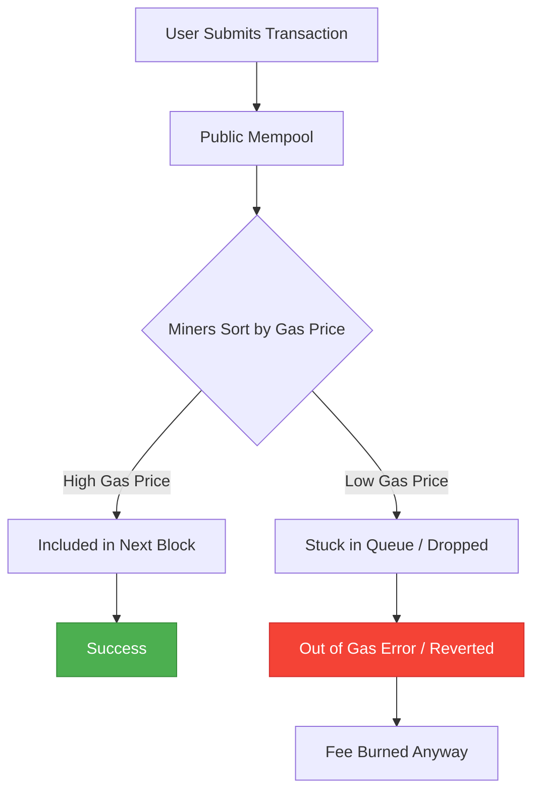

Welcome to August 2020. If you are a Web3 developer, a yield farmer, or just someone who accidentally left a limit order open on a decentralized exchange, your wallet is currently crying. DeFi Summer has officially mutated from an exciting experiment into a wild, speculative playground where food-named tokens yield four-digit APYs, and Ethereum's mempool looks like a Black Friday sale at a department store where only ten people are allowed inside at a time.

Yesterday, I tried to execute a simple swap on Uniswap. The transaction fee? Over $80. To claim some reward tokens, the gas cost was estimated at $150. We have reached a point where the very system built to bypass greedy centralized middlemen is now charging fees that make wire transfers at major banks look like a charitable discount.

So, why has Ethereum gas become a luxury item? What is happening under the hood of the Ethereum Virtual Machine (EVM) to cause this gridlock, and how do we solve this without pricing out every retail user on Earth?

## Understanding the EVM Auction House

To understand why a simple transaction costs as much as a decent dinner, we have to look at how Ethereum allocates its computational power. 

When you write or execute a smart contract, you are using the computer resources of hundreds of independent miners around the world. These miners don't operate out of the goodness of their hearts. They want to be compensated for their electricity and hardware. That compensation is measured in **Gas**.

Gas is the unit of measurement for computational effort. Every action in Solidity has a fixed gas cost defined in the Ethereum Yellow Paper:
* A basic ETH transfer: 21,000 gas
* Reading a storage slot: 800 gas
* Writing a storage slot (SSTORE): up to 20,000 gas
* Executing a complex multi-hop swap on Uniswap or Curve: 150,000 to 300,000 gas

The price you pay for that gas is denominated in **Gwei** (one billionth of an ETH). Your final transaction fee is a simple multiplication:

$$\text{Transaction Fee} = \text{Gas Used} \times \text{Gas Price}$$

Here is the kicker: Ethereum has a hard limit on how much computation can fit into a single block. This is called the **Block Gas Limit**. Currently, the limit is capped at around 12.5 million gas per block. Because blocks are mined roughly every 15 seconds, there is a strict, unyielding cap on how many transactions Ethereum can process per second.

When demand to use Ethereum exceeds the 12.5 million gas limit per block, Ethereum turns into a blind, high-stakes auction house. Miners are rational economic actors. They want to maximize their revenue, so they configure their nodes to sort transactions in the mempool from highest gas price to lowest. If you want your swap to go through in the next block, you must outbid everyone else.

## The Bottleneck: DeFi Summer & Priority Gas Auctions

What is driving this unprecedented demand? Two words: **Yield Farming**.

Ever since Compound launched its COMP governance token in June, followed closely by Balancer, Curve, and a parade of food-themed protocols like Yam, the yield farming craze has taken over. Users are routing millions of dollars through nesting dolls of smart contracts. A single yield farming harvest doesn't just transfer tokens; it interacts with multiple protocols, borrows assets via flash loans, swaps them on AMMs, deposits them back into lending vaults, and mints yield-bearing derivative tokens. 

A single complex transaction can easily consume 500,000 to 1,000,000 gas. This means a single farmer can take up nearly 10% of an entire Ethereum block.

At the same time, arbitrage bots are fighting in the public mempool. When a price discrepancy occurs between Uniswap and SushiSwap, multiple bots spot the opportunity simultaneously. To ensure their trade is processed first, they engage in **Priority Gas Auctions (PGAs)**. They constantly resubmit their transactions with slightly higher gas prices, bidding up the cost of gas for everyone else. 

| Transaction Type | Average Gas Used | Cost at 50 Gwei (Standard) | Cost at 450 Gwei (DeFi Peak) |
| :--- | :--- | :--- | :--- |
| **Simple ETH Transfer** | 21,000 | ~$0.40 | ~$3.60 |
| **ERC-20 Token Transfer** | 65,000 | ~$1.20 | ~$11.10 |
| **Uniswap V2 Swap** | 150,000 | ~$2.85 | ~$25.65 |
| **Yearn Vault Deposit** | 350,000 | ~$6.65 | ~$59.85 |
| **Complex Yield Harvest** | 800,000 | ~$15.20 | ~$136.80 |

*(Note: Calculated assuming ETH price of $380, typical for August 2020)*

If you are a retail investor trying to move $100, paying $25 to $136 for a transaction is a complete dealbreaker. You are mathematically priced out of the ecosystem. The financial system of the future is quickly starting to look like a private playground for whales.

## Short-Term Fixes and Their Limits

In the short term, miners have tried to alleviate the pressure by increasing the Block Gas Limit from 10 million to 12.5 million. While this temporarily increases throughput by about 25%, it comes with significant technical trade-offs:
1. **Uncle Rates**: Larger blocks take longer to propagate across the peer-to-peer network. This leads to a higher rate of "uncle" blocks (blocks mined at the same time as the main block that are eventually discarded), which weakens the security of the network.
2. **State Bloat**: Processing more transactions means the Ethereum ledger grows at an accelerated rate. This makes it increasingly difficult and expensive for regular users to run full nodes, leading to centralization risks.

Simply raising the block gas limit is like adding lanes to a highway that is already suffering from severe gridlock; it only delays the inevitable bottle-neck.

## Medium-Term: Enter EIP-1559

To address the terrible user experience of the blind auction system, developers are rallying behind **EIP-1559**, a proposed Ethereum Improvement Proposal that radically changes how fees are calculated.

Under the current first-price auction model, users have to guess the correct gas price. If you guess too low, your transaction gets stuck for hours. If you guess too high, you overpay. EIP-1559 replaces this with an algorithmic pricing model:
* **Base Fee**: An automatically calculated minimum fee required to include a transaction in a block. This fee adjusts dynamically based on block congestion. If a block is more than 50% full, the base fee increases; if it is less than 50% full, the base fee decreases.
* **Fee Burning**: Instead of going to miners, the entire Base Fee is burned (permanently removed from circulation), which aligns the economic incentives of ETH holders with network utility.
* **Tip (Priority Fee)**: A small, optional tip paid directly to miners to get priority treatment during times of extreme congestion.

While EIP-1559 will not necessarily lower gas fees during times of massive systemic demand, it will make fees highly predictable and eliminate the overbidding wars that artificially inflate prices.

## Long-Term: Layer 2 is the Only Way Out

Let’s be honest: EIP-1559 and miner adjustments are band-aids. The real, permanent solution is to move execution off the main Ethereum chain (Layer 1) while retaining its security guarantees. This is the promise of **Layer 2 (L2) Scaling**.

The scaling roadmap focuses on two primary rollup architectures:

1. **Optimistic Rollups**: These networks (like Optimism and Arbitrum) execute transactions off-chain and assume they are valid by default. They periodically bundle hundreds of transactions into a single batch and post it to Layer 1. If someone spots a fraudulent transaction, they can submit a "fraud proof" within a seven-day window to challenge it and revert the state.
2. **ZK-Rollups**: These networks use advanced cryptography (zero-knowledge proofs) to generate a mathematical proof of validity for every batch of transactions. The proof is posted directly to Layer 1, offering instant finality and mathematical security without the need for a seven-day challenge window.

By packing thousands of transactions into a single Layer 1 block, L2s can reduce transaction fees by 95% or more, opening the floodgates for mass retail adoption.

## Surviving the Squeeze

Until Layer 2 rollups are fully deployed and integrated with major wallets and exchanges, developers must write highly optimized Solidity code. Every storage write must be scrutinized. Every loop must be minimized. 

If you are a developer, now is the time to embrace gas optimization as a core discipline. If you are a user, keep an eye on the gas station trackers, submit your transactions during the low-activity weekend windows, and prepare yourself for the Layer 2 future. 

Ethereum is going through its growing pains. It is congested, expensive, and chaotic—but it is also the most active financial laboratory on the planet. The high fees are simply proof of its undeniable success. Let's build the scaling layers to make sure everyone can join the revolution.
