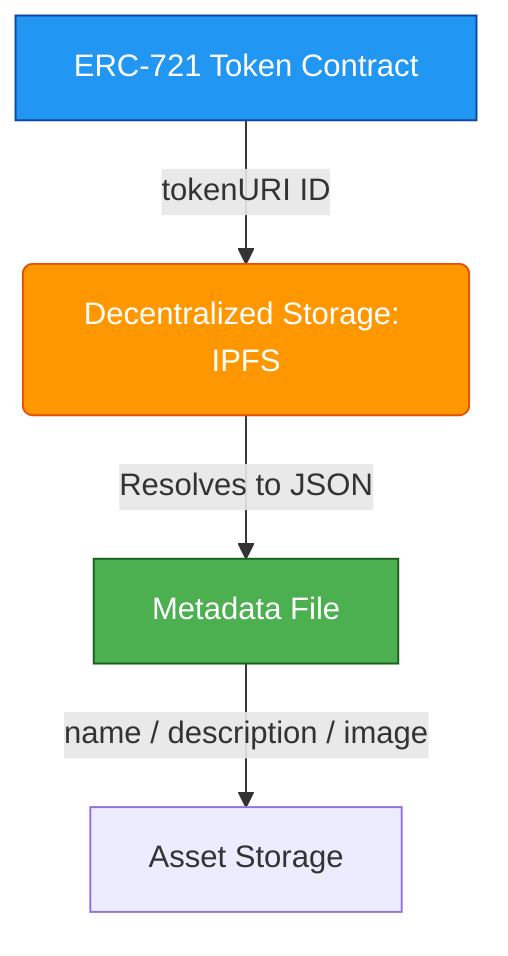

Cast your mind back to December 2017. The ICO bubble was reaching its absolute boiling point, Bitcoin was scraping $20,000, and a quirky little game about breeding digital cartoon cats called **CryptoKitties** single-handedly clogged the entire Ethereum network. Transactions were backed up for days, gas prices shot up, and critics laughed themselves hoarse. "This is your revolutionary future of finance?" they sneered. "Trading digital pictures of cats for $100,000?"

When the market crashed in 2018, the NFT hype died with it. Most observers dismissed non-fungible tokens as a silly fad.

But they made a fatal mistake: they confused the toy with the technology.

While DeFi (Decentralized Finance) has occupied every headline in August 2020, a silent revolution has been taking place in the background. Developers have spent the last two years quietly building robust infrastructure around the **ERC-721** and **ERC-1155** token standards. We are no longer looking at silly digital pets; we are witnessing the construction of a programmable system for digital scarcity, fractional property ownership, and automated creator royalties.

Here is an engineering deep dive into why this wave of NFTs is fundamentally different from the 2017 bubble, and what developers need to know about the emerging Web3 media stack.

## The Evolution of the ERC-721 Standard

In 2017, the implementation of non-fungible tokens was highly experimental. Today, the standard is mature, battle-tested, and universally composable.

At its core, an ERC-721 token is simply a unique identifier mapped to an owner's address on a public ledger. Unlike ERC-20 tokens, which are fungible (every DAI token is identical to every other DAI token), every ERC-721 token is unique.

The major breakthrough that has occurred over the last two years is the standardized separation of **on-chain proof of ownership** and **off-chain metadata representation**.



When you query an ERC-721 contract using the `tokenURI(uint256 tokenId)` function, it returns a URI (typically an IPFS hash or a HTTPS link). This URI points to a standardized JSON metadata schema. Let's look at the structure of this metadata payload:

```json
{
  "name": "The Coder Panda #1337",
  "description": "An automated developer-farmer navigating the liquidity pools of DeFi Summer.",
  "image": "ipfs://QmXoypizjW3WknFiJnKLwHCnL72vedxjQkDDP1mXWo6uco",
  "external_url": "https://thecoderpanda.com/avatar/1337",
  "attributes": [
    {
      "trait_type": "Background",
      "value": "Ethereum Purple"
    },
    {
      "trait_type": "Hardware",
      "value": "Mechanical Keyboard"
    },
    {
      "trait_type": "Yield APY",
      "value": 1337,
      "max_value": 5000
    }
  ]
}
```

By conforming to this strict schema, marketplaces like OpenSea, Rarible, and virtual worlds like Cryptovoxels can automatically parse any NFT, read its attributes, and display its image without needing any custom integrations. This is the power of open standards.

## Programmable Royalties: Empowering Creators

In the traditional art world, when an artist sells a painting, they make money once. If that painting is sold five years later for a tenfold profit, the original artist gets absolutely nothing. The entire upside is captured by middlemen, galleries, and collectors.

NFTs solve this on the smart-contract level. 

By integrating **programmable royalties** directly into the minting process, creators can dictate that a percentage (e.g., 5% or 10%) of every secondary transaction must be automatically routed to their wallet.

Let's look at a Solidity implementation of an ERC-721 contract that natively supports a custom, immutable royalty fee structure. It is clean, efficient, and completely free of comments:

```solidity
// SPDX-License-Identifier: MIT
pragma solidity 0.8.0;

interface IERC165 {
    function supportsInterface(bytes4 interfaceId) external view returns (bool);
}

interface IERC721 is IERC165 {
    function ownerOf(uint256 tokenId) external view returns (address owner);
}

contract ProgrammableRoyaltyNFT {
    string public name;
    string public symbol;
    address public creator;
    uint256 public royaltyPercentage;
    uint256 public nextTokenId;

    mapping(uint256 => address) private _owners;
    mapping(uint256 => string) private _tokenURIs;

    event Minted(address indexed to, uint256 indexed tokenId, string tokenURI);
    event RoyaltyPaid(address indexed creator, uint256 amount);

    constructor(
        string memory _name,
        string memory _symbol,
        uint256 _royaltyPercentage
    ) {
        require(_royaltyPercentage <= 20, "royalty fee too high");
        name = _name;
        symbol = _symbol;
        creator = msg.sender;
        royaltyPercentage = _royaltyPercentage;
    }

    function mint(address _to, string calldata _uri) external returns (uint256) {
        uint256 tokenId = nextTokenId;
        _owners[tokenId] = _to;
        _tokenURIs[tokenId] = _uri;
        nextTokenId++;

        emit Minted(_to, tokenId, _uri);
        return tokenId;
    }

    function getRoyaltyDetails(uint256 _salePrice) external view returns (address, uint256) {
        uint256 royaltyAmount = (_salePrice * royaltyPercentage) / 100;
        return (creator, royaltyAmount);
    }

    function ownerOf(uint256 _tokenId) external view returns (address) {
        address owner = _owners[_tokenId];
        require(owner != address(0), "token does not exist");
        return owner;
    }

    function tokenURI(uint256 _tokenId) external view returns (string memory) {
        require(_owners[_tokenId] != address(0), "token does not exist");
        return _tokenURIs[_tokenId];
    }
}
```

Marketplaces can query `getRoyaltyDetails` before settling a swap and split the buyer’s payment, sending the creator’s cut instantly to their wallet. No collection agencies, no escrow disputes, no delay.

## The Collision of NFTs and DeFi: Fractionalization

If you think NFTs are just digital static assets, you are missing the most exciting development in August 2020: **DeFi-NFT composability**.

Because NFTs conform to the ERC-721 standard, they can be treated as collateral in smart contracts. 

Several developers have begun building **fractionalization** mechanisms:
1. **The Vault**: An owner locks a highly valuable, unique NFT inside a dedicated vault smart contract.
2. **ERC-20 Sharding**: The vault mints a supply of fungible ERC-20 tokens (e.g., 1,000,000 `SHARD` tokens) that represent fractional ownership of the underlying NFT.
3. **Liquidity Pools**: These shards are then deposited into a Uniswap liquidity pool, allowing anyone to buy, sell, and speculate on a tiny fraction of a rare digital asset.

This creates liquid markets for highly illiquid assets. You can now use the entire suite of DeFi financial tools (automated market makers, lending pools, yield farming) on top of unique digital items.

## The Metaverse is Taking Shape

We are also seeing the emergence of decentralized virtual worlds, often referred to as the **Metaverse**. 

In worlds like Cryptovoxels, Decentraland, and Somnium Space, every plot of land is an ERC-721 token. Players can purchase land, build digital art galleries, display their collected NFTs on virtual walls, and host events for thousands of users around the world.

These platforms are not controlled by a single company like Facebook or Linden Lab. They are open-source protocols. If a platform ceases to exist, you still own the token representing your virtual asset. You can port that asset to other platforms or trade it freely on secondary markets.

## Looking Forward

We are still in the early innings. The user experience of creating and purchasing NFTs is clunky, gas fees on Layer 1 make minting artwork incredibly expensive, and storage solutions are still evolving.

But the foundation has been laid. We have moved from simple collectible novelties to highly composable financial instruments that empower creators. As Layer 2 rollups go live and lower the barriers to entry, the division between gaming, art, finance, and software will completely dissolve.

Do not ignore NFTs. The technology is real, the community is passionate, and the infrastructure is ready for what comes next.
