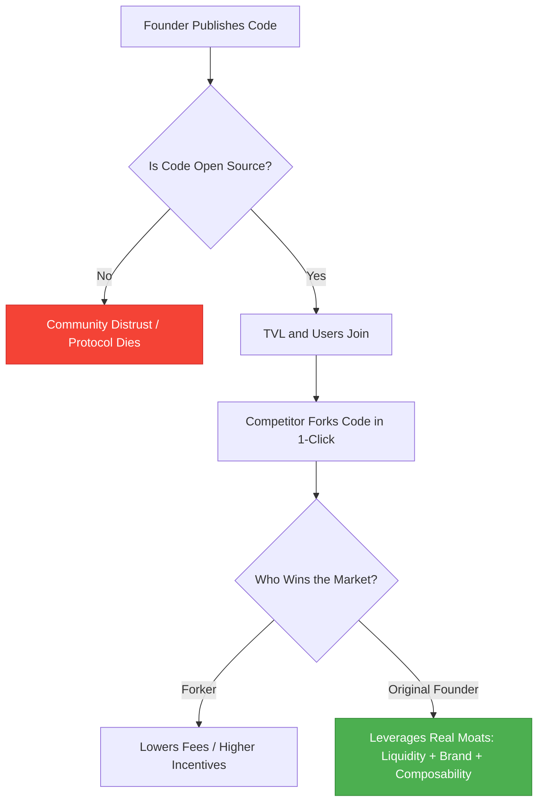

If you are building a traditional software startup in 2020, your standard playbook for defensibility is simple: guard your intellectual property like a medieval fortress. You lock your source code in private GitHub repositories, patent your proprietary algorithms, hide your database schemas behind multiple firewalls, and make every employee sign an ironclad Non-Disclosure Agreement. Your proprietary technology is your moat.

In Decentralized Finance, that entire playbook is not only obsolete—it is a recipe for instant failure.

DeFi is built on the radical principles of open-source software, transparency, and composability. If you try to launch a protocol without publishing verified smart-contract source code on Etherscan, the community will instantly assume you are preparing a "rug pull" and refuse to touch your application. 

This creates a terrifying paradigm for developer-founders: **your product is fully open-source and can be forked with a single click.**

If any developer with a command-line interface can clone your entire codebase, rename the frontend, launch a cheaper native token, and deploy a direct competitor in under an hour, how do you build a defensible business? How do you prevent yourself from being cannibalized by copycats?

Here is the developer-founder playbook for shipping fast, surviving clones, and building real, uncopyable defensibility in Web3.

## The Illusion of the Code Moat

The first step to surviving in DeFi is accepting a hard truth: **your code is not a moat.** 

If your startup’s sole competitive advantage is that you wrote a clever smart contract, you have already lost. The copycats are coming, and they will run your same code with lower trading fees or higher yield subsidies to lure your users away.

To build a real moat in DeFi, you must look beyond the solidity files and understand the three layers of Web3 defensibility:

### 1. The Liquidity Moat (Network Effects)
Liquidity is the ultimate gravity well in DeFi. 

Consider Uniswap. Its smart contracts are incredibly elegant but mathematically straightforward. Dozens of copycat decentralized exchanges have launched over the last few months, copying Uniswap V2's exact router and factory code. Yet, Uniswap remains the undisputed leader in volume.

Why? Because liquidity begets liquidity. 
* Traders choose Uniswap because it has the deepest liquidity pools, which means the lowest slippage for their trades.
* Liquidity Providers (LPs) supply their tokens to Uniswap because it has the highest trading volume, which means they earn the most fee revenue.

This classic two-sided network effect is incredibly difficult to displace. A copycat can fork Uniswap’s code, but they cannot fork Uniswap's $500 million in TVL (Total Value Locked).

### 2. The Integration Moat (Composability)
DeFi is often described as "money legos." Smart contracts can call other smart contracts seamlessly, creating deeply integrated financial networks. 

Once your protocol is integrated into other major protocols, you have built a powerful integration moat. For example:
* Yearn Finance’s automated vault strategies route millions of dollars of stablecoins directly into Curve Finance's pools.
* Lending platforms like Aave query Chainlink oracles for real-time asset pricing data.
* Synthetic asset protocols mint tokens backed by interest-bearing cTokens from Compound.

If a competitor forks Compound, they do not automatically get integrated into the rest of the DeFi ecosystem. Other protocols are hardcoded to interact with Compound's specific, verified contract addresses on Ethereum mainnet. To replace you, a competitor doesn't just have to copy your code; they have to convince the entire ecosystem to swap out their active smart-contract dependencies.

### 3. The Brand and Trust Moat (The Security Premium)
In Web3, a bug can mean the instantaneous, irreversible loss of hundreds of millions of dollars. Because the stakes are so high, users place an extraordinary premium on trust, security, and founder reputation.

A protocol that has processed billions of dollars of volume over two years without a security exploit possesses a track record that a freshly deployed fork simply cannot match. Users are willing to accept slightly lower yields or higher fees on an established platform in exchange for the peace of mind that their principal capital is secure.

## The Developer-Founder Shipping Playbook

If defensibility is built on liquidity, integrations, and trust, how should developer-founders organize their engineering workflows to stay ahead of the curve?

### Step 1: Establish a Continuous Delivery Loop
Because your code will be copied, your primary advantage is **shipping velocity**. You must iterate faster than your competitors can adapt. While they are busy modifying your old codebase, you should already be preparing the next major upgrade.

To ship fast without sacrificing security:
* **Leverage Battle-Tested Standards**: Never reinvent the wheel. Use OpenZeppelin's audited implementations for standard ERC-20, ERC-721, and access control patterns.
* **Automate Your Analysis**: Integrate static analysis tools like Slither and Mythril directly into your Github Actions CI/CD pipeline. Every commit should be automatically scanned for common vulnerabilities (like re-entrancy, uninitialized storage, and integer overflows).
* **Write Exhaustive Unit Tests**: Target 100% branch coverage. Utilize mainnet fork testing to ensure your contracts behave correctly under actual market conditions.

### Step 2: Implement Secure Guardrails
When you are iterating quickly, you need safety nets to protect user funds in case an unexpected edge case slips through your testing suite.
* **Multisig Governance**: Initialize your protocol under the control of a secure Gnosis Safe multisig wallet managed by key team members and respected community figures.
* **Timelocks**: Route all administrative functions through a `Timelock` contract with a 48-hour delay. This gives the community time to inspect any proposed upgrades or configuration changes before they take effect, preventing sudden malicious exploits or "admin key" hacks.
* **Emergency Pausability**: Implement a circuit-breaker pattern (`Pausable.sol`) that allows a trusted multi-sig to pause user deposits and token transfers in the event of an active exploit, while preserving the ability for users to withdraw their existing balances safely.

### Step 3: Align Incentives with Token Economics
In Web3, your community is your sales team, your developer advocates, and your defense force. 

Instead of treating your users as passive customers, turn them into active stakeholders by distributing ownership of the protocol through a native governance token. When LPs, developers, and integrations are rewarded with protocol governance rights, they become financially aligned with your long-term success. They will choose to support your original platform over a fork because they want their governance tokens to retain and grow their value.

## Speed is the Only True Security

In the open-source wilderness of DeFi, trying to protect your business by hiding your technology is a fool's errand. Clones are inevitable. 

But as a developer-founder, you must view forks not as a threat, but as validation of your success. If nobody is copying your code, you probably built something nobody wants.

Focus on building deep liquidity, cultivating developer integrations, earning user trust through unblemished security practices, and shipping code with relentless consistency. In the end, the winner of the DeFi wars won't be the team that wrote the code first—it will be the team that continues to build the fastest, most secure, and most collaborative ecosystem around it.
