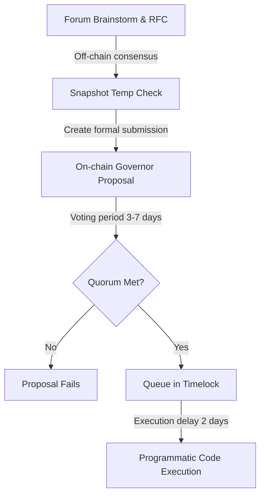

Welcome to the grand, chaotic experiment of Web3 decentralized governance. 

This is a world where your lead smart contract developer, who has a PhD in mathematics and spent three years designing an innovative state-transition system, can have their code upgrade blocked on-chain because a pseudonymous user named "DeFi\_Pepe_420" holding $50 worth of tokens convinced a Discord channel that the upgrade "felt like bad vibes."

If you are a founder or community manager who recently launched a governance token during the DeFi Summer of 2020, congratulations! You have successfully decentralized your protocol. 

But you have also just converted your startup into a highly active, public, and frequently paranoid digital direct-democracy. You no longer have customers; you have a vocal group of micro-shareholders who have direct access to your Discord, expect weekly dividends, and have the power to programmatically fire your team via a smart contract call.

Let’s talk about how to survive this transition and manage the beautiful, terrifying chaos of governance token communities.

---

## The Theory vs. The Reality of DAOs

In academic whitepapers, Decentralized Autonomous Organizations (DAOs) are described with pristine, clockwork elegance. 

Token holders read beautifully formatted proposals, discuss structural parameters in public forums, weigh the macroeconomic trade-offs of interest rate adjustments, and cast their on-chain votes with solemn, civic responsibility.

In reality, running a DAO in 2020 feels like trying to conduct a town hall meeting inside a crowded, burning sports bar where everyone has had four double-espressos and is shouting their trade positions at the top of their lungs.



Most discussions don't start in formal academic circles. They start because someone spotted a transaction on Etherscan and posted: *"OMG, is the dev wallet dumping??"* (it was actually a routine liquidity rebalance), which instantly triggers a 50-page Discord thread filled with panic, exclamation points, and demands for an emergency token buyback.

To successfully navigate this, you need to establish a structured, predictable **Governance Lifecycle**.

---

## Step 1: The Forum is Your Buffer

If you let users submit formal on-chain proposals directly without an off-chain vetting process, you are inviting disaster. 

On-chain proposals cost thousands of dollars in gas to submit and vote on. Furthermore, once an on-chain proposal is submitted, it is a binary "YES/NO" vote—you cannot edit the code or fix a typo.

You must mandate a strict off-chain funnel:
1. **RFC (Request for Comment)**: Must be posted on your Discourse forum for a minimum of 5 days. It must follow a strict, standardized template (Summary, Motivation, Specification, Implementation, and Risk Analysis).
2. **Temperature Check**: If the forum discussion is positive, launch an off-chain, gas-free vote on **Snapshot**. This gauges overall sentiment without costing anyone a single gwei.
3. **Formal On-Chain Proposal**: Only if the Snapshot vote passes with a clear supermajority does the proposal get written as a Solidity transaction and submitted to the Governor contract.

This funnel serves a vital psychological purpose: **it slows down the panic**. It forces users to channel their immediate emotional reactions into structured, written arguments, giving your core development team time to review the technical details and respond calmly.

---

## Step 2: The Battle of the Whales (VCs vs. Community)

One of the greatest sources of friction in governance communities is the tension between venture capital (VC) funds and retail users. 

Funds like Andreessen Horowitz (a16z) or Paradigm hold massive blocks of tokens. In a standard "one-token-one-vote" system, a single VC address can easily dwarf the voting power of 10,000 retail users combined.

When a VC single-handedly swings a vote, the Discord will explode with accusations of "fake decentralization" and "VC cartels."

To manage this, you must actively encourage **Proxy Vote Delegation**.

```solidity
// High-level conceptual overview of the Compound GovernorAlpha delegate pattern
function delegate(address delegatee) public {
    return _delegate(msg.sender, delegatee);
}

function _delegate(address delegator, address delegatee) internal {
    address currentDelegate = delegates[delegator];
    uint96 delegatorBalance = balances[delegator];
    delegates[delegator] = delegatee;

    emit DelegateChanged(delegator, currentDelegate, delegatee);
    _moveDelegates(currentDelegate, delegatee, delegatorBalance);
}
```

VC funds do not actually want to micromanage your protocol's daily parameter adjustments—they don't have the developer time, and they want to avoid regulatory liability. 

Establish a "Delegation Directory" on your forum. Invite active, trusted, and technically competent community members, developers, and ecosystem participants to pitch themselves as delegates. 

Help your institutional backers delegate their massive voting power to these community leaders. This balances the scales: it gives the active community a powerful voice while keeping your institutional investors aligned and passive.

---

## Step 3: The Ultimate Shield: The Timelock

If there is one contract that you must configure with absolute, conservative paranoia, it is the **Timelock**.

The Timelock contract is the final gatekeeper of your protocol. When an on-chain proposal passes, it is not executed immediately. Instead, it is queued in the Timelock for a mandatory delay period—typically between 48 hours and 7 days.

Why is this delay critical?
1. **Security against Governance Takeovers**: If an attacker executes a "flash loan" to temporarily borrow millions of tokens, submit a malicious proposal to drain the treasury, and vote it through in a single block, the Timelock prevents immediate theft. The malicious code is queued, giving the community 48 hours to coordinate a defense or giving users time to withdraw their assets from the protocol.
2. **Review of Executable Code**: It gives your core developers a final chance to review the exact bytecode payload that is queued for execution, ensuring no malicious or buggy lines slip through.

If your protocol does not have a Timelock, you are playing Russian roulette with your users’ funds.

---

## The Developer’s Role: Leader, Not Ruler

As a developer or founder of a DAO, your relationship with the community has to shift. You are no longer a dictator who can ship code in the middle of the night because you felt like it. 

You must act as a civil servant. You do not command the protocol; you write code proposals, explain the engineering trade-offs, and let the network decide. 

When you treat your community with intellectual honesty—explaining why a certain upgrade is necessary, detailing the security risks, and admitting when things go wrong—they will surprise you with their loyalty, their intelligence, and their resilience.

Decentralized democracy is incredibly messy, loud, and inefficient. But when it works, it is the most powerful coordinating mechanism the world has ever seen. 

Just remember to keep your Timelock set to 48 hours, and never, ever argue with DeFi Pepe in the general chat.
