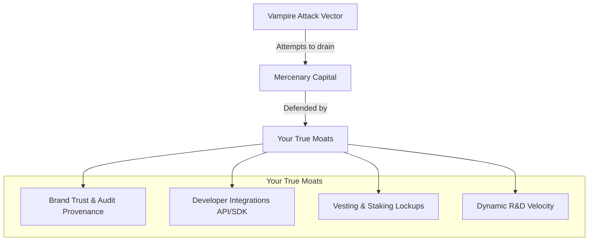

Picture this. You are a Web3 founder. You and your small team of developers have spent the last nine months living on Soylent, sleeping four hours a night, and spending tens of thousands of dollars on Solidity smart contract audits. You finally launch your protocol. It is beautiful. It is secure. Within three weeks, you've bootstrapped $100 million in Total Value Locked (TVL). You are the toast of Crypto Twitter.

Then, on a Tuesday morning, a pseudonymous developer named "Chef Pasta" forks your open-source repository. They change the logo, swap out your brand colors for an emoji, add a highly inflationary governance token called $NOODLE, and offer 2000% APY to anyone who stakes their liquidity pool tokens on their site.

Within 48 hours, half of your TVL vanishes into their smart contracts.

Welcome to the jungle. You are currently being **vampire attacked**.

In the traditional startup world, intellectual property laws, patents, and trademark lawyers protect you from copycats. But in Web3, where open-source code is a cultural religion, your software is public property. 

How do you survive when anyone can copy your product with a single git command and buy user acquisition using inflationary tokens? How did Uniswap survive, and what can you do to build a fortress around your protocol? 

Here is the Web3 founder's survival guide to surviving a vampire attack.

---

## 1. Accept the Brutal Reality: Code is No Moat

First, let's kill the Web2 mental model. If your defense strategy is "our code is proprietary" or "we will sue them," you've already lost. In decentralized finance and Web3, open-source is non-negotiable. If you try to run a closed-source protocol, the community will reject you on principle.

If code is not your moat, what is?

Your true moats are **Brand Trust**, **Integrations**, **Liquidity Stickiness**, and **R&D Velocity**. Let's break down how to weaponize each of these.

---

## 2. Leverage the Brand and Security Moat

Mercenary yield farmers (the people who chase 2000% APYs) are highly risk-tolerant. But the massive institutional players, integrations, and long-term liquidity providers are not. They care about one thing above all else: **security**.

When a copycat forks your code, they often do so in a rush. They modify the contracts to inject their token incentives, frequently skipping proper, multi-week security audits. 

When Chef Nomi launched SushiSwap, the code was completely unaudited. Within a week, Chef Nomi panicked the market by selling $14M of the developer fund. 

As the original founder, your narrative must be relentless:
* **Provenance**: You are the creator of the tech. You understand every single line of that bytecode. If a critical vulnerability is found, your team is the only one capable of hot-fixing it.
* **Audit History**: Highlight your clean audit reports from tier-1 firms like Trail of Bits or ConsenSys Diligence. Remind users that placing capital in an unaudited fork is an invitation to get rug-pulled.
* **The "Lindy Effect"**: The longer your smart contracts run without a bug, the more secure they are perceived to be. Capital will always pay a premium for peace of mind.

---

## 3. Build Deep Ecosystem Integrations

A protocol does not exist in isolation. It is part of a highly composable network of "Money Legos." 

Uniswap's real strength wasn't just its web interface. It was the fact that its factory and pair contracts were deeply integrated into:
* Wallets (MetaMask, Trust Wallet)
* Portfolio trackers (Zerion, Zapper)
* Lending protocols (Aave, Compound)
* Aggregators (1inch, Paraswap)

If an aggregator routing algorithm wants to find the best swap price, it points directly to Uniswap’s smart contracts. If a developer forks Uniswap, they don't automatically get those integrations. The aggregator has to manually add the fork's new contract addresses to their routing engine.

As a founder, your job is to make integrating with your protocol as easy as possible. Write immaculate SDKs, build comprehensive documentation, and spend your time building relationships with other developers. 

If 500 other dApps are calling your smart contracts under the hood, your protocol is practically impossible to replace, no matter what yield a copycat offers.

---

## 4. Weaponize Liquidity Stickiness

If your liquidity is highly liquid (meaning users can withdraw it in a single transaction with zero penalty), you are leaving yourself wide open to a vampire attack.

You must build mechanisms that make liquidity "sticky":
* **veTokenomics (Vesting and Locking)**: Pioneered by Curve Finance, the vote-escrowed token model is the ultimate vampire shield. LPs are incentivized to lock up their governance tokens for up to four years in exchange for boosted yields and voting power. Once locked, that capital is completely immune to a migration script.
* **Withdrawal Fees / Vesting Schedules**: Introduce small penalties or multi-day cooldowns for withdrawing liquidity, or vest token rewards over time rather than distributing them instantly. This prevents mercenary capital from entering, farming your incentives, and dumping them on the market in a 24-hour cycle.

---

## 5. Keep Your Retroactive Token as a Tactical Nuke

If you don't have a token yet, the fear of a vampire attack can be paralyzing. But this is actually your greatest advantage.

A copycat can only attack you with a token because they have already launched theirs. Once their token is in the wild, their cards are on the table. The market has priced it.

Your unlaunched token is a tactical weapon of infinite potential value. 

The moment a competitor attempts a vampire migration, you trigger your retroactive user allocation. You reward the users who stayed loyal to your platform and explicitly exclude those who migrated their capital to the fork. 

This creates an intense game-theoretic dilemma for your users: *If I move my liquidity to the fork for a temporary 1000% yield, will I disqualify my wallet from the historic, multi-thousand-dollar airdrop that the original team is planning?*

This is exactly how Uniswap halted SushiSwap's momentum with the UNI airdrop on September 16. It was a perfect, retrospective counter-attack.

---

## 6. Out-Innovate the Fork

A copycat fork is a snapshot of your past. They have copied your current code, but they do not have your brainpower, your research team, or your product roadmap.

While SushiSwap was celebrating its successful migration, Uniswap’s core team was already working on **Uniswap v3**—an entirely new AMM design featuring concentrated liquidity that would render v2-style forks obsolete in terms of capital efficiency.

Your engineering velocity is your ultimate defense. Keep building, keep shipping, and let the copycats exhaust themselves trying to maintain their copy-paste infrastructure while you build the future of the industry.

Surviving a vampire attack is not about stopping people from copying your code. It's about building an ecosystem so deeply integrated, so trusted, and so culturally aligned that your users wouldn't leave even if someone paid them to.

Stay focused, keep shipping, and don't let the vampires bite.
