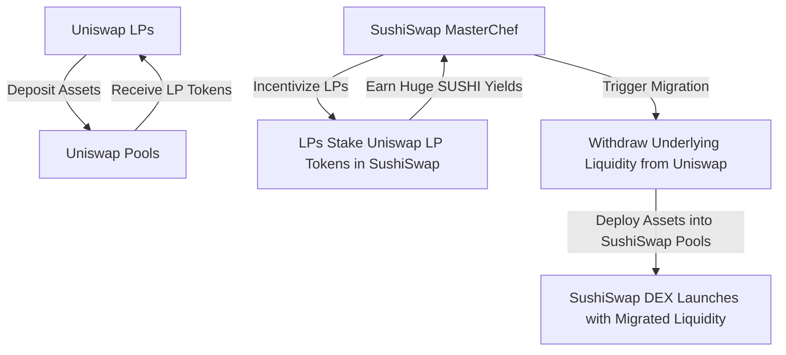

If you thought the wild-west history of tech was written by Steve Jobs stealing from Xerox, or Mark Zuckerberg lock-stepping past the Winklevoss twins, let me welcome you to late August 2020 on the Ethereum blockchain. 

There were no boardrooms. There were no lawyers. There were no non-compete clauses. There was only a pseudonymous Twitter account named "Chef Nomi," a highly optimized Solidity contract named `MasterChef.sol`, and a multi-billion-dollar pool of capital that was sucked from one protocol into another overnight like a digital slurpee.

This is the story of the **SushiSwap Vampire Attack**. 

It remains the most audacious, legally untouchable, and programmatically brutal corporate raid in history. It completely rewrote the rules of Web3 tokenomics, proving that in a world of open-source "Money Legos," your code is not your moat. Your liquidity is not yours. And your users are only as loyal as your current APY.

Grab your chopsticks. Let’s dissect the anatomy of DeFi’s greatest heist.

## The Setup: Uniswap’s Missing Piece

In August 2020, Uniswap was the undisputed champion of Decentralized Exchanges (DEXs). It was routing hundreds of millions of dollars of volume a day. But it had a glaring, massive structural vulnerability: it did not have a native token.

When a liquidity provider (LP) deposited ETH and DAI into Uniswap, they received Uniswap LP tokens. These LP tokens were essentially a receipt, allowing them to claim their share of the 0.3% trading fees generated by that pool.

But there was no long-term loyalty mechanism. The moment a competitor offered a higher yield or a better deal, an LP could instantly withdraw their capital.

Enter Chef Nomi.

In a medium post published on August 28, Chef Nomi announced **SushiSwap**. It was a direct, line-by-line copy-paste of Uniswap v2’s code. But with one crucial, game-changing addition: the **SUSHI token**.



## Anatomy of a Vampire: How the Attack Worked

A standard fork is simple: you copy the code, launch a new domain, and spend millions trying to convince people to move their capital. It's slow and rarely works.

Chef Nomi didn't do that. Chef Nomi built a **Vampire Attack**. 

Instead of asking users to manually move their capital to SushiSwap, SushiSwap told users: "Keep your capital in Uniswap. But take those Uniswap LP tokens (the receipts) and stake them in our `MasterChef` contract. In exchange, we will mint brand-new SUSHI tokens and hand them to you at a 1000%+ APY."

This was incredibly clever psychological engineering. LPs were still earning their 0.3% trading fees on Uniswap, and now they were *also* earning a mountain of highly hyped SUSHI tokens on top of it. 

It was a risk-free yield double-dip. Within days, yield farmers rushed in. Uniswap's Total Value Locked (TVL) rocketed as farmers deposited billions of dollars into Uniswap pools just to get the LP tokens to stake on SushiSwap. 

At its peak, SushiSwap had accumulated over **$1.8 billion** worth of Uniswap LP tokens in its MasterChef contract. SushiSwap controlled more than 70% of Uniswap’s entire liquidity pool base.

But the trap was already set.

Deep inside the MasterChef contract was a `migrate()` function. This function was scheduled to execute after a two-week bootstrapping phase. When called, the contract would programmatically take all those staked Uniswap LP tokens, walk over to Uniswap, redeem them for the underlying assets (like actual ETH and DAI), and then instantly deposit those assets into brand-new SushiSwap liquidity pools.

It was literally going to hollow Uniswap out from the inside, leaving it a ghost town, while SushiSwap became the largest DEX on earth in a single block transaction.

## The Plot Twist: Chef Nomi’s $14M Exit

Just as the migration was approaching, the drama escalated to reality-TV levels.

On September 5, Chef Nomi did the unthinkable. Using admin keys, they converted the SushiSwap developer share allocation (worth roughly $14 million in SUSHI) into raw ETH. 

To the community, it looked like a classic "rug pull." The price of SUSHI plummeted by over 70% in hours. The developer chats erupted into absolute chaos. 

"Nomi exit-scammed!" 
"DeFi is dead."

Chef Nomi took to Twitter to defend himself, comparing his action to Charlie Lee selling his Litecoin. It didn't go well. The community felt completely betrayed. The entire multi-billion-dollar migration was on the verge of collapsing into a smoking crater of legal threats and smart contract panic.

## Enter SBF and the Great Migration

In a twist that reads like a cheesy thriller, Sam Bankman-Fried (SBF), then the highly respected founder of Alameda Research and FTX, stepped in. SBF publicly roasted Nomi on Twitter and offered to take over the project.

With his tail between his legs, Chef Nomi agreed. He transferred the administration keys of the SushiSwap smart contracts directly to SBF.

SBF acted fast. He set up a multi-signature wallet, transferred ownership to a group of trusted keyholders, and pushed forward with the programmatic migration.

On September 9, 2020, the migration script was triggered. 

Over **$830 million** worth of liquidity was systematically ripped out of Uniswap's smart contracts and pushed into SushiSwap. It was a flawless technical execution. The code worked exactly as written. Uniswap's TVL fell off a cliff, dropping from $1.5 billion to under $400 million, while SushiSwap's pools ballooned instantly.

```solidity
// High-level conceptual flow of the MasterChef migration logic
function migrate(uint256 pid) public {
    require(msg.sender == migrator, "not migrator");
    PoolInfo storage pool = poolInfo[pid];
    IUniswapV2Pair lpToken = pool.lpToken;
    uint256 bal = lpToken.balanceOf(address(this));
    
    // Redeem Uniswap LP tokens for underlying tokens (token0, token1)
    lpToken.transfer(address(migrator), bal);
    (IERC20 token0, IERC20 token1) = migrator.migrate(lpToken);
    
    // Deposit them into new SushiSwap pair contract
    uint256 newBal = lpToken.balanceOf(address(this));
    pool.lpToken = IUniswapV2Pair(migrator.pairFor(token0, token1));
    
    emit Migrate(pid, address(lpToken), address(pool.lpToken));
}
```

A few days later, a remorseful Chef Nomi returned the entire $14 million worth of ETH back to the SushiSwap treasury, apologizing to the community in a lengthy Twitter thread. 

The vampire had bitten, fed, and successfully mutated into a sovereign protocol.

## The Lasting Legacy of the War

The SushiSwap Vampire Attack changed the core philosophy of decentralized networks.

Before this event, code was considered a moat. If you built a better product, you won. SushiSwap proved that in an open-source world, **code has zero moat**. Anyone can fork you in five minutes.

The real moat in Web3 consists of three things:
1. **Community Alignment**: Giving your users actual ownership (tokens) of the protocol.
2. **Brand Moat**: Uniswap’s brand ultimately survived this attack and came back stronger.
3. **Integrations**: Having your contracts deeply woven into other DeFi protocols (like Yearn, Maker, etc.) so that replacing you causes systemic breakage.

Uniswap’s ultimate response to this attack, of course, was the historic UNI token airdrop just a week later. The vampire forced the king to share his crown with the peasants—and in doing so, created the modern standard for decentralized token distributions.

We lived through yield warfare. It was messy, it was stressful, and it was the most fun you could possibly have with a text editor and an internet connection.
