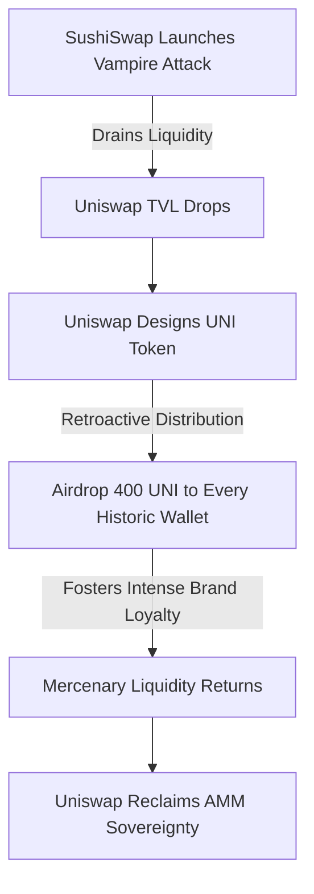

If you woke up on the morning of September 16, 2020, and checked Crypto Twitter, you probably thought your feed was malfunctioning. Or that some elaborate, industry-wide phishing scam was underway. 

My phone was buzzing off the hook. In our developer group chats, the messages were flying faster than gas fees on a congested Sunday. 

"Go to Uniswap. Connect your wallet. There's a 'Claim UNI' button."
"Wait, is this real?"
"I just got $1,200. No joke. I clicked it twice and bought an iPad."

It wasn't a scam. It wasn't a hallucination. It was the birth of the **retroactive user airdrop**, a moment that would go down as the most successful, most expensive, and most brilliant defensive chess move in the history of decentralized software. Hayden Adams and the Uniswap team had just dropped 400 UNI tokens into every single Ethereum address that had ever used Uniswap before September 1.

At the opening price of around $3, those 400 tokens were worth exactly $1,200. In DeFi slang, we called it the "Ethereum Stimulus Check." And if you were a developer or power user who had played around with 10 different test wallets over the years, you were suddenly staring at a brand-new car's worth of liquidity, waiting to be claimed.

Let’s unpack exactly what went down on that historic Wednesday and explore why this wasn't just a giant giveaway, but a profound shift in tokenomics, community sovereignty, and defensive protocol design.

## The Context: Under Vampire Siege

To understand why Uniswap did this, we have to look back at the preceding three weeks. 

Uniswap, despite being the undisputed king of automated market makers (AMMs), was under siege. A anonymous developer named Chef Nomi had launched a fork called **SushiSwap** and initiated a hostile liquidity migration—popularly dubbed a **Vampire Attack**. 

SushiSwap was literally draining Uniswap’s liquidity pools by offering astronomical yield incentives in its own token, SUSHI. Uniswap had no token of its own to fight back with. Its liquidity was mercenary, and billions of dollars of Total Value Locked (TVL) were walking out the door.

Uniswap needed a nuke. They needed something so massive, so legally defensible, and so culturally dominant that it would instantly reclaim the throne.

Their answer was UNI: a native governance token. But instead of hosting a VC-dominated private sale or a hyped-up public auction, they chose the path of radical gratitude. They rewarded the people who actually built their empire: the users.



## The Beautiful Chaos of the Claim

The mechanics of the claim were incredibly simple but sent Ethereum's gas markets into absolute meltdown. 

To claim your tokens, you didn't have to perform KYC. You didn't have to sign up for an email newsletter. You didn't have to invite three friends. You simply initiated an on-chain transaction that interacted with the Merkle Distributor contract.

The distributor contract held a Merkle root of all eligible addresses and their respective balances. When your wallet requested a claim, it provided a cryptographic proof that your address was indeed part of that historical snapshot. 

The smart contract validated the proof, verified you hadn't claimed yet, and instantly minted 400 UNI into your wallet.

```solidity
// High-level conceptual overview of the Merkle Distributor mechanism
function claim(uint256 index, address account, uint256 amount, bytes32[] calldata merkleProof) external {
    require(!isClaimed(index), 'MerkleDistributor: Drop already claimed.');

    // Verify the merkle proof
    bytes32 node = keccak256(abi.encodePacked(index, account, amount));
    require(MerkleProof.verify(merkleProof, merkleRoot, node), 'MerkleDistributor: Invalid proof.');

    // Mark it claimed and send tokens
    _setClaimed(index);
    require(IERC20(token).transfer(account, amount), 'MerkleDistributor: Transfer failed.');

    emit Claimed(index, account, amount);
}
```

The sheer volume of claim transactions crashed Infura (the primary API gateway used by MetaMask). For several hours, the decentralized web felt incredibly fragile yet incredibly alive. Gas fees surged past 600 gwei. 

We were paying $80 in ETH fees just to claim our $1,200 of free money. And we did it with smiles on our faces.

## Why This Rewrote the User Acquisition Playbook

Historically, tech startups acquire users through massive capital expenditure. Uber spent billions of dollars in VC subsidies to make rides cheap, hoping that eventually, they could raise prices and find profitability. Web2 user acquisition is a game of burning investor cash to buy consumer habits.

Uniswap proved that in Web3, you don't need to burn cash. You can distribute equity-like governance power directly to your users retrospectively. 

Consider the profound psychological difference:
1. **Web2**: You are the product. Facebook sells your data to advertisers.
2. **Web3**: You are the owner. Uniswap rewards your early participation by making you a shareholder in the network's future.

By giving 15% of the total UNI supply to historical users and liquidity providers, Uniswap bypassed the entire traditional marketing funnel. Overnight, they turned hundreds of thousands of retail traders and developers into active, vocal, and highly motivated stakeholders. 

If you own 400 UNI, you are no longer just a customer of Uniswap. You are a co-owner. You are highly incentivized to use Uniswap over SushiSwap, even if Sushi has a slightly higher yield, because you want your UNI tokens to succeed.

## The Long-Term Economics: Decentralization as a Shield

There is also a massive regulatory and strategic genius behind the UNI airdrop. 

By distributing the token to over 250,000 addresses globally, Uniswap achieved "sufficient decentralization" almost instantaneously. In the eyes of regulators, a network that is owned and governed by a massive, highly distributed global community looks far less like a centralized security and far more like a public utility.

Furthermore, it established a massive treasury. The community treasury received 43% of the total UNI supply, to be unlocked over four years. This treasury represents a war chest worth billions of dollars, managed completely via on-chain governance proposals, dedicated to funding developers, builders, and ecosystem integrations.

## The Hangover: Did It Work?

Four years later, we can confidently say: yes, it worked. 

While SushiSwap put up a legendary fight, Uniswap's massive community distribution built an impenetrable moat of brand trust, developer mindshare, and integrations. The UNI token established Uniswap as a sovereign DeFi institution.

But more than that, the Uniswap airdrop changed the cultural fabric of crypto. It set an incredibly high bar for what user alignment looks like. It proved that in this weird, wild ecosystem, early testers and curious developers aren't just grease in the wheels of venture-backed machines—they are the core value of the network.

If you were there on September 16, you’ll never forget the feeling of that claim transaction confirming. It was the day the magic internet money felt real, democratic, and intensely exciting.

What did you do with your 400 UNI? Let me know in the comments below. (And yes, I still have mine.)
