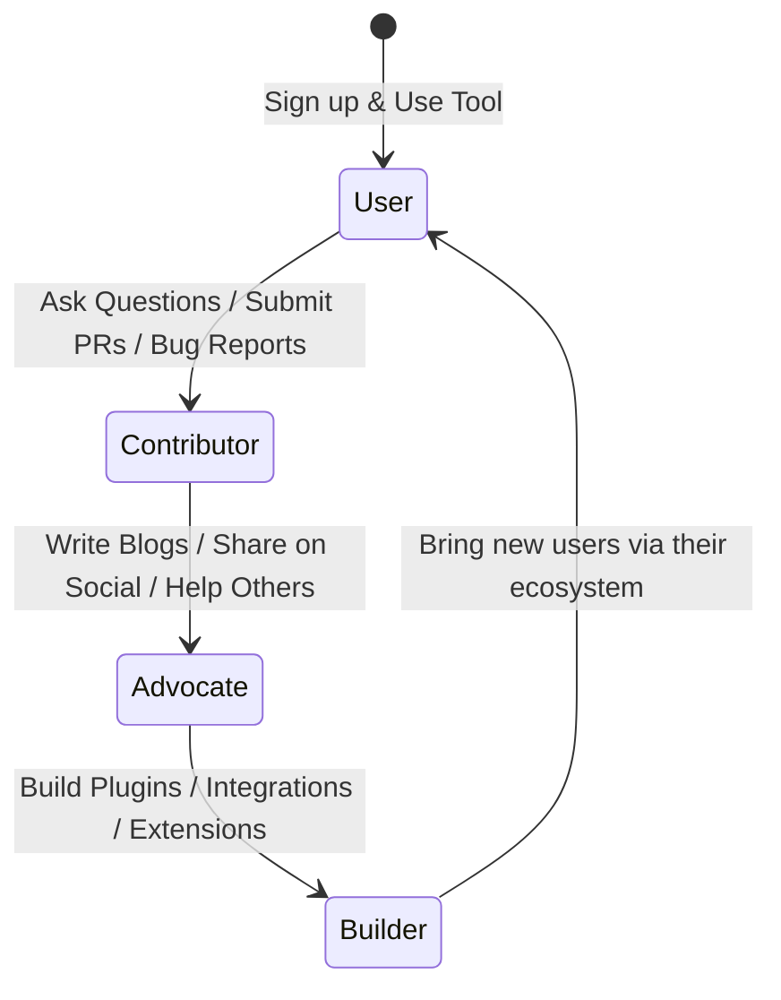

# Community-Led Growth for DevTools: The Complete Playbook

> **TL;DR:** Setting up a Discord server or a Slack workspace is not a developer community. It’s just chat infrastructure. Real community-led growth is a flywheel where users become contributors, contributors become advocates, and advocates bring in your next wave of users. It requires seeding high-quality members early, providing real value without pushing a sales pitch, and measuring engagement over raw headcounts.

It is mid-2021, and "Community-Led Growth" is the new buzzword on every VC's lips. If you look at any dev-tool pitch deck today, there's guaranteed to be a slide with a big Discord or Slack icon, bragging about how they are "building a community." 

Most of these communities are absolute ghost towns. 

They are digital equivalent of abandoned malls: a few automated GitHub integration bots posting commit logs, a founder shouting into the void about their latest minor feature release, and 500 lurkers who signed up for a sticker pack and immediately muted all notifications.

Building a developer community is exceptionally hard because developers have an incredibly high "BS detector." They can instantly tell if you are genuinely trying to help them learn and solve hard problems, or if you are just trying to build an audience to inflate your registration metrics for your next funding round.

If you do it right, a developer community becomes a massive, self-sustaining distribution engine and your ultimate product feedback loop. If you do it wrong, it’s a high-maintenance support liability. Let's look at the actual playbook for building a community that lasts.

---

## The Community Flywheel: From User to Builder

A successful developer community does not just consist of users talking to your support team. It is a structured ecosystem where developers progress through distinct stages of involvement.

1. **The User**: They sign up, read the docs, and use your product to solve a personal or work problem. They are mostly passive.
2. **The Contributor**: They move from passive consumption to active participation. They ask a smart question in your chat, report a bug on GitHub, or submit their first pull request to fix a documentation typo.
3. **The Advocate**: They love your product so much they start talking about it without you asking them to. They write blog posts about how they used your tool, recommend it to friends, and help answer questions for newer members in your community forums.
4. **The Builder**: This is the peak of the flywheel. They start building plugins, templates, library integrations, or open-source extensions around your core product. They are actively expanding your product’s ecosystem, making it more valuable for every other user.

Your goal as a founder or community manager is not just to acquire more "Users." It is to design clear paths that help people transition from one stage of this flywheel to the next.

---

## Seeding Your First 100 Members (Do Not Do a Broad Launch)

The biggest mistake founders make is launching their community to thousands of people on Product Hunt or Hacker News on Day 1. 

A community with 5,000 strangers and no established culture is just a noisy chatroom. 

You need to seed your community slowly, starting with your first 50 to 100 members. These must be **high-intent, deeply technical users** who are highly invested in the problem you are solving.

- **Identify your early champions**: Reach out to developers who have already starred your GitHub repo, submitted feedback via your support emails, or tweeted about your space.
- **Invite them individually**: Send a personal email or DM: *"Hey, we are setting up a private space for our most active early users to discuss the product roadmap, share what they are building, and get direct access to our core engineering team. We’d love to have you."*
- **Create an exclusive feedback loop**: In the early days, your core engineers (including you, the founder) must be highly active in the community. If a seeded member asks a question or reports a bug, respond in ten minutes. Fix their bug and push a patch in an hour. This direct, high-bandwidth connection to the builders is incredibly rewarding for developers.

Once these first 100 members have established a helpful, respectful, and highly technical culture, you can gradually open the gates to the public. The newcomers will naturally conform to the culture they observe.

---

## Slack vs. Discord: The Structural Dilemma

In 2021, the default choices for developer community platforms are Slack and Discord. While they look similar on the surface, they have fundamentally different structural implications:

### Slack: Best for Professional, Low-Scale Networks
Slack is where developers already spend their working hours. 
- **The Good**: It has a highly professional vibe. Developers are already logged in for work, so there's zero friction to check your workspace.
- **The Bad**: Slack’s free tier has a 10,000-message limit, after which your history starts disappearing. This is catastrophic for a developer community because valuable technical answers get wiped out. Slack is also expensive to upgrade for public communities.

### Discord: Best for High-Scale, Creator-Led Ecosystems
Discord has grown from a gaming platform into the default home for open-source and Web3 developer communities.
- **The Good**: It has robust voice channels, role-based access control, great bot integrations, and is 100% free with unlimited message history.
- **The Bad**: Some enterprise developers can't install Discord on their work machines due to corporate security blocks. The interface can also feel chaotic and overly "gamified" for more senior engineers.

**The Verdict**: If you are building a tool aimed at enterprise/corporate developers, consider Slack or a forum-based tool like Discourse. If you are building a tool for startups, individual creators, or open-source developers, Discord is the clear winner.

---

## Measuring Community Health vs. Vanity Metrics

If you measure your community's success by "Total Registered Users," you are setting yourself up for failure. This is a vanity metric that is easily gamed.

Instead, track these actual indicators of health:

- **Weekly Active Members (WAM)**: How many unique people are actually posting, replying, reacting, or active in your channels each week?
- **Unanswered Question Rate**: What percentage of technical questions posted in your community go without a reply for more than 4 hours? (This should be as close to 0% as possible. If nobody answers, developers will leave and never return).
- **Self-Service Support Ratio**: Are community members answering each other's questions, or is your team doing all the heavy lifting? A healthy community naturally transitions to a state where experienced members help novices, reducing your support load.

---

## Key Takeaways

- **Chat is Not Community**: Focus on building relationships and enabling peer-to-peer help, not just managing channels.
- **Seed the Core Early**: Hand-pick your first 100 members to establish a strong technical and cultural foundation.
- **Integrate Core Engineering**: Make sure your product developers spend time interacting with the community. It builds immense trust and keeps your product grounded in real user needs.

---

## Frequently Asked Questions

**Q: How do we prevent our community from becoming a free support channel?**
A: In the beginning, it *will* be a support channel, and that's a good thing. It lets you find where your onboarding is failing. As you scale, you can redirect common support queries to your documentation and encourage community-driven moderation. Reward helpful members with custom Discord roles, exclusive swag, and early access to features.

**Q: What do we do if someone is toxic or rude in the community?**
A: Ban them immediately. Developers want a safe, respectful place to discuss technical topics. A single toxic member can destroy the culture you spent months building. Create a clear Code of Conduct on Day 1, and enforce it ruthlessly and publicly.

---

*If this made you think, it'll do even more when shared. Hit that subscribe button — I write about developer relations, community building, and open-source growth every week.*

*— [Shantanu Vishwanadha](https://substack.com/@thecoderpanda)*
