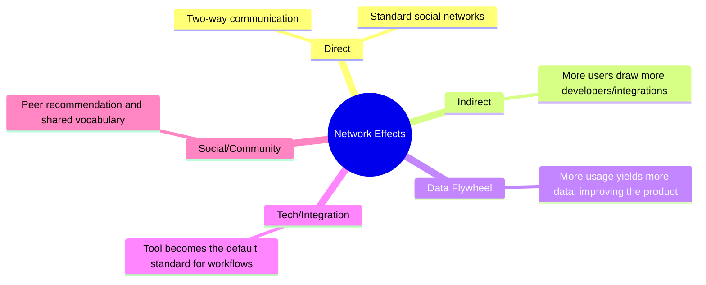
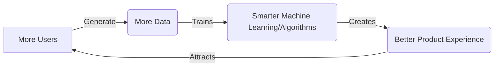

# How to Build Network Effects Without Being a Platform

> **TL;DR:** You do not need to be a massive two-sided marketplace like Uber or Airbnb to benefit from network effects. By building smart "single-player" utility tools that naturally encourage collaboration, utilizing data flywheels, and leveraging community networks, any SaaS startup can build a product that gets exponentially more valuable with every new user.

When venture capitalists talk about "moats," the conversation inevitably turns to network effects. 

They’ll draw a standard diagram of eBay or Facebook, explaining how every new user who joins the platform makes it more valuable for all the existing users. "If you don't have a network effect," they'll warn you, "you are just building a linear software company. You'll eventually be crushed by competitors with lower customer acquisition costs."

For founders building standard business-to-business (B2B) SaaS or developer tools, this advice is deeply frustrating. They think: *"I'm building a database monitoring tool. Or a transactional email API. How on earth am I supposed to build a 'network effect'? We aren't a social network or a marketplace. We are a tool."*

Let’s bust a popular myth: **you do not need to be a platform or a marketplace to build powerful network effects**. 

In 2021, some of the most capital-efficient software companies are building powerful viral loops and defensibility into what initially look like pure, single-player utilities. Look at Loom, Notion, Figma, or Github. They didn't start as massive platforms. They started as incredibly useful tools for individual creators, but they designed their products so that usage naturally triggers expansion.

Let's dissect how you can build these compounding advantages into your product, even if you are "just" a B2B SaaS tool.

---

## The Five Types of Network Effects

To build network effects, you first have to understand the different ways they can manifest. While academic textbooks list dozen of variations, in software, we care about five main types:

1. **Direct (Physical/Protocol)**: The classic network effect. Think of telephones or Slack DMs. The utility increases as more people you want to communicate with join the same network.
2. **Indirect**: More users of a product attract more third-party developers or service providers. Think of iOS and the App Store. More iPhone users draw more app developers, which in turn makes the iPhone more valuable.
3. **Data**: The product gets smarter with more data. Every transaction or search query helps the underlying algorithms improve, creating a better experience for the next user. Think of Google Search or fraud-detection engines.
4. **Tech / Integration**: When your tool becomes the standard vocabulary or file format for an industry. Think of Excel's `.xlsx` or Photoshop's `.psd`. It is extremely hard to switch away because everyone else expects that format.
5. **Social / Community**: The compounding value of human connection. When users of a tool gather in public to help each other, write templates, and share tutorials, they make the tool vastly easier to adopt for new users.

---

## Single-Player Utility with Multi-Player Upgrades

The gold standard of modern SaaS growth is the **"come for the tool, stay for the network"** strategy. 

If you build a product that *requires* multiple people to use it from Day 1 to be valuable (like a social network with zero users), you face the classic cold-start problem. Nobody wants to be the first person in an empty room.

Instead, you should build a tool that provides immense, immediate value to a single user (the "single-player" mode), but becomes exponentially more powerful when they invite their team (the "multi-player" mode).

### Example 1: Loom
Loom is a screen-recording tool. As a single player, it is an incredibly convenient way to record a quick video of a bug and get a shareable link. The value is immediate. 

But when you send that link to a teammate, they watch the video. They see how clean the interface is. They notice they can leave comments at specific timestamps. They sign up for Loom to record their response. 

The act of *using* the product as a single player is the primary distribution channel for acquiring the next user.

### Example 2: Notion
An individual developer can use Notion as a personal wiki or journal. It’s a great markdown editor. 

But the moment they want to share their project roadmap with a co-founder, they invite them to their Notion workspace. Suddenly, they are editing documents together, assign tasks, and collaborating. The tool has naturally transitioned from a personal notebook into the team's single source of truth.

---

## Building a Data Flywheel

Many founders claim they have a "data network effect" because they store a lot of user data. This is false. Simply having a large database is not a network effect.

A true data network effect is a loop: **More Users → More Data → Smarter Product → More Users**.

If you are building an email marketing tool, a data network effect could look like this: as millions of emails are sent through your system, your algorithms learn which subject lines get marked as spam by Gmail across different industries. You use this aggregated data to build an automated helper that warns new users if their draft is likely to bounce. 

The product is now objectively better for the next user *because* of the historical data generated by the existing users.

---

## Integrating Community as a Network Moat

We talked about community in our last post, but let’s look at it through the lens of a competitive moat. 

When your users start building open-source plugins, creating UI templates, or writing tutorials about your product on their own blogs, they are building an **integration network effect**.

Look at WordPress. From a technology standpoint, WordPress is ancient and clunky. Yet, it still powers over 40% of the web in 2021. Why? Because of its massive ecosystem of plugins and themes. If a business needs a specific integration, someone has already built a WordPress plugin for it. A competitor trying to build a modern CMS from scratch has to replicate fifteen years of community-built integrations to compete on utility.

To build this yourself, expose public APIs early. Build a simple plugin architecture. Encourage your developers to share their templates. Make your tool customizable, and let your community do the work of making your product more valuable.

---

## Key Takeaways

- **Start Single-Player**: Solve an immediate, specific pain point for an individual. Do not require a team to be present to deliver initial utility.
- **Design Viral Loops**: The act of consuming the product's output (watching a Loom video, viewing a Notion page) should naturally introduce non-users to the tool.
- **Expose APIs Early**: Enable your community to build extensions and templates. This turns your product into an extensible platform.

---

## Frequently Asked Questions

**Q: Our product is a backend database. How can we have a "multi-player" mode?**
A: Your multi-player mode isn't about chat or real-time collaboration. It’s about workflow integration. For example, if a developer writes a complex database query, can they easily share that query performance chart with their engineering manager with a secure link? Can they share query history with their team? Enable developers to collaborate on infrastructure, not just documents.

**Q: Aren't viral loops just for B2C consumer apps?**
A: Absolutely not. B2B viral loops are often *more* powerful because they carry high-intent business users. When an engineer shares a GitHub pull request or a Figma design file with a client or contractor, they are initiating a highly targeted business-to-business referral.

---

*If this made you think, it'll do even more when shared. Hit that subscribe button — I write about product strategy, network effects, and tech startups every week.*

*— [Shantanu Vishwanadha](https://substack.com/@thecoderpanda)*
