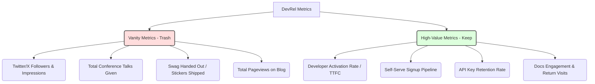

# DevRel Metrics That Actually Matter (And the Vanity Ones to Trash)

> **TL;DR:** If your Developer Relations team is reporting "number of conference talks given," "Twitter impressions," or "swag stickers shipped" to the executive team, you are asking to get your budget slashed. CFOs don't care about developer hype; they care about business value. You must tie your DevRel efforts directly to product metrics: developer activation rates, documentation depth, and self-serve pipeline growth.

It is late 2021, and the Developer Relations (DevRel) landscape is experiencing a massive identity crisis. 

For the past few years, during the height of the venture capital boom, companies threw millions of dollars at DevRel. They hired developers to travel the world, give presentations at sunny conferences, write quirky Twitter threads, and hand out fancy socks. 

When founders or CFOs asked, *"What are we getting out of this $500,000 DevRel budget?"*, the answer was usually a vague hand-wave toward "brand awareness," "developer love," or "ecosystem goodwill."

Now, as the economic climate begins to cool, that era of unaccountable spend is coming to an end. 

If you cannot measure the direct business impact of your Developer Relations program, your program is going to get cut. 

But measuring DevRel is notoriously difficult. Developers are highly cynical, and their journey from first hearing about your tool at a conference to getting an enterprise contract approved is long, non-linear, and incredibly complex. 

If you try to measure DevRel using traditional sales attribution models (like clicking on a tracking link), you will fail. If you don't measure it at all, you will also fail. Let’s talk about the vanity metrics you need to throw in the trash, and the real metrics that actually correlate to business outcomes.

---

## The Trash Pile: DevRel Vanity Metrics

Let’s start by calling out the metrics that look impressive on a slide deck but have zero correlation to whether your company is actually succeeding:

- **Conference Talks Given**: Giving a talk to 200 sleeping developers at 9:00 AM on a Thursday is not an achievement. It is a marketing expense. Unless that talk results in actual, measurable signups or engagement, the quantity of talks is meaningless.
- **Twitter Followers and Brand Impressions**: Social media reach is incredibly easy to game. You can write a viral thread about "10 CSS Tricks You Didn't Know" and get 100,000 impressions, but if your company sells database replication middleware, 99.9% of those readers are not your target audience. You are buying empty hype.
- **Stickers and Swag Shipped**: Sending a sticker pack to a developer in another country who filled out a Google Form is a nice gesture, but it does not make them a user. Tracking "swag volume" as a core KPI incentivizes your team to run expensive giveaways that attract low-intent freebie-seekers rather than actual developers.

---

## The Gold Standard: Metrics That Correlate to Revenue

If you want your CFO to happily sign off on your DevRel budget, you must learn to speak their language. CFOs speak in terms of **Customer Acquisition Cost (CAC), Lifetime Value (LTV), Activation, and Pipeline**.

Here are the four high-impact metrics you should be tracking:

### 1. Developer Activation Rate (The "Time to First Call" Loop)
We discussed Time to First API Call (TTFC) in our developer-led growth post, but DevRel plays a direct role in optimizing this. 

You should measure: **What percentage of signups from a specific DevRel channel (e.g., a specific blog post or video tutorial) successfully make an API call or build a basic app within 24 hours?**

If your DevRel team is driving thousands of signups through conferences, but only 2% of those users are actually "activating" by calling the API, your DevRel team is targeting the wrong audience or your onboarding developer experience is broken.

### 2. Documentation and Guide Engagement
Your documentation is your best sales tool. You should measure:
- **Search Success Rate**: What percentage of developers who search your docs find an answer and stop searching, vs. those who search, get frustrated, and close the tab?
- **Doc-to-Signup Conversion**: How many developers read a specific conceptual guide (e.g., "How to handle Stripe webhooks") and immediately click the "Sign Up" button? This tells you which content pieces are driving actual commercial intent.

### 3. API Key Retention and Expansion
Acquiring a developer is cheap; keeping them is expensive. DevRel shouldn't just focus on the top of the funnel. You should monitor: **Of the developers who activated last month, how many are still making API calls this month? Is their query volume growing?**

If developers are signing up but churning after two weeks, your DevRel team needs to write better troubleshooting guides, build better SDKs, and figure out why developers are hitting roadblocks in production.

### 4. Self-Serve Pipeline Contribution
Even in a bottom-up model, DevRel should contribute to your sales pipeline. Track **Product-Qualified Leads (PQLs)**. These are developers who are using your self-serve tier heavily and have reached usage thresholds that indicate enterprise readiness. 

When your sales team closes a deal with a massive enterprise company, check the historical logs: did their lead architect read three of your DevRel blog posts, star your GitHub repo, or ask questions in your Discord six months before the sales contract was signed? That is **influence attribution**, and it is incredibly powerful.

---

## How to Build a DevRel Reporting Framework

To present these metrics effectively to the executive team, structure your reporting into three distinct tiers:

1. **The Operational Tier (Internal)**: This is for your DevRel team’s daily work. Track things like articles written, video views, GitHub stars, and community replies. Use these to understand what tactics are working on a weekly basis.
2. **The Product Tier (Cross-Functional)**: Share this with your Product and Engineering teams. Track documentation bounce rates, SDK installation counts, common error-code frequencies, and friction points. This helps improve the core product.
3. **The Executive Tier (C-Suite)**: This is the only slide your CEO and CFO should see. Show **Self-Serve Pipeline growth, Product-Qualified Leads, Developer Activation Rates, and NRR (Net Revenue Retention) of developer-led accounts**.

---

## Key Takeaways

- **Ditch the Hype**: Stop measuring social impressions and conference counts. Focus on downstream product usage.
- **Own the Activation Loop**: DevRel must take responsibility for Time to First API Call. Help developers get to their "Aha!" moment faster.
- **Speak CFO Language**: Frame your successes in terms of pipeline contribution, conversion rates, and retention.

---

## Frequently Asked Questions

**Q: How do we track a developer who hears about us at a conference but signs up weeks later at home?**
A: Traditional UTM tracking links don't work well for developer audiences because they often switch devices or clear cookies. Instead, use qualitative attribution. Add a simple, optional survey field on your registration page: *"How did you first hear about us?"* You’ll be surprised at how honest developers are. They will write: *"Saw your talk at PyCon"* or *"Read your blog post on Hacker News."*

**Q: Our DevRel team says tracking metrics ruins their authenticity. Is that true?**
A: No. It’s an excuse for lack of accountability. Tracking metrics doesn't mean you have to write clickbait or spam developers. It simply means you are measuring whether your genuine, helpful efforts are actually reaching the right people and solving their problems. Authenticity and analytical rigour are not mutually exclusive.

---

*If this made you think, it'll do even more when shared. Hit that subscribe button — I write about DevRel, developer experience, and technical marketing every week.*

*— [Shantanu Vishwanadha](https://substack.com/@thecoderpanda)*
