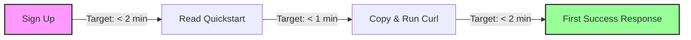

# Developer Experience is a Product Moat

> **TL;DR:** In 2022, devtools are booming, but feature sets are easily copied. Developer Experience (DX) is not a vanity metric or a nice-to-have UI polish—it is the ultimate product moat. Great DX reduces friction, builds developer trust, and creates an operational lock-in that competitors cannot break simply by releasing a new feature checklist.

Let’s be honest: most developer tools in 2022 do the exact same thing. 

If you are building an authentication service, a database-as-a-service, or a transactional email API, your raw technical capabilities are essentially a commodity. If a competitor wants to copy your core feature set, they can hire a couple of senior engineers and do it in a quarter. The feature gap between competitors has never been narrower.

So why do some developer tools become cult-like movements while others, with identical feature checklists, go to die in the enterprise sales graveyard?

The answer is **Developer Experience (DX)**.

DX is not about adding emojis to your terminal output or choosing a cool dark-mode theme for your documentation site (though I do love a good dark mode). DX is the system-level optimization of the friction a developer feels when interacting with your product. In a world where developers have infinite choices and zero patience, the tool that removes the most friction wins. It is a product moat that competitors cannot easily copy, buy, or bypass.

---

## What DX Actually Encompasses

When people talk about UX (User Experience), they talk about customer journeys, buttons, and user flows. When we talk about DX, we are looking at an entirely different set of touchpoints. Developers are a skeptical, easily annoyed demographic. They do not want to be sold to; they want to get their job done and go to sleep.

A complete DX footprint encompasses five key pillars:

### 1. SDK and API Quality
Your API is your product’s primary interface. If your SDK requires 45 lines of boilerplate setup just to initialize a client, your DX is broken. Clean, idiomatic SDKs in the language of the developer's choice are non-negotiable. If I am writing Node.js, your SDK should feel like Node.js, not a lazy, autogenerated translation of your Go backend.

### 2. The Quality of Error Messages
The error message is the most underappreciated marketing channel in tech. A bad error message says: `Internal Server Error (500)`. A mediocre error message says: `Invalid parameter: user_id`. A world-class error message says: 
```json
{
  "error": {
    "type": "invalid_request_error",
    "message": "The user_id 'usr_123' does not exist. Did you mean 'usr_1234'?",
    "param": "user_id",
    "docs_url": "https://docs.myapi.com/errors/invalid_user_id"
  }
}
```
When your tool helps a developer solve their own problem at 2:00 AM without having to file a support ticket, you have won their loyalty forever.

### 3. The Documentation Ecosystem
Documentation is not just a reference manual; it’s a onboarding funnel. It should include interactive guides, copy-pasteable code blocks that actually work, and real-world scenarios. If your docs are out of date, or if the code snippet in your getting started guide throws a syntax error, you have failed before the developer has even evaluated your features.

### 4. Command Line Interfaces (CLIs)
A great CLI is like a superpower. It should be fast, highly discoverable (via smart auto-completion), and interactive. It should allow developers to manage their entire environment without ever touching a browser. 

### 5. Speed to First Success (TTFW)
How long does it take for a developer to sign up, write their first line of code, and get a successful response from your API? If that number is more than 5 minutes, you are losing 50% of your potential users. We call this **Time to First Success** or **Time to Hello World**.

---

## The Stripe Moat: Why Great DX Survives for Decades

Let’s look at the gold standard of DX: **Stripe**.

In the early 2010s, if you wanted to accept payments on the internet, you had to jump through a series of regulatory, banking, and technical hoops that would make any sane engineer quit their job. You had to talk to merchant banks, deal with PCI compliance, and integrate with archaic SOAP APIs that looked like they were designed in the Soviet Union.

Then Stripe came along with a seven-line curl command:

```bash
curl https://api.stripe.com/v1/charges \
  -u sk_test_YOUR_STRIPE_KEY: \
  -d amount=2000 \
  -d currency=usd \
  -d source=tok_visa \
  -d description="Charge for jenny.rosen@example.com"
```

That was it. No bank calls. No 80-page PDFs. Just code that worked.

Stripe’s technical moat wasn't that they figured out how to move money; banks had been doing that for decades. Their moat was that they made moving money an *exceptional developer experience*. 

Once an engineering team integrates Stripe, writes the tests, sets up the webhooks, and deploys it, they are extremely reluctant to move. Even if a competitor emerges offering transaction fees that are 10% cheaper, the cost of migrating away—the developer friction of rewriting code, debugging new API quirks, and reading worse documentation—is so high that the business will happily pay the premium to stay with Stripe. 

That is what a real moat looks like. It is an operational lock-in built on developer trust.

---

## How to Measure DX (Practically)

If you can’t measure it, you can’t optimize it. But how do you put a number on something as subjective as "developer experience"? You don't need academic metrics; you need practical indicators that correlate with real engineering behavior.

Here are the three metrics we track:

*   **Time to Hello World (TTHW)**: The median time from clicking "Sign Up" to making a successful API call in a test environment. Keep this under 5 minutes.
*   **The "Number of Googles" Metric**: How many times does a developer have to leave your documentation site to Google an error message, find a workaround on Stack Overflow, or search for an npm package explanation? Your docs should be a self-contained universe.
*   **SDK Parity Drift**: The lag time between a new core API feature being released and its native availability in your official language SDKs. If developers have to write raw HTTP requests because your SDK is outdated, your DX is decaying.



---

## Why Companies Systematically Underinvest in DX

If DX is such an obvious moat, why do so many companies get it wrong?

First, **DX is invisible to non-technical executives**. A VP of Sales does not understand why an SDK being written in TypeScript instead of generic JavaScript matters. A CFO doesn’t see the financial impact of rewriting an outdated getting-started guide. They see features, pricing models, and marketing pipelines.

Second, **enterprise buyers are often not the end-users**. In legacy software sales, the person signing the check (the CIO or VP of Engineering) is rarely the one writing the code. A legacy sales process wins on slide decks and golf course meetings. But in 2022, bottom-up developer adoption is overtaking top-down purchasing. Developers are refusing to use bad tools, and they have the leverage to force their managers to buy the tools they actually love.

Finally, **good DX is hard**. It requires cross-functional coordination. It means your engineering team, product managers, technical writers, and developer relations advocates must work in perfect harmony. It requires treating error handling, documentation, and SDK maintenance as first-class product features, not tasks to be done in an engineer's spare time.

---

## Key Takeaways

- **DX is your brand**: To a developer, your documentation, error messages, and API design *are* your product. There is no separation.
- **TTHW is king**: Ruthlessly optimize the first 5 minutes of a developer's interaction with your tool.
- **Treat errors as features**: A great error message teaches the developer how your system works and helps them debug their own code instantly.
- **Invest in idiomatic SDKs**: Do not use generic autogenerated wrappers. Make your tools feel native to the language the developer is using.

---

## Frequently Asked Questions

**Q: Isn’t developer experience just for startups? Don't enterprise clients care more about security and compliance?**  
A: Enterprise clients care deeply about SOC2, SSO, and compliance, but they also care about engineering costs. Brittle APIs, poor documentation, and missing SDKs translate directly to wasted engineering hours and delayed launch dates. Exceptional DX makes enterprise deployments faster and safer.

**Q: We have limited engineering resources. How do we justify spending time on DX over building new revenue-generating features?**  
A: Think of DX as a retention and acquisition strategy. If your DX is terrible, your churn rate will be astronomical. Developers will sign up, get frustrated by the first bug, and sign up for a competitor instead. Good DX reduces your support overhead and increases organic word-of-mouth growth.

**Q: How do we get started improving our DX if our API is already in production?**  
A: Start by instrumenting your developer portal. Track where developers drop off in your onboarding flow. Read your support tickets and group them by error code. If 40% of your tickets are about a specific authentication error, that's your starting point. Fix that error message, write a dedicated guide for it, and watch your support volume plunge.

---

*If this resonated, hit subscribe — I write about developer tools and DevRel every week.*

*— [Shantanu Vishwanadha](https://substack.com/@thecoderpanda)*
