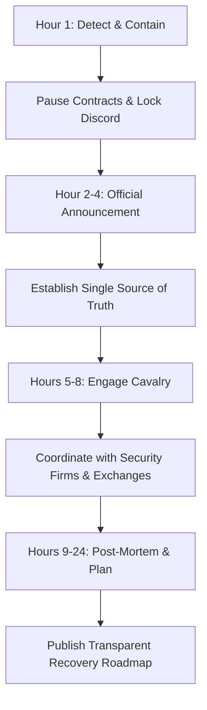

# Crisis Management for Web3 Communities: The Hour-by-Hour Playbook

> **TL;DR:** When a Web3 project is hacked, the immediate battle isn't technical—it's psychological. Managing community panic, preventing mass capitulation, and maintaining a clear line of communication is what saves a project from instant death. This hour-by-hour playbook details exactly how to manage your community when your protocol is compromised.

It is 3:00 AM on a Tuesday. Your phone starts vibrating off the nightstand. It’s not your mom, and it’s not your group chat planning a weekend trip. It is your lead solidity developer, and their voice is flat, devoid of emotion—the universal vocal signature of a human being who has just realized they are ruined. "The treasury contract has been drained," they say. "Someone bypassed the validation check. It’s all gone."

Your stomach drops. Your heart hammers against your ribs. Welcome to the absolute worst day of your professional life. Over the next twenty-four hours, your technical team will be locked in a war room trying to figure out what happened. But as a founder, your primary battlefield isn't the code—it is your community. In Web3, your community is your liquidity, your marketing engine, and your ultimate defense mechanism. If you lose them, you lose everything. Here is the exact, hour-by-hour playbook for surviving a systemic exploit without letting your Discord burn to the ground.

## Hour 1: Stop the Bleeding and Lock Down the House

The first sixty minutes are about containment. Do not, under any circumstances, start drafting a long, defensive Twitter thread explaining your grand vision. Nobody cares about your vision when their life savings are actively being routed through Tornado Cash.

First, immediately pause all active contracts, bridges, and frontends. If you cannot pause them programmatically, shut down the website DNS. Yes, it looks suspicious, but letting players continue to deposit funds into a compromised vault is a corporate death sentence.

Second, lock down your community platforms. Go to your Discord settings and disable the ability for users to send messages in all general channels. Set the server to "Read Only" mode. This sounds authoritarian, and your hardcore decentralization maximalists will scream "censorship" on Twitter. Ignore them. If you leave general chat open, it will instantly become a cesspool of panic, FUD, malicious links, fake support accounts phishing for keys, and coordinated attacks from rival projects. You must control the environment before you can control the narrative.

## Hours 2-4: Establish the Single Source of Truth

Once the physical space is locked down, you need to establish a single, verified channel for all updates. Do not have five different team members tweeting separate updates from their personal accounts.

Draft a short, objective, and unemotional statement. State clearly what you know, what you do not know, and what immediate actions you have taken. Do not guess. Do not say "we think it was a reentrancy attack" if you aren't 100% sure. If you speculate and are proven wrong, you destroy your credibility.

```markdown
**System Exploit Announcement**
- **What happened**: A vulnerability was exploited in our treasury contract at [Timestamp].
- **Immediate action**: All contracts have been paused. The website frontend is temporarily offline.
- **Next steps**: We are working with top-tier security firms to audit the breach.
- **Important**: We will never DM you. Do not click any links claiming to offer refunds.
```

Publish this statement on your official Twitter account, pin it in a read-only announcements channel on Discord, and embed it as a plain-text banner on your website. Tell your community exactly when they can expect the next update—and stick to that timeline, even if you only have "we are still investigating" to report. Silence is the gasoline that feeds the fire of panic.

## Hours 5-8: Bring in the Cavalry and Coordinate Backers

By hour five, the initial shock has passed, and the narrative is being written on Twitter by self-proclaimed forensic analysts. It is time to bring in professional muscle.

Reach out to established blockchain security firms, independent white-hat hackers, and your institutional investors. If you have venture capital backing, this is when they earn their equity. They have direct pipelines to exchanges, law enforcement, and on-chain analytics platforms like Chainalysis.

Work with exchanges to flag and freeze the attacker's addresses. If the hacker tries to send the stolen assets to a centralized exchange to cash out, you want those accounts locked instantly. Announcing publicly that you are working with major security firms and law enforcement doesn't just help recover funds; it sends a powerful psychological signal to your community that you are taking the crisis seriously and are not running away.

## Hours 9-24: The Hard Truth and the Path Forward

Within twenty-four hours, you must transition from reactive panic management to proactive recovery planning. This is where your leadership is truly tested.

You must publish a comprehensive, transparent post-mortem. Explain exactly how the hack happened, the exact assets lost, and the technical steps you are taking to patch the vulnerability. Do not try to sugarcoat the numbers. If you lost $50 million, do not say "a portion of reserves was affected." Say "$50 million was compromised."



Most importantly, outline your recovery roadmap. If you have a plan to raise capital, dilute tokens, or use treasury assets to reimburse users, present it clearly. If you don't have a plan yet, state clearly that your absolute focus is developing a recovery framework and give a hard deadline for when that framework will be presented. The community will forgive a hack; they will not forgive a lack of leadership and accountability.

## Key Takeaways
- **Control the Environment First**: Locking Discord chats to read-only prevents panic-driven spirals and malicious phishing campaigns during the peak of the crisis.
- **Speculation is Poison**: Never publish unverified theories about the exploit vector; stick strictly to confirmed technical facts.
- **Synchronized Messaging is Vital**: Route all communications through a single, official channel to prevent conflicting narratives from team members.
- **Transparency Breeds Loyalty**: Acknowledging the exact scale of the loss and outlining a clear, realistic recovery roadmap is the only way to retain community trust.

## Frequently Asked Questions

**Q: Isn't locking down Discord channels a violation of Web3's decentralized ethos?**
A: In a crisis, operational survival supersedes philosophical purity. An open Discord general chat during a $100M exploit is not a forum for healthy decentralized discourse; it is a chaotic physical security hazard where users are actively targeted by scammers trying to steal whatever they have left. Lock it down.

**Q: How do we handle hostile influencers and Twitter accounts spreading rumors?**
A: Do not engage in public shouting matches or try to argue with individual accounts on Twitter. The best defense against rumors is a relentless, predictable flow of high-quality, verified data from your official account. When you publish a thorough, objective post-mortem, you starve the rumors of their oxygen.

**Q: When should we reopen community channels for active chat?**
A: Only after you have published a detailed post-mortem and a clear, actionable recovery or reimbursement plan. Reopening channels without a plan is inviting a mob to throw rocks at your office. When you do reopen, ensure you have reinforced your moderation team to handle the high volume of emotional queries.

---

*Bear markets are where the real builders are found. Subscribe for weekly reality checks.*

*— [Shantanu Vishwanadha](https://substack.com/@thecoderpanda)*
