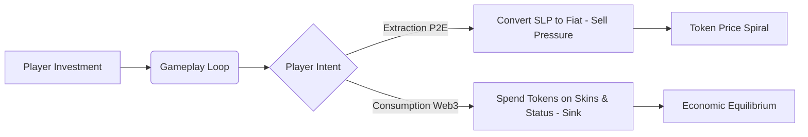

# Play-to-Earn Economics: What Axie Infinity Taught Us About Token Design

> **TL;DR:** The Play-to-Earn (P2E) craze of 2021 was built on a fundamental mathematical lie: that a closed economic system can pay millions of users more than they spend. Axie Infinity's dual-token model of AXS and SLP became a hyper-inflationary trap that relied on continuous new user inflow to survive. This post dissects why the model collapsed and what sustainable token design actually looks like.

Let’s talk about the giant, pixelated elephant in the room. In 2021, we were told that the future of human labor was playing video games. Tens of thousands of people in developing countries were reportedly quitting their day jobs to breed digital creatures called Axies, earning a living wage in the process. It was hailed as an economic miracle—a decentralized redistribution of wealth that would liberate the working class. Major venture capital firms wrote massive checks, and the term "Play-to-Earn" (P2E) became the ultimate buzzword of the Web3 gaming revolution.

Fast forward to March 2022, and the dream is in tatters. The earnings of average players have plummeted below minimum wage, the price of the in-game currency is down over 95% from its peak, and the entire ecosystem is reeling from a massive security exploit. It turns out that the laws of basic economics do not suspend themselves just because you put your ledger on a blockchain. P2E was not a new paradigm of labor; it was a beautifully wrapped, hyper-financialized loop that behaved exactly like a classic Ponzi scheme. Let's look at the mechanics of this collapse and extract the hard lessons for tokenomics design.

## The Dual-Token Trap: AXS and SLP

To understand the collapse of Axie Infinity's economy, we have to look at its dual-token structure: AXS and SLP. AXS (Axie Infinity Shards) is the governance token—it represents ownership in the ecosystem, is capped in supply, and is captured largely by investors and core developers. SLP (Smooth Love Potion), on the other hand, is the utility token—the blood supply of the game.

Players earned SLP by winning PvE and PvP battles inside the game. Conversely, to breed new Axies (which you needed to do to play, or to sell to new players), you had to spend both AXS and SLP. When you bred an Axie, the spent SLP was burned (destroyed), reducing the circulating supply.

```
+-------------------------------------------------------------+
|                     Axie Economic Loop                      |
|                                                             |
|   New Player Buy-in ----> Demand for Axies (Breeding)       |
|                                |                            |
|                                v                            |
|   SLP Burned <------------ SLP Spent                        |
|                                                             |
|   Players Earn SLP <------ Winning Battles (Inflation)      |
+-------------------------------------------------------------+
```

This model is elegant in its simplicity, but it has a fatal flaw: it is completely dependent on continuous exponential growth. The only real utility for SLP was breeding more Axies. The only reason to breed more Axies was to sell them to new players who wanted to enter the game. If new user growth slows down, the demand for breeding vanishes. When breeding stops, the burn mechanism for SLP drops to zero, while the minting mechanism (players earning SLP by playing) continues unchecked. The result is instant, devastating hyper-inflation.

## The Ponzi Loop of Play-to-Earn

Let’s be intellectually honest: the core customer of Axie Infinity in 2021 was not a gamer who loved the gameplay. The core customer was an investor (or a "scholar" hired by an investor) whose sole objective was to extract more fiat value from the system than they put in.

When you build a game where every participant is a net seller of the utility token, your economy is fundamentally insolvent. For players to extract real-world money (USD or PHP) from the system, someone else has to be injecting new real-world money. In the bull run, this capital injection came from new players buying their initial teams of three Axies, which at one point cost over $1,000.

The moment the inflow of new player capital fell below the rate of token extraction by existing players, the price of SLP began its inevitable death spiral. As the token price dropped, players had to play more hours to earn the same amount of value, which led to a higher volume of SLP being minted and dumped onto the open market, accelerating the collapse. It was a self-reinforcing feedback loop of economic destruction.

## Designing for Value Consumption, Not Extraction

The contrarian shift we must make as designers in 2022 is moving from "Play-to-Earn" to "Play-and-Earn"—or better yet, "Play-to-Own." We must design games where the primary motivation for participation is entertainment, status, or competition, not financial extraction.

For a token economy to be sustainable, there must be sink mechanisms that do not rely on future financial expectations. Players must be willing to spend and burn tokens on things that provide zero financial return. This is how the traditional gaming industry works. Millions of players spend billions of dollars every year on skins in Fortnite, or virtual tanks in World of Tanks, purely for the joy of cosmetic customization, social status, and competitive dominance.



In a sustainable Web3 game, the token must act as a medium of exchange for utility, not a license to print money. The sink mechanisms should include cosmetic upgrades, tournament entry fees, guild registration fees, and access to exclusive gameplay modes. If you cannot get players to spend your token without expecting a return on investment, you do not have a game economy; you have a decentralized investment fund disguised as a cartoon.

## The Long Road to Sustainable Web3 Gaming

As the carnage of 2022 continues, the death of the pure P2E model is a necessary clearing of the brush. It is a harsh but vital correction that will force developers to focus on what actually matters: building fun games with sustainable token designs.

We must build Web3 games with complex, multi-layered sinks, dynamic emission controls, and a clear separation between financialized assets and pure gameplay utility. The future belongs to projects that treat blockchain technology not as a magical printing press, but as a database for secure digital ownership. Until we make that shift, every P2E project will meet the exact same fate as Axie Infinity—crushed under the weight of its own inflationary mechanics.

## Key Takeaways
- **The Closed-Loop Insolvent Fallacy**: Closed economies cannot sustainably pay users more than they spend; value extraction must be balanced by value consumption.
- **The Hyper-Inflationary Trap**: Relying on a single utility token (like SLP) whose only sink is expansion (breeding) guaranteed collapse when user growth flattened.
- **Sustainable Sinks are Non-Financial**: A healthy token economy requires players to permanently burn tokens on cosmetic, status-driven, or entertainment-focused utilities.
- **Entertainment Over Extraction**: Future Web3 games must prioritize fun and digital ownership over guaranteed financial yield to prevent speculative death spirals.

## Frequently Asked Questions

**Q: What is a token sink, and why is it important in game design?**
A: A token sink is any mechanism within a game or protocol that permanently removes tokens from circulation (usually by burning them or locking them in a treasury). Sinks are vital because they offset the constant inflation created by players earning tokens. If your game has "faucets" (ways to earn tokens) but lacks effective "sinks" (ways to spend and destroy tokens), the token supply will expand endlessly, driving down its value.

**Q: Why did the dual-token model fail if it was designed to separate governance from utility?**
A: The separation of governance (AXS) and utility (SLP) was smart in theory, but it failed because the utility token’s consumption loop was entirely dependent on speculation. Because SLP's only utility was breeding more Axies, its value was tied directly to the demand for new player entry. When new user growth plateaued, the entire demand side of the SLP equation vanished, exposing the fundamental structural flaw of the system.

**Q: Can Web3 games ever be sustainable if players expect to make money?**
A: Only if the financial returns are treated as a sporadic, skill-based reward rather than a guaranteed basic income. A sustainable Web3 game can allow top-tier competitive players to earn value from tournament pools, or lucky players to find rare, tradeable cosmetic assets. However, the average player must accept that they are paying for entertainment, just as they do in traditional Web3-less gaming.

---

*Bear markets are where the real builders are found. Subscribe for weekly reality checks.*

*— [Shantanu Vishwanadha](https://substack.com/@thecoderpanda)*
