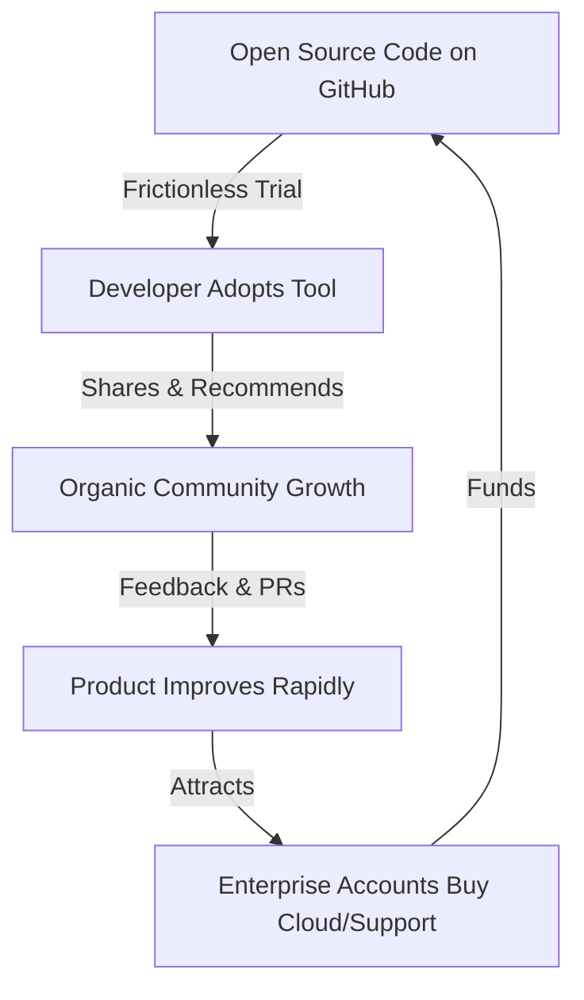

# Open Source is the Best Go-to-Market

> **TL;DR:** In 2022, the traditional software sales playbook is dead for developer tools. Developers do not want to fill out contact forms, sit through sales calls, or read slick marketing slide decks. They want to clone a repository, look at the code, and run it locally. Open source is the ultimate go-to-market strategy because it builds unmatched trust, eliminates sign-up friction, and creates a community-led acquisition flywheel that no sales team can compete with.

If you are a technical founder starting a developer tool company in 2022, you have a massive choice to make early on: 

Do you build a proprietary, closed-source SaaS tool and hire a sales team to pitch it to CTOs? Or do you open-source your core engine, put it on GitHub under an MIT or Apache license, and build a business on top of it?

Twenty years ago, open sourcing your core IP would have been considered business suicide. Today, it is the single most powerful go-to-market (GTM) playbook in existence. 

The companies winning the developer tools space right now are not winning because they have the best salespeople. They are winning because they have the best GitHub repositories. Open source is no longer just a philosophical stance or a hobby for hobbyists; it is the most efficient, scaleable customer acquisition model available. Let’s talk about why open source is the best GTM for developer tools, how the business models work, and where founders get tripped up.

---

## Why Open Source Works as a GTM Strategy

To understand why open source is so effective, you have to understand the developer psychology. Developers have a profound, systemic dislike of being sold to. They are naturally skeptical of marketing claims. They don't want to hear that your database is "highly available and sub-millisecond"; they want to read your raft implementation code on GitHub and see how you handle network partitions.

Open source changes the dynamic from a **push sales model** to a **pull adoption model**.

### 1. The Power of Zero Friction
In a proprietary SaaS model, a developer who wants to try your tool has to:
1.  Go to your website.
2.  Click "Request a Demo."
3.  Schedule a 15-minute qualification call with a SDR (Sales Development Representative) who doesn't know what a docker container is.
4.  Sit through a 45-minute slide deck presentation.
5.  Get permission from security to run a proof-of-concept.

By the time they get to use the tool, three weeks have passed, they are annoyed, and they’ve likely lost interest.

In an open-source model, the journey looks like this:
```bash
git clone https://github.com/yourcompany/yourproject.git
cd yourproject
docker-compose up
```
Within 90 seconds, the developer is interacting with your product, seeing its value, and building on it. There are no forms, no salespeople, and no friction.

### 2. Building Unmatched Trust
When developers write code, they are taking a bet on your infrastructure. If they adopt a closed-source SaaS tool and that startup goes out of business, their application is broken. But if they adopt an open-source tool, they know they have the code. They can fork it, host it themselves, and maintain it if you vanish. This safety net eliminates the "vendor risk" that kills early-stage proprietary software sales.

### 3. The Discovery and Contribution Flywheel
When your project is open source, every user is a potential marketer. They write blog posts about how they integrated your tool, they talk about it on Reddit, they share it on Hacker News, and they open pull requests to fix bugs or add edge-case integrations. Your users become your R&D team and your sales team, all at the same time.



---

## The Business Models That Actually Work on Top of OSS

You cannot buy groceries with GitHub stars. At some point, your open-source project has to become a real business. In 2022, there are three primary models that successfully monetize open-source software:

### 1. Cloud Managed Service (SaaS)
This is the most common model. The core code is open source and developers can run it themselves on their own AWS or GCP instances. However, managing databases, clusters, and scaling infrastructure is tedious, expensive, and time-consuming. 

Your business model is: *"Our code is free to run, but we will run it for you for a fee."* Developers get the convenience of a managed cloud service (backups, scaling, monitoring, automatic patches) while maintaining the freedom to self-host if they ever want to. Companies like Mongo (Atlas) and Elastic have built multi-billion dollar businesses on this model.

### 2. Open Core
In the Open Core model, the core utility is free and open source, but advanced enterprise features—like Single Sign-On (SSO), role-based access control (RBAC), multi-tenant isolation, audit logs, and complex compliance tools—are proprietary and require a paid license. 

The rule of thumb here is simple: **Open source the tools that individual developers need to build their apps; monetize the features that IT managers, security teams, and compliance officers need to run the business.**

### 3. Support and Services
This is the oldest OSS business model (popularized by Red Hat). The software is free, but you charge for enterprise-level SLAs, custom feature development, and architectural consulting. While this is a great way to generate early revenue without writing proprietary code, it is incredibly difficult to scale. You are essentially running a consulting shop rather than a high-margin product business.

---

## Getting it Right: The Winners and the Warned

We have seen this playbook play out beautifully across tech history. 

Look at **Postgres**—an ancient open-source database that remains the default choice for almost every new project in 2022 because of its community reliability and cloud-agnostic nature. Look at **Kubernetes**—open-sourced by Google to commoditize the cloud infrastructure layer and prevent AWS from dominating orchestrations. Look at **React**—open-sourced by Meta, which won them the frontend mindshare of an entire generation of developers.

But open source is not a magic wand. It has real costs. 

Maintaining a popular open-source project is exhausting. You will spend half your day reviewing low-quality PRs, answering basic setup questions on Discord, and dealing with highly demanding community members who expect you to fix their bugs for free on a Sunday afternoon. 

Furthermore, founders in 2022 must be highly strategic about licensing. Cloud giants like AWS have historically taken popular open-source tools (like Elasticsearch) and offered them as managed cloud services without contributing back to the core project. This is why we are seeing companies like Elastic, MongoDB, and HashiCorp adopt licenses that prevent cloud providers from reselling their open-source work without paying. You must choose a license that protects your business while remaining welcoming to individual developers.

---

## Designing the Line: What to Open Source vs. Keep Proprietary

The biggest mistake OSS founders make is putting the "line" in the wrong place. 

If you make your open-source product too crippled or annoying to use, developers will feel manipulated, call you out on Hacker News, and fork your project to build a truly free alternative. 

But if you open-source *everything*, you will have millions of happy users and exactly $0.00 in revenue because no one has a reason to pay you.

```text
PROPRIETARY ENTERPRISE LAYER
--------------------------------------------- <- "The Line" (Monetize managers)
- SAML/SSO Authentication
- Role-Based Access Control (RBAC)
- Compliance Logs & Audit Trails
- Multi-Region Replication
---------------------------------------------
OPEN SOURCE CORE ENGINE (MIT/Apache 2.0)      <- (Engage developers)
- Full API/Database Functionality
- CLI and Developer SDKs
- Documentation and Local Dev Tools
- Core Performance Capabilities
```

The division should be based on **buyer personas**. Individual developers care about APIs, developer utilities, local performance, and documentation. Enterprise buyers care about compliance, security, administrative control, and SLAs. Put your energy into making the open-source core an absolute joy to use, and charge for the administrative wrapper around it.

---

## Key Takeaways

- **Adoption is your funnel**: Forget MQLs (Marketing Qualified Leads). Your primary metric is active installations or active cluster deployments.
- **Developers buy bottom-up**: If the engineers love your open-source core, they will pull your enterprise paid product into their organizations.
- **Open core requires boundary discipline**: Have a clear, non-negotiable definition of what is free and what is paid, and do not blur the line to close a single deal.
- **Community is your competitive advantage**: A highly engaged open-source community is a defensible asset that no proprietary competitor can buy with venture capital.

---

## Frequently Asked Questions

**Q: If we open-source our codebase, won't our competitors just copy our code and build a competing product?**  
A: They can copy your code, but they cannot copy your community, your brand, your developer trust, or your speed of execution. In developer tools, the community and the integrations are the real defensible assets. If a competitor simply copies your code, they will always be trailing behind your roadmap and struggles to build the organic developer love that you have cultivated.

**Q: We are already building a proprietary SaaS tool. Can we transition to an open-source model later?**  
A: Yes, it’s possible, but it is highly challenging. You have to clean your codebase (remove any internal hacks, hardcoded secrets, or proprietary dependencies), choose a licensing strategy, and prepare your team for open-source community management. It is almost always easier to design your open-source boundaries from day one.

**Q: How do we measure the success of our open-source GTM? Are GitHub stars a real metric?**  
A: GitHub stars are a vanity metric. They measure hype, not adoption. Instead, track metrics that represent real usage: Docker pulls, npm downloads, active local runs, and the number of active self-hosted installations sending telemetry data back to your system. Those are the numbers that correlate with real business growth.

---

*If this resonated, hit subscribe — I write about open-source strategy and developer GTM every week.*

*— [Shantanu Vishwanadha](https://substack.com/@thecoderpanda)*
