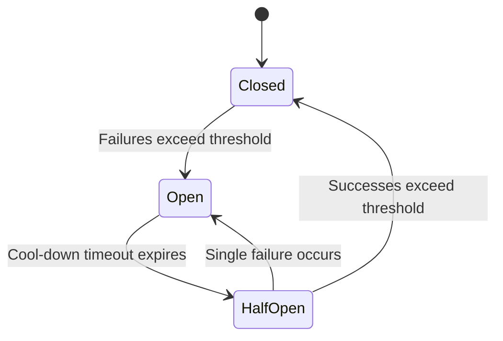

# Building Resilient APIs: Designing for Failure and Scale

> **TL;DR:** When building distributed systems, assuming that network calls will always succeed or that downstream services will always be online is a recipe for catastrophic downtime. By implementing defensive architecture patterns—such as circuit breakers, intelligent rate limiting, jittered retries, and clean graceful degradation—you can ensure your APIs remain stable even when their supporting infrastructure is in flames.

It is easy to build an API that works perfectly when there is zero traffic, the network is instantaneous, and downstream services respond in three milliseconds. Anyone can do that on their local machine. But the moment you deploy that API to a production cloud environment, you enter a hostile wasteland. The network is flaky, databases freeze, third-party authentication services go offline, and sudden surges in traffic will try to hammer your application into submission.

In a modern distributed architecture, failure is not a rare anomaly; it is a daily, statistical certainty. If your API is designed under the assumption that every dependency will always be healthy, a minor slowdown in a single non-essential database can cascade throughout your entire system, locking up threads, consuming memory, and eventually bringing down your entire application. Building resilient APIs is the art of design-for-failure—creating defensive code structures that isolate faults, degrade gracefully, and protect your core infrastructure from being overwhelmed. Let us look at the essential patterns of API resilience.

## The Circuit Breaker Pattern: Stopping the Cascade

Imagine your API relies on a third-party payment gateway to process transactions. Suddenly, that gateway suffers a major outage, causing all requests to hang for thirty seconds before timing out. 

If your server receives fifty requests per second, and each request spins up a thread or a process that waits thirty seconds for the timeout, your server will exhaust its resource pool within seconds. It can no longer accept new connections, and your entire application crashes. A failure in a payment service has successfully knocked out your product catalog, your user profiles, and your blog. This is a cascading failure.

To prevent this, you must implement the **Circuit Breaker** pattern. A circuit breaker acts as an electrical safety switch placed around a network call. It operates in three states:



1. **Closed**: Under normal conditions, the circuit is closed, and requests flow through to the downstream service. The breaker monitors the success and failure rates of these calls.
2. **Open**: If the failure rate exceeds a specific threshold (e.g., 50% of the last 100 requests fail or time out), the circuit breaker trips and opens. When the circuit is open, all incoming calls fail immediately, bypassing the downstream service entirely and returning a fallback response (or a cached value) to the client. This prevents resource exhaustion on your server and gives the struggling downstream service room to recover.
3. **Half-Open**: After a specific cool-down period (e.g., thirty seconds), the breaker enters the half-open state. It allows a small, controlled number of trial requests to pass through. If these requests succeed, the breaker assumes the downstream service has recovered and closes the circuit. If any request fails, it immediately trips open again.

By isolating flaky services, circuit breakers turn catastrophic crashes into controlled, local degradations.

## Intelligent Retries: Jitter and Exponential Backoff

When a network call fails, our instinctive reaction is to try again. But if a database is struggling to cope with a sudden spike in traffic, having thousands of clients instantly and repeatedly retrying their failed requests will act as a distributed denial of service (DDoS) attack, completely sealing the database's doom.

If you are implementing retries, you must follow two non-negotiable rules:
- **Exponential Backoff**: Instead of retrying every second, increase the delay between retries exponentially (e.g., 100ms, 200ms, 400ms, 800ms). This gives the downstream system breathing room.
- **Jitter (Randomness)**: If thousands of clients fail at the exact same moment, and they all back off exponentially, they will still retry in coordinated waves. To break up these waves, you must inject randomness, or "jitter," into your delay calculation. 

```typescript
// The formula for a jittered backoff delay
const baseDelay = 100; // 100ms
const multiplier = 2;
const maxJitter = 0.5; // 50% randomness

function getJitteredDelay(attempt: number): number {
  const exponentialDelay = baseDelay * Math.pow(multiplier, attempt);
  const jitterAmount = exponentialDelay * maxJitter * Math.random();
  return exponentialDelay + jitterAmount;
}
```

By spreading retries out randomly over time, you smooth the traffic curves, allowing your database or microservices to recover smoothly from temporary capacity overloads.

## Rate Limiting: Protecting the Gates

Resilience is not just about surviving downstream failures; it is about protecting your own services from malicious or poorly written upstream clients. A single client running an unthrottled infinite loop can exhaust your database connection pool and spike your CPU usage, taking down the API for everyone else.

You must implement robust rate limiting at your API gateway layer. Use standard algorithms like the **Token Bucket** or **Leaky Bucket** to enforce fair-use policies. Track requests by API key, IP address, or user ID.

When a client exceeds their limit, do not process the request. Return a clear `429 Too Many Requests` HTTP status code, along with a `Retry-After` header telling them exactly how many seconds they must wait before making another request. This forces clients to behave responsibly and preserves your computing resources for well-behaved users.

## Key Takeaways
- **Prevent cascading collapses**: Use circuit breakers to instantly isolate failing downstream dependencies, protecting your thread pools from resource exhaustion.
- **Implement jittered backoffs**: Never retry failed requests on a fixed interval; use exponential delays mixed with random jitter to avoid crushing recovering databases.
- **Govern upstream traffic**: Enforce strict rate limits at your entry points using Token Bucket algorithms to protect your application from sudden traffic overloads.
- **Decline gracefully**: Design fallback scenarios (e.g., returning cached data or default profiles) so that minor microservice failures do not break the entire user experience.

## Frequently Asked Questions

**Q: How do we choose the right timeout value for our API requests?**
A: A timeout should be set aggressively. If your downstream service normally responds in 50ms, a timeout of 500ms is generous. Setting a multi-second timeout "just in case" is a dangerous antipattern that causes connection pools to fill up during traffic spikes. If a call cannot succeed within a reasonable threshold, fail fast and let your fallback logic handle it.

**Q: Where should the circuit breaker logic live in our system?**
A: For simple applications, circuit breakers can be implemented directly in your backend codebase using libraries like `opossum` (Node.js) or `resilience4j` (Java). For complex, polyglot microservice architectures, it is far better to delegate circuit breaking, retries, and rate limiting to a dedicated service mesh layer (like Istio or Linkerd) or an API Gateway (like Kong or AWS API Gateway) so that your application code remains dry and focused on business logic.

**Q: What is the difference between rate limiting and load shedding?**
A: Rate limiting is a client-specific policy that throttles requests based on identity (e.g., limiting User A to 100 requests per minute). Load shedding is a systemic, emergency defense mechanism used by a server when it is critically overloaded (e.g., high memory usage or long event loop delays). During load shedding, the server will intentionally reject a percentage of all non-essential incoming requests with a 503 status code to ensure it does not run out of memory and crash completely.

---

*Bear markets are where the real builders are found. Subscribe for weekly reality checks.*

*— [Shantanu Vishwanadha](https://substack.com/@thecoderpanda)*
