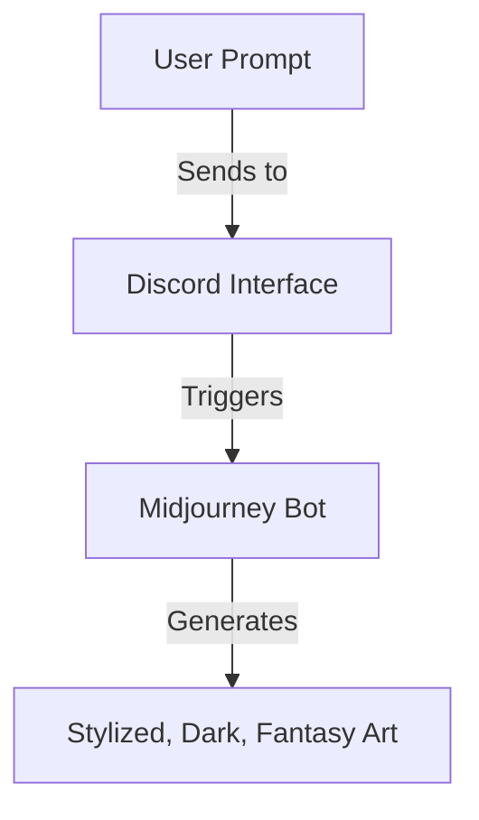

# Midjourney and DALL-E 2: The AI Art Revolution Is Actually Here

> **TL;DR:** The mid-2022 arrival of DALL-E 2 and Midjourney marks a paradigm shift in human creativity. By comparing the photorealistic precision of OpenAI's tool with the dark, painterly style of Midjourney, we can understand how latent diffusion models are transforming from technological curiosities into powerful, practical tools for developers and designers alike.

For decades, we were told that artificial intelligence would automate the boring, repetitive tasks of the world first. We believed that the robots would wash our dishes, sweep our floors, and assemble our cars, leaving human beings free to pursue high-level, creative endeavors like painting, writing, and making music. "AI can never capture the soul of human art," the critics reassured us.

In July 2022, that comfortable assumption was shattered into a million pieces. The release of OpenAI’s DALL-E 2 and the rapid open-beta expansion of Midjourney have triggered a creative gold rush. In the span of a single afternoon, anyone with an internet connection and a Discord account can generate high-resolution, complex illustrations, concept art, and photorealistic renders in seconds. We are not looking at simple, blocky filters or low-resolution generative adversarial network (GAN) artifacts. We are looking at a profound leap in machine intelligence that is redrawing the boundaries of design, development, and the creative economy.

## The Contenders: Two Worlds of Generative Aesthetics

While both Midjourney and DALL-E 2 rely on similar underlying machine learning advancements, they have chosen radically different philosophical paths in terms of user experience, access, and output style.

### DALL-E 2: The Precise, Academic Illusionist
Developed by OpenAI, DALL-E 2 is built with a focus on photorealism, spatial comprehension, and absolute prompt fidelity. It is a highly scientific tool. If you ask DALL-E 2 for "a high-resolution photo of an astronaut riding a horse in space," it will construct a scene that perfectly obeys the physical rules of lighting, shadows, and anatomical geometry. 

DALL-E 2's standout features are its specialized editing tools: **inpainting** (the ability to erase a section of an image and have the AI fill it in with new, contextually appropriate objects) and **outpainting** (the ability to extend an existing image beyond its original boundaries). It is a professional, sterile, and highly precise visual assistant.

### Midjourney: The Moody, Painterly Alchemist
In contrast, Midjourney operates entirely inside a Discord server. Its interface is chaotic, collaborative, and deeply communal. You type your prompts in public channels, watching your images compile block by block alongside those of hundreds of other users.

Aesthetic-wise, Midjourney does not care about boring realism. It is biased toward beauty. Even a simple, two-word prompt like "steampunk cathedral" will yield a highly stylized, atmospheric, and dramatic digital painting that looks like it took a professional concept artist three weeks to paint. It has an innate understanding of texture, composition, shadow, and gothic drama. It is an expressive, opinionated artist rather than a literal translator of text.

## How It Works: The Denoising Magic of Diffusion

To understand how these tools achieve such spectacular results, we must look beneath the hood at the underlying mechanics of **Latent Diffusion Models**.

Unlike older generative models that tried to stitch together pieces of existing images from a database, diffusion models work through a process of controlled destruction and reconstruction. During training, a neural network is shown millions of high-resolution images, which are slowly degraded by adding mathematical static noise until they are nothing but a blank screen of gray fuzz. The network learns to predict exactly how much noise was added at each step, essentially learning how to reverse the process of decay.

When you write a prompt, the AI does not start with a blank canvas. It starts with a random grid of pure static noise in a mathematical "latent space." It then uses a Text-Image matching model (like CLIP) to guide the denoising process. Block by block, the AI strips away the noise, carving out shapes, textures, and lights that match the semantic meaning of your text. It is akin to a sculptor carving a beautiful marble statue, except the marble is a block of random digital noise, and the chisel is a mathematical equation guided by your words.

## Developer Use Cases: Beyond the Canvas

While illustrators and artists are debating the ethics of AI art, software developers and product managers are finding highly practical, high-value applications for these tools:

- **Rapid UI Prototyping**: Need a unique set of vector icons, an atmospheric hero image for a landing page, or a series of realistic avatar placeholders? Instead of spending hours searching royalty-free stock websites, developers are using generative AI to produce custom assets in minutes that match their exact color palette and theme.
- **Game Development and Concepting**: Indie game developers with zero budget are using Midjourney to generate high-fidelity environment concept art, character reference sheets, and texture maps, leveling the playing field against massive, well-funded game studios.
- **Narrative Storyboarding**: Product teams are using DALL-E 2 to storyboard user journeys, creating vivid, sequential illustrations of customer problems and solutions to align stakeholders during product pitches.

## Key Takeaways
- **Aesthetics vs Precision**: DALL-E 2 excels at literal prompt compliance and photorealistic editing, while Midjourney prioritizes atmospheric, high-concept artistic styling.
- **Diffusion is the new standard**: Generative art has moved past GANs to leverage diffusion models that construct high-fidelity images by denoising random static patterns.
- **Unlocking indie capabilities**: Generative AI democratizes high-end visual design, allowing solo developers and lean startups to produce premium visual assets with zero budget.
- **The prompt is the interface**: In the generative era, the ability to articulate clear, descriptive, and structured prompts is becoming a valuable developer skill.

## Frequently Asked Questions

**Q: Who owns the copyright of AI-generated images?**
A: This is a major legal gray area in mid-2022. In the United States, the Copyright Office has repeatedly ruled that works created solely by an AI without human intervention cannot be copyrighted, as copyright requires human authorship. However, both OpenAI and Midjourney grant commercial usage rights to their paid users, meaning you are free to use your generated images in commercial products, games, and web designs, though you cannot prevent others from copying or using them as well.

**Q: Will AI art replace professional graphic designers?**
A: No, but it will change their workflow. Just as the invention of photography did not destroy painting, and the release of Photoshop did not eliminate graphic designers, generative AI will be absorbed as a powerful new tool in the designer's utility belt. The designers who survive will be those who learn how to use AI to supercharge their ideation phases and produce high-quality layouts faster than ever before.

**Q: What is prompt engineering, and is it a real skill?**
A: Yes. Because diffusion models are highly sensitive to word choice, syntax, and style tags, "prompt engineering" has emerged as a valuable skill. Understanding how to construct a prompt using specific lighting terms, camera angles, artist references, and rendering engines is the difference between getting a blurry, chaotic image and a breathtaking masterpiece.

---

*Bear markets are where the real builders are found. Subscribe for weekly reality checks.*

*— [Shantanu Vishwanadha](https://substack.com/@thecoderpanda)*
