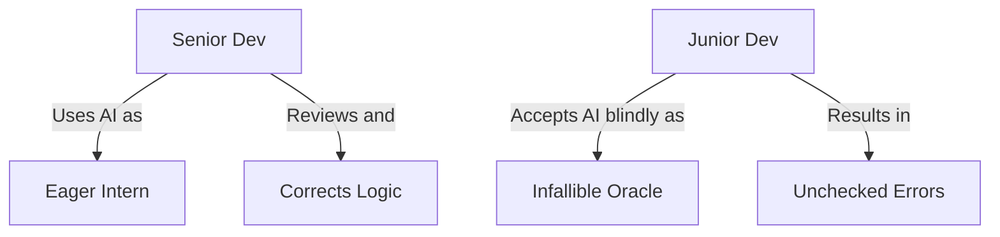

# The Rise of AI Coding Assistants: How Copilot Is Changing Software Engineering

> **TL;DR:** The general release of GitHub Copilot marks a historic shift in how software is written. While critics dismiss it as a glorified auto-complete engine, Copilot represents the beginning of the AI-augmented developer era—a transition that dramatically boosts senior engineering output, reshapes how we learn to code, and shifts the developer's role from writing syntax to designing systems.

Last month, GitHub officially moved Copilot out of its year-long technical preview and opened it up to the public as a paid subscription. The software engineering community immediately split into two camps. In one corner, we have the traditionalists, arguing that AI-generated code is a dangerous, plagiarized security hazard that will turn junior developers into lazy, uncritical thinkers. In the other corner, we have the enthusiasts, claiming that they are already writing code twice as fast and that the traditional human-written codebase is destined for obsolescence.

As is usually the case with major technological disruptions, the truth lies somewhere in the middle. GitHub Copilot is neither a useless toy nor a fully autonomous software engineer. It is something far more interesting: a highly sophisticated, context-aware pattern-matching assistant that is fundamentally changing the cognitive workflow of programming. By sitting directly inside your Integrated Development Environment (IDE), Copilot is forcing us to ask a deep, structural question: what does it actually mean to be a software engineer in an era where writing syntax has been partially automated?

## The Boilerplate Killer: Elevating Developer Flow

The most immediate, tangible benefit of Copilot is the complete destruction of boilerplate code. As software developers, we spend an embarrassing amount of time writing repetitive, predictable code: setting up Express.js servers, configuring Webpack, writing unit test assertions, mapping data objects, and implementing standard cryptographic hash functions.

This is not high-level intellectual labor; it is syntactic typing chore. Copilot excels at this. Because it was trained on billions of lines of public code, it understands the patterns behind standard boilerplate. You write a descriptive function name like `calculateDistanceBetweenCoordinates(lat1, lon1, lat2, lon2)`, and before you can even open a parenthesis, Copilot has filled out the entire mathematical Haversine formula for you.

By handling the mechanical, repetitive parts of coding, Copilot keeps developers in the coveted "flow state." You no longer have to break your concentration every ten minutes to search StackOverflow for a minor syntax detail or look up a utility function signature. You describe what you want in plain English, review the suggested block of code, press the tab key, and keep building. Your focus shifts from "how do I write this syntax?" to "does this logic make sense in the context of my system?"

## The Junior Developer Bottleneck: A Double-Edged Sword

While Copilot is a massive productivity accelerator for experienced developers, it poses unique, structural challenges for junior engineers and students who are still learning the basics of software development.

A senior developer has the architectural intuition and domain experience required to immediately spot when Copilot suggests a subtle bug, an outdated API library, or a security vulnerability. They treat Copilot like an extremely fast, eager intern: useful, but requiring constant supervision and strict code reviews. 

A junior developer, however, does not yet possess that mental model. They are prone to treating the AI as an infallible oracle. When Copilot suggests a complex, thirty-line function, a junior developer is likely to accept it blindly without understanding how it works or why it was constructed that way. This leads to a terrifying phenomenon: "cargo cult programming," where code is assembled by combining blocks of AI-generated syntax that the developer cannot explain, debug, or maintain when it inevitably fails. 

Learning how to code is not about memorizing syntax; it is about building the logical problem-solving frameworks required to decompose complex problems into simple steps. If we automate those early, difficult steps of struggling with syntax, we risk short-circuiting the educational loops that turn junior developers into competent engineers.

## From Typists to System Architects

The long-term implication of tools like Copilot is a fundamental shift in the definition of a software engineer. Historically, a significant portion of an engineer's value was their mastery of specific language syntax, API frameworks, and compiler quirks. We were valued for our ability to write clean, manual implementations.

In the AI-augmented future, syntax will become increasingly commoditized. The real value of an engineer will lie in their ability to design systems, reason about data models, secure application boundaries, optimize performance profiles, and guide product requirements. We will evolve from "writers of code" into "readers, editors, and orchestrators of code." 

The developers who thrive in this new paradigm are those who embrace AI as a multiplier for their capabilities rather than fearing it as a threat. Copilot will not replace software engineers; but software engineers who use Copilot will replace those who do not.

## Key Takeaways
- **Boilerplate is solved**: Use Copilot to handle repetitive, standard implementations so you can stay in flow and focus on complex architecture.
- **Maintain a zero-trust model**: Treat AI suggestions with healthy skepticism, reviewing every line of generated code for security flaws and logic errors.
- **Protect junior learning loops**: Ensure junior engineers struggle with fundamentals and syntax before relying on AI coding assistants as a crutch.
- **Invest in system-level skills**: Shift your career development focus from learning raw language syntax to mastering software architecture, testing, and security.

## Frequently Asked Questions

**Q: Does GitHub Copilot raise legal or copyright concerns?**
A: Yes, this is one of the most highly debated topics of mid-2022. Because Copilot was trained on public open-source code repositories (some of which carry restrictive licenses like GPL), critics argue that its suggestions can sometimes emit verbatim snippets of licensed code without proper attribution, potentially exposing commercial codebases to copyright liabilities. GitHub has introduced filters to block suggestions that match public code, but the legal landscape remains highly complex and unresolved.

**Q: Can Copilot introduce security vulnerabilities into my application?**
A: Absolutely. Research has shown that Copilot can easily suggest insecure code patterns, outdated libraries, or common vulnerabilities (such as SQL injection or cross-site scripting) if the prompt context resembles older, insecure training data. It is critical to run comprehensive unit tests, static code analysis, and security scanning tools on all code, regardless of whether it was written by a human or an AI.

**Q: How can teams establish a healthy culture around using AI coding tools?**
A: Establish clear, written guidelines. Encourage the team to use AI for boilerplate, documentation lookup, and test generation, but explicitly prohibit using it to write core business logic without detailed, human-led peer reviews. Make it clear that the developer who merges a pull request is fully responsible for every line of code inside it, regardless of its origin.

---

*Bear markets are where the real builders are found. Subscribe for weekly reality checks.*

*— [Shantanu Vishwanadha](https://substack.com/@thecoderpanda)*
