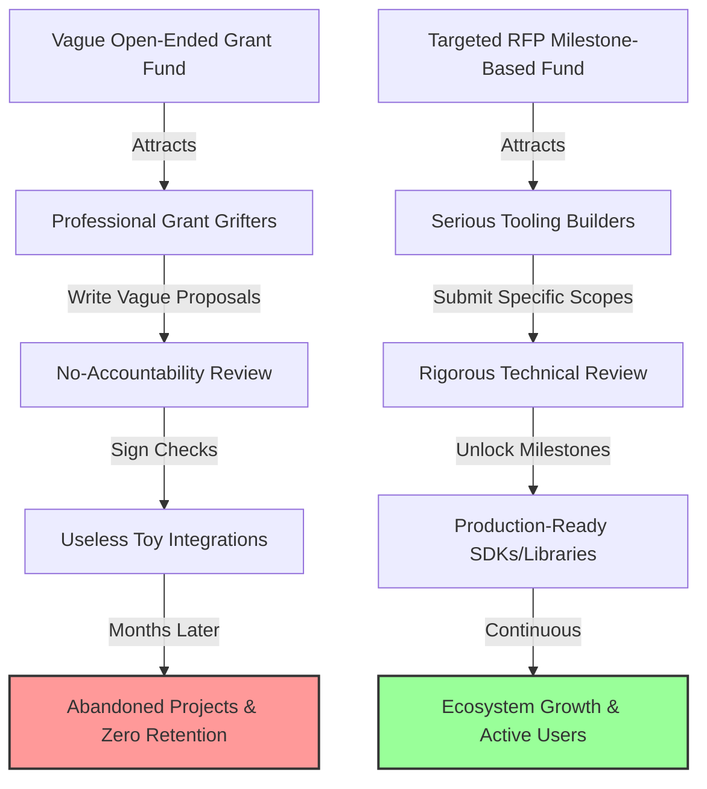

# Designing Developer Grant Programs That Work

> **TL;DR:** In the web3 and devtools gold rush of 2022, everyone is running developer grant programs. Most of them are massive failures—burning millions of dollars on grifters, abandoned toy projects, and useless blog posts. To build a program that actually drives ecosystem growth, you must enforce milestone-based releases, define highly specific RFPs (Requests for Proposals) rather than open-ended submissions, mandate public reporting, and measure success by integration metrics rather than the number of checks signed.

If you look at the developer relations landscape in late 2022, you’ll see an absolute avalanche of money being thrown around. 

Crypto foundations, cloud providers, and SaaS startups are all launching $10M, $50M, or even $100M "developer grant funds." The pitch is always the same: *"We want to support open-source builders, enrich our ecosystem, and foster organic innovation."*

It sounds beautiful. But if you look under the hood of most of these programs, they are an absolute disaster. 

They are a vanity exercise designed to show "ecosystem growth" to venture capitalists or community members. They sign a check for $25,000 to some developer who writes a half-baked Python wrapper for their API, publishes a single GitHub repo that is never updated again, and disappears into the ether. 

This is **spray-and-pray grant funding**. It is an expensive way to buy temporary good vibes while achieving exactly zero long-term retention or ecosystem utility. Let’s talk about how to design a developer grant program that actually works—one that attracts serious, long-term builders, creates valuable open-source tooling, and drives measurable return on investment.

---

## Why Most Developer Grant Programs Fail

The fundamental flaw in most grant programs is a failure of **incentive design**. 

When you offer open-ended, non-dilutive capital (i.e., "free money") with loose criteria, you do not attract senior, high-quality engineers who are trying to build real businesses. Instead, you attract "grant grifters"—professional proposal-writers who jump from ecosystem to ecosystem, collecting $10k to $30k checks by doing the absolute minimum amount of work necessary to clear your vague evaluation hurdles.

Here are the three classic failure modes of early developer grant programs:

### 1. The "Open-Ended Submission" Trap
Many programs have an application box that essentially says: *"Tell us what you want to build and we'll give you money."* This is lazy community building. 

Developers do not know your internal roadmap or what tools your customers are begging for. If you don’t define what needs to be built, you will end up with 42 different "tutorial blogs," 10 identical discord bots, and zero production-grade SDKs or databases.

### 2. Upfront Payment Without Accountability
Signing a check and transferring 100% of the grant money upfront is an invitation for abandonment. Once the developer has the cash, their financial incentive to complete the project disappears. Life gets in the way, their day job gets busy, or a more lucrative opportunity arises, and your project gets relegated to a dusty folder on their local machine.

### 3. Vague Definition of "Done"
If your grant agreement says the project is completed when "the library is built and documented," you have a major loophole. Does the library have tests? Is it published to npm or PyPI? Is there a working demo? If you don't define the technical standards of acceptance beforehand, you will be forced to pay out for code that cannot actually be used by anyone else in the real world.

---

## What Actually Makes a Grant Program Succeed

Building a successful developer ecosystem requires treating your grant program like a **specialized procurement pipeline**, not a charity. 

You are trading capital for technical assets that enrich your platform. Here is the framework for a program that actually returns value:

### 1. Shift to RFPs (Requests for Proposals)
Instead of asking developers what they want to build, tell them exactly what your ecosystem **needs**. Maintain a public list of specific RFPs. For example:
*   *RFP-01: A fully-typed, native Rust SDK for our core API (Budget: $25,000)*
*   *RFP-02: A Prometheus monitoring exporter for our database clusters (Budget: $15,000)*
*   *RFP-03: A production-ready integration with Next.js Auth (Budget: $10,000)*

This ensures that every dollar spent goes directly toward solving a real, identified bottleneck in your developer journey.

### 2. Milestone-Based Payouts (No Exceptions)
Never, under any circumstances, pay the full amount of a grant upfront. Break every grant down into strict, sequential milestones with clear deliverables. 

For a $20,000 SDK grant, the milestones might look like this:
*   **Milestone 1 (25% payout)**: Complete architectural design document and public GitHub repository setup with basic client initialization.
*   **Milestone 2 (50% payout)**: All core API endpoints implemented, fully documented, and covered by a comprehensive test suite (min 80% coverage).
*   **Milestone 3 (25% payout)**: Package published to the official package registry, a working example app deployed, and a community demo video recorded.

If a developer stops working after Milestone 1, they only get paid for what they actually delivered, and you can quickly hand the remaining scope to someone else.

### 3. Rigorous Technical Review
Your grant evaluation committee cannot just be composed of marketing or community managers. You need senior engineers to review the code. 

Before a milestone is approved and a payout is unlocked, an engineer from your team must pull the developer's repository, run the code, review the architecture, and verify that it meets your technical standards. This keeps developers honest and ensures the output is actually production-ready.

---

## Measuring the Real ROI of Ecosystem Grants

If you want your CFO to keep funding your developer grant program, you have to prove its value. "Number of grants approved" is a cost metric, not a success metric. 

Here are the real metrics that indicate a successful program:

*   **Ecosystem Downstream Dependency**: How many projects in your community are importing the library or tool created by the grant recipient? If a grant-funded SDK has 0 active imports on npm after six months, that grant was a write-off.
*   **Active Maintainer Retention**: Is the grant recipient still maintaining the code six months after the final payout? A great grant program builds long-term core contributors, not one-time contractors.
*   **Customer Acquisition Cost (CAC) Offset**: Did a major enterprise customer adopt your platform because a grant-funded integration (e.g., with Terraform or Datadog) made it easy for them? If a $15,000 grant unblocks a $100,000 ACV (Annual Contract Value) deal, your program is incredibly profitable.

---

## Key Takeaways

- **A grant is a contract, not a gift**: Treat the relationship with professional rigor, clear milestones, and strict quality control.
- **Solve real bottlenecks**: Use RFPs to direct capital toward building critical tooling, SDKs, and integrations.
- **Senior engineers must review code**: Do not let non-technical team members approve milestone payouts.
- **Optimize for maintenance, not just delivery**: Incentivize developers to stay around and maintain their tools by offering small, recurring maintenance grants.

---

## Frequently Asked Questions

**Q: High-quality developers are expensive. Won't a tedious milestone process scare them away?**  
A: The opposite is true. High-quality developers appreciate clarity and professional rigor. They like knowing exactly what is expected of them, how they will be evaluated, and when they will get paid. A structured, milestone-driven program actually filters out the amateurs and grifters, leaving more budget and attention for serious, professional builders.

**Q: Should we allow teams to stay anonymous when applying for developer grants?**  
A: While anonymity is popular in Web3 ecosystems, it is a massive risk factor for grant fraud and poor execution. At a minimum, your core team must have a verified identity of the lead developer (via KYC or a reliable LinkedIn/GitHub profile check). If someone is unwilling to stand behind their professional identity, they are not a reliable partner to build critical ecosystem infrastructure.

**Q: How do we handle a developer who has received 50% of the payout but has stopped communicating?**  
A: You must have a clear "inactivity timeout" clause in your grant agreement. If a developer goes dark for more than 14 days without prior notice, the grant is terminated, any unpaid milestones are canceled, and the scope is returned to the public RFP pool. Do not waste weeks pleading for updates—cut ties quickly and reallocate the budget.

---

*If this resonated, hit subscribe — I write about developer relations, ecosystem design, and community growth every week.*

*— [Shantanu Vishwanadha](https://substack.com/@thecoderpanda)*
