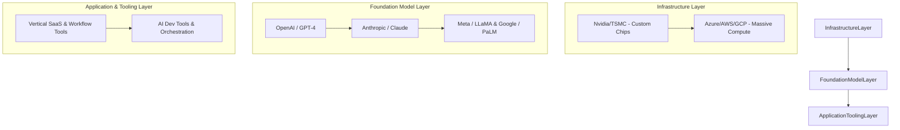
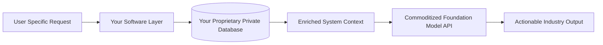

The gold rush is officially on. 

My Twitter feed is an absolute firehose of "AI founders" announcing pre-seed rounds, launching Product Hunt MVPs, and proclaiming that they are "disrupting" every industry from healthcare to dog walking. 

If you are a builder looking at this absolute circus, it is easy to feel a combination of intense FOMO and extreme skepticism. You see companies raising $20 million on a slide deck and a fancy domain name, and you wonder: *Is there a real, sustainable business model here, or are we just witnessing the mother of all hype cycles?*

Let's be incredibly clear: **We are in a massive structural bubble, but the paradigm shift is absolutely real.** 

Just like the dot-com bubble of 1999, many of the initial high-flyers of early 2023 will go to zero. They will burn through their venture cash and realize they built something with zero defensibility. But out of the ashes of this frenzy, the defining software giants of the next decade are being built right now.

If you want to be one of the founders who survives the hype cycle and builds a generational business, you need to understand where the leverage actually lies. You cannot compete with the infrastructure giants. You have to find the niches they cannot touch.

Here is the honest, unvarnished blueprint for the AI startup opportunity in the decade ahead.

---

## 1. The Realities of the AI Value Chain

Before you write a single line of code, you must understand the three distinct layers of the modern AI tech stack:

If you are a startup founder, **do not touch the Foundation Model layer.** 

Unless you are a world-renowned AI researcher who can raise $150 million on day one just to pay for raw compute, trying to train your own foundational LLM is a suicide mission. The giants (OpenAI, Google, Microsoft, Meta) are locked in a multi-billion-dollar war of attrition. They will spend whatever it takes to drive model capabilities up and API costs down. 

Your job isn't to build the engine. Your job is to build the specialized sports car that uses their engine to dominate a specific track.

---

## 2. Beware the "Thin Wrapper" Trap

The easiest way to get crushed in 2023 is to build a "thin wrapper" on top of OpenAI's API. 

If your entire product value proposition is: *"We take your prompt, send it to ChatGPT behind the scenes, and show the result in a slightly prettier UI,"* you do not have a business. You have a featureset. 

The moment OpenAI updates their native playground, releases a new system feature, or lowers their context limits, your company will disappear overnight. We are already seeing this with dozens of "AI copywriting assistants" who raised massive rounds at astronomical valuations in late 2022, only to realize that their customers can now get 95% of the same value directly inside the free ChatGPT interface.

Defensibility in the AI era cannot come from the model itself. It must come from **data proprietary ownership, system workflow complexity, and product integration.**

---

## 3. Opportunity Category A: The Vertical SaaS Moat

The highest leverage opportunity for solo builders and small technical teams is **Vertical SaaS powered by proprietary context.**

Foundation models are trained on the public web. They are incredibly good at general reasoning because they’ve read Wikipedia, Reddit, and thousands of books. But they have absolutely zero access to the private, hyper-specific data silos that run the real world:
- The messy, handwritten safety logs of a commercial construction site.
- The historical patent filings of a boutique intellectual property firm.
- The real-time supply chain records of a regional auto-parts distributor.

If you build software that integrates deeply with these industry-specific data flows, captures that context, and uses LLMs to automate tedious, high-friction tasks, you build an iron-clad moat. 

A vertical SaaS founder doesn't win because their model is smarter. They win because their application has the **exact context** required to solve a painful, $10,000-a-month problem for a business that doesn't even know what an API is.

---

## 4. Opportunity Category B: Workflow Orchestration & Cognitive Agents

Right now, most people interact with AI through a single-turn chat window: *Question -> Answer.*

This is incredibly limiting. The real power of LLMs lies in their ability to act as the reasoning engine for complex, multi-step **agents** that interact with external tools and APIs. 

Imagine an agent that can:
1. Monitor an company's incoming billing inbox.
2. Read a messy invoice PDF using OCR and structural processing.
3. Automatically log into QuickBooks to check if the vendor exists.
4. Flag discrepancies in line items.
5. Draft an approval email and queue up the wire transfer in Mercury.

This isn't a simple chatbot. This is a complex workflow orchestrator. 

Building "cognitive loops"—where the LLM runs a step, evaluates the output, decides which API tool to call next, and continues until a long-running task is fully accomplished—is a massive frontier. The tooling for this (like LangChain and early agent frameworks) is still incredibly raw and difficult to use. If you can build robust, deterministic guardrails around non-deterministic LLM behaviors to automate real-world office workflows, you will mint money.

---

## 5. Opportunity Category C: The Developer Enablers

Whenever there is a gold rush, the safest bet is to sell shovels. 

The developer ecosystem for building AI applications is in its absolute infancy. Engineers are trying to build complex production systems using tools that were hacked together over a weekend. 

There are massive, gaping holes in the AI developer stack waiting for smart founders to fill:
- **Testing & Evaluation**: How do you run automated tests on an LLM app when its output is non-deterministic? We need the "Jest" or "PyTest" of the LLM era.
- **Observability & Latency Monitoring**: How do you track token usage, trace chain-of-thought execution steps, and debug why a specific API prompt is taking 5 seconds to load?
- **Security & Prompt Injection Defenses**: How do you prevent users from hacking your agent to bypass system instructions and steal your vector database contents?

These are highly technical, deep engineering problems. The buyers are other developers who are flush with budget and desperate for tools that speed up their time-to-market.

---

## The Founders' Playbook for 2023

If you are going to build in this space, ignore the venture capital hype and focus on the fundamentals:

1. **Find the Friction**: Don't build "cool tech looking for a problem." Talk to real businesses, find out what they spend their afternoons manually typing into spreadsheets, and automate that.
2. **Move Faster than the Giants**: Large companies are paralyzed by legal compliance, safety alignment, and brand preservation. You can deploy, iterate, and break things on production before their compliance committee can schedule a meeting.
3. **The Data is the Moat**: Build product loops that naturally incentivize users to input high-quality, proprietary data that makes your system smarter and more sticky over time.

Stop looking at the multi-billion-dollar models with envy. The infrastructure is being commoditized for you. Grab the smartest model on earth for a fraction of a cent per token, wrap it in a hyper-focused, workflows-first application, and go build a real business.

The canvas is blank. Grab your paintbrush.